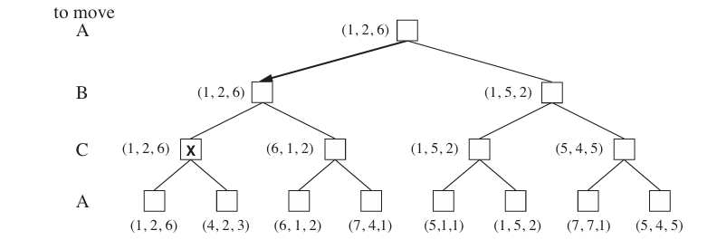

- [Concepts](#concepts)
  - [Deterministic](#deterministic)
  - [Stochastic](#stochastic)
  - [Non-Deterministic](#non-deterministic)
  - [Fully Observable](#fully-observable)
  - [Partially Observable](#partially-observable)
  - [Summary](#summary)
  - [Mutually Exclusive Events](#mutually-exclusive-events)
  - [Independent Events](#independent-events)
  - [Dependent Events](#dependent-events)
- [Introduction](#introduction)
  - [Can machine think](#can-machine-think)
  - [Turing Test](#what-is-turing-test)
- [Agent](#agents)
  - [Simple Reflex Agents](#1-simple-reflex-agents)
  - [Model-Based Reflex Agents](#2-model-based-reflex-agents)
  - [Goal-Based Agents](#3-goal-based-agents)
  - [Utility-Based](#4-utility-based)
  - [Learning Agents](#5-learning-agents)
  - [PEAS framework](#peas-framework)
  - [Environment Representation](#environment-representation)
  - [Rationality of Agent](#rationality-of-agent)
  - [Structure of Agent](#structure-of-agent)
  - [Nature of Agent](#nature-of-agent)
- [Problem Solving Agents](#problem-solving-agents)
  - [Goal & Problem Formulations](#goal--problem-formulations)
  - [Problem Formulation](#problem-formulation)
    - [Incremental Formulation](#incremental-formulation)
    - [Complete State Formulation](#complete-state-formulation)
  - [Well Defined Problems](#well-defined-problems)
  - [Problem Example](#problem-example)
  - [Infinite State Space Problem](#infinite-state-space-problem)
  - [Problem Solving Performance](#problem-solving-performance)
- [State Space Problem](#state-space-problem)
  - [Uninformed Search](#uninformed-search)
  - [Informed Search](#informed-search)
    - [Heuristic Function](#heuristic-function)
  - [Adversarial Search](#adversarial-search)
- [Uninformed Search](#uninformed-search-1)
  - [BFS](#bfs)
  - [DFS](#dfs)
- [Informed Search](#informed-search-1)
  - [A\* Search Algorithm](#a-search-algorithm)
- [Adversarial Search](#adversarial-search)
  - [Game Tree](#game-tree)
  - [Concepts](#concepts)
  - [AND–OR Search Analogy](#andor-search-analogy)
  - [Minimax Algorithm](#minimax-algorithm)
  - [Optimal decisions in multiplayer games](#optimal-decisions-in-multiplayer-games)
  - [Alpha-Beta Pruning](#alpha-beta-pruning)
  - [Imperfect Real-Time Decisions](#imperfect-real-time-decisions)
  - [Stochastic Games](#stochastic-games)
- [Knowledge Representatoin](#knowledge-representatoin)
  - [Propositional Logic](#propositional-logic)
  - [Predicate Logic](#predicate-logic)
  - [Rule Based System](#rule-based-system)
    - [Forward Chaining](#forward-chaining-data-driven-inference)
    - [Backward Chaining](#backward-chaining-goal-driven-inference)
  - [Ontologies and Semantic Network](#ontologies-and-semantic-network)
    - [What is an Ontolgoy?](#what-is-an-ontolgoy)
    - [What is a Semantic Network?](#what-is-a-semantic-network)
- [Uncertainity](#uncertainity)
  - [Probability Notation](#probability-notation)
  - [Joint Probabilty](#joint-probabilty)
  - [Marginal Probability](#marginal-probability)
  - [Independence](#independence)
    - [Conditional Independence](#conditional-independence)
  - [Baye's Theorem](#bayes-rule)
- [Probabilistic Reasoning](#probabilistic-reasoning)
  - [Bayesian Network](#bayesian-network)
  - [Conditional Probability Distribution](#conditional-probability-distribution)
  - [Chain Rule](#chain-rule)
  - [Uses of Bayesian Networks](#uses-of-bayesian-networks)
    - [Local Probability Model](#local-probability-models-quantitative-semantics)
    - [Joint Distribution](#joint-distribution)
  - [Efficient Representation of Conditional Distribution](#efficient-representation-of-conditional-distribution)
    - [Deterministic CPDs](#deterministic-cpds)
    - [Noisy-OR Models](#noisy-or-models)
  - [Inference](#inference)
    - [Exact Inference](#exact-inference)
      - [Enumeration](#inference-by-enumeration)
      - [Variable Elimination](#the-variable-elimination-algorithm)
    - [Approximate Inference](#approximate-inference)
      - [Direct Sampling](#direct-sampling)
        - [Rejection Sampling](#rejection-sampling)
        - [Likelihood Weighting](#likelihood-weighting)
      - [Markov Chain Simulation - Gibbs Sampling](#markov-chain-simulation---gibbs-sampling)

# Concepts

## Deterministic

A deterministic system is one in which the outcome of every action is completely predictable. Given a specific state and action, the next state is always the same.

**Same input → same output, every time.**

### Characteristics

- No randomness involved.
- Fully predictable behavior.
- Easier to model and test.

### Example

Pathfinding in a grid world with no obstacles or randomness

- Suppose an agent moves on a 2D grid.
- If it takes the "Right" action from position (2,3), it always ends up at (3,3).
- There's no uncertainty—the transition is deterministic.

## Stochastic

The next state is not completely predictable — the environment has randomness. The same action may lead to different outcomes with certain probabilities.

## Non-Deterministic

A non-deterministic environment is one where multiple outcomes are possible, but the agent does not know the probabilities. The outcome may depend on:

- Randomness
- Unknown variables
- External agents (like other players or unpredictable environments)

**Same input → multiple possible outputs.**

### Characteristics

- Involves uncertainty.
- Harder to predict.
- Requires probabilistic or adaptive models.
- Actions might depend on incomplete or probabilistic information.
- Outcomes vary due to enemy behavior and randomness.

### Example

Robot navigating a **slippery floor**

- The robot tries to move forward from position (2,3), but due to the slipperiness, it ends up at (2,3), (3,3), or (2,4) randomly.
- The same action doesn't always lead to the same result → non-deterministic.

## Fully Observable

The agent has access to the complete state of the environment at every point. Nothing is hidden.

## Partially Observable

The agent has incomplete or noisy access to the environment’s state. Uses sensors or memory to infer hidden information.

## Summary

| Type                 | Definition                                                      | Example               | AI Considerations                        |
| -------------------- | --------------------------------------------------------------- | --------------------- | ---------------------------------------- |
| Deterministic        | Next state is completely determined                             | Chess                 | Easier to model; predictable planning    |
| Stochastic           | Outcomes involve randomness with known probabilities            | Robot on slippery ice | Requires probabilistic reasoning         |
| Non-deterministic    | Multiple possible outcomes, without known probabilities         | Mystery box in a game | Worst-case or bounded planning           |
| Fully Observable     | Agent can see the entire state of the environment               | Tic-Tac-Toe           | Direct decision-making                   |
| Partially Observable | Agent sees only part of the environment (e.g., limited sensors) | Driving in fog        | Must estimate hidden state using history |

## Mutually Exclusive Events

Two events are mutually exclusive (also called disjoint events) if they cannot occur at the same time.

In other words, if one event happens, the other one cannot.

For two events A and B, they are mutually exclusive if:

$$
P(A∩B)=0
$$

## Independent Events

Two events A and B are said to be independent if the occurrence of one does not affect the probability of the other.

**Mathematical Definition:**

$$
P(A∩B)=P(A)⋅P(B)
$$

This means:

$$
P(A∣B)=P(A) \\ and \\ P(B∣A)=P(B)
$$

## Dependent Events

Two events A and B are dependent if the occurrence of one does affect the probability of the other.

**Mathematical Definition:**

$$
P(A∩B) \ne P(A)⋅P(B)
$$

Or:

$$
P(A∣B) \ne P(A)
$$

# Introduction

AI refers to the simulation of human intelligence in machines, enabling them to perform tasks that typically require human intelligence.

## Can machine think?

It is a fundamental philosophical and technological debate in AI.

To determine if machines can think, we need to first define thinking.

- **Human Thinking:** Involves reasoning, self-awareness, emotions, creativity, consciousness, and problem-solving.
- **Machine "Thinking"**: Machines follow algorithms and process data, but do not have self-awareness, emotions, or creativity in the human sense. They perform tasks based on patterns and logic, not subjective understanding.

Machines can simulate thinking by learning from data, making predictions, and even engaging in conversations (like chatbots). However, they do not have human-like consciousness or the ability to experience emotions.

Machines do not truly "think" in the human sense. They simulate intelligence and decision-making using algorithms and data but do not possess self-awareness or consciousness.

## What is turing test

Turing Test is a method to determine whether a machine can exhibit human-like intelligence.

Since defining "thinking" is difficult, he instead proposed a practical test: If a machine can fool a human into believing it is also human, then it can be considered intelligent.

### How Does the Turing Test Work?

1. **Three Participants:**

   - A human interrogator (judge).
   - A human participant.
   - A machine (AI) pretending to be human.

2. **The Process:**

   - The interrogator communicates with both the human and the AI through text-based conversation (so no physical clues).
   - The interrogator asks any kind of questions to determine which participant is the AI.
   - If the AI can consistently fool the human into believing it is also human, it passes the test.

3. **Success Criteria:**
   - If the AI’s responses are indistinguishable from human responses, it is said to have passed the Turing Test.

# Agents

An agent in AI is an autonomous entity that perceives its environment through sensors and takes actions using actuators to achieve specific goals.

- It percieves from it's environment
- Make decision
- Perform action

## Types

### 1. Simple Reflex Agents

- Works by finding a **rule** that match current situtation
- **Ignore past**
- Uses if-else condition rules
- React directly to the environment using predefined rules.
- Example: A thermostat detects temperature and turns heating on/off.

### 2. Model-Based Reflex Agents

- Partially observer the system.
- **Consider Past**.
- Works by finding a **rule** that match current situation.
- Example: A chess AI remembers past moves to improve strategy.

### 3. Goal-Based Agents

- Unlike simple or model-based reflex agents, which only follow predefined rules, goal-based agents evaluate different possible actions and select the one that leads them **closer to achieving their goal**.
- Example: A self-driving car follows GPS directions to reach a destination.

### 4. Utility-Based

- Not only considers **a goal but also assigns a numerical value** (utility) to different possible outcomes.
- Consider multiple possible actions and choose the best one based on utility (effectiveness).
- Example: A recommendation system suggests movies based on user ratings.

#### Difference between utility-based agent and goal-based agent

| Feature                 | Goal-Based Agent                    | Utility-Based Agent                                          |
| ----------------------- | ----------------------------------- | ------------------------------------------------------------ |
| **Decision Basis**      | Reaches a goal                      | Chooses the most desirable outcome                           |
| **Performance Measure** | Checks if goal is achieved (yes/no) | Assigns a value to different outcomes                        |
| **Example**             | A chess AI trying to win            | A chess AI choosing the best move with the highest advantage |
| **Flexibility**         | Only cares about reaching the goal  | Considers efficiency, safety, and user preferences           |

### 5. Learning Agents

- Learn from experience to improve decision-making over time.
- Example: ChatGPT improves responses based on user feedback.

#### Components

**1️⃣ Learning Element**

- This part allows the agent to learn from experiences and improve its actions.
- Example: A chatbot learning new words based on user input.

**2️⃣ Performance Element**

- Responsible for making decisions and executing actions in the environment.
- Example: A self-driving car’s AI deciding when to stop or accelerate.

**3️⃣ Critic (Feedback Mechanism)**

- Evaluates how well the agent is performing and provides feedback.
- Example: A recommendation system tracking user engagement.

**4️⃣ Problem Generator (Exploration Component)**

- Helps the agent explore new possibilities to improve its performance.
- Example: A game-playing AI trying new moves to discover better strategies.

## PEAS framework

PEAS is a framework used to define the environment in which an intelligent agent operates. It helps in designing and understanding the components that make up an AI agent.

### P: Performance Measure

- This defines how the success of an agent is measured.
- It sets the goals for the agent.
- The performance measure depends on the problem and can involve multiple criteria like speed, accuracy, cost, etc.

### E: Environment

- This is the external context in which the agent operates.
- It includes everything the agent interacts with and affects.
- The environment can be partially observable or fully observable, static or dynamic, discrete or continuous, etc.

### A: Actuators

- These are the components that the agent uses to act upon the environment.
- In robotics, this can be motors, wheels, arms; in software, it can be sending messages, updating records, etc.

### S: Sensors

- These are the means by which the agent perceives the environment.
- They collect data that the agent uses to make decisions.
- In a robot, these could be cameras, microphones, GPS, etc.; in software agents, these could be user inputs, logs, etc.

### Example: Self-driving Car

| PEAS Component      | Description                                                                                  |
| ------------------- | -------------------------------------------------------------------------------------------- |
| Performance Measure | Safe driving, obeying traffic laws, reaching destination, passenger comfort, fuel efficiency |
| Environment         | Roads, traffic signals, other vehicles, pedestrians, weather conditions                      |
| Actuators           | Steering wheel, accelerator, brakes, turn signals, horn                                      |
| Sensors             | Cameras, LiDAR, radar, GPS, speedometer, accelerometer                                       |

### Example: Smart Vacuum Cleaner

| PEAS Component      | Description                                                        |
| ------------------- | ------------------------------------------------------------------ |
| Performance Measure | Cleanliness of floor, battery efficiency, time taken, area covered |
| Environment         | House layout, furniture, floor types, dirt or dust                 |
| Actuators           | Wheels, suction mechanism, brushes, speaker                        |
| Sensors             | Bump sensors, infrared sensors, camera, dirt sensor                |

## Environment Representation

1. **Atomic Representation:** Treats each state as an indivisible unit with no internal structure.

For example, in a route-finding problem, a city might be represented as a single entity.

2. **Factored Representation:** Describes states using a set of attributes with values.

For instance, a driving scenario could consider variables such as fuel level, GPS coordinates, and toll money.

3. **Structured Representation:** Represents the world in terms of objects and their relationships.

For example, it can describe how a truck reversing into a driveway is blocked by a cow.

## Rationality of Agent

A rational agent is one that takes actions to achieve the best expected outcome, based on its knowledge and capabilities.

**Rationality ≠ Perfection**

Rational does not mean the agent always succeeds, but rather that it does the best it can with the information it has.

## Structure of Agent

### Agent = Architecture + Program

- **Architecture:** The hardware platform or software environment where the agent runs.
  - Examples: A robot, a computer, a virtual server.
- **Agent Program:** The software code that defines how the agent makes decisions based on inputs (percepts).
  - Implemented using rules, decision trees, or AI algorithms.

### General Agent Structure

- Sensors – Perceive the environment
- Agent Function – Maps percepts to actions
- Actuators – Carry out actions

```
Environment → [Sensors] → [Agent Program] → [Actuators] → Environment
```

## Nature of Agent

| Agent Type         | Memory | Goal-Oriented | Learns | Utility Awareness | Example                    |
| ------------------ | ------ | ------------- | ------ | ----------------- | -------------------------- |
| Simple Reflex      | ❌     | ❌            | ❌     | ❌                | Basic vacuum cleaner       |
| Model-Based Reflex | ✅     | ❌            | ❌     | ❌                | Smart home thermostat      |
| Goal-Based         | ✅     | ✅            | ❌     | ❌                | Path-finding robot         |
| Utility-Based      | ✅     | ✅            | ❌     | ✅                | Drone delivery system      |
| Learning Agent     | ✅     | ✅            | ✅     | ✅                | Chess AI, Self-driving car |

# Problem Solving Agents

A problem-solving agent is a type of goal-based intelligent agent that decides what to do by finding sequences of actions that lead to desirable states.

- Problem solving agents use atomic representations.

## Goal & Problem Formulations

- A goal is a set of desirable world states.
- The agent must determine actions that will lead to a goal state.
- Problem formulation involves deciding what actions and states to consider to reach the goal.

**Example: Navigating Romania**

- An agent in Arad wants to reach Bucharest.
- Without knowledge of Romania’s geography, it cannot determine the best route.
- A map provides information about possible paths, allowing the agent to plan a route.
- The agent assumes an observable, discrete, known, and deterministic environment, ensuring predictable outcomes for its actions.

**Search, Solution, and Execution**

- **Search:** The agent looks for a sequence of actions that lead to the goal.
- **Solution:** A sequence of actions that guarantees reaching the goal.
- **Execution:** The agent follows the solution without considering new percepts (open-loop execution).

## Problem Formulation

### Incremental Formulation

- Each state includes the current position in the problem.
- The solution is built incrementally, action by action.
- Good for problems where the path to the goal matters (e.g., pathfinding, planning).

### Complete State Formulation

- Each state is a complete candidate solution or configuration.
- Good for combinatorial problems like puzzles, games, or scheduling.
- Often used with successor functions that generate all possible next configurations.

## Well Defined Problems

1. **Initial State:** The starting point of the agent (e.g., being in Arad).
2. **Actions:** The set of possible actions in each state (e.g., traveling to Sibiu, Timisoara, or Zerind from Arad).
3. **Transition Model:** Describes how each action changes the state (e.g., moving from Arad to Sibiu results in being in Sibiu).
4. **Goal Test:** Determines if a state satisfies the agent’s goal (e.g., being in Bucharest).
5. **Path Cost:** Measures the cost of a sequence of actions (e.g., distance traveled).

## Problem Example

### 8 Queen

**Incremental:**

- **States:** Any board with 0 to 8 queens (partially complete).
- **Initial State:** An empty board (0 queens).
- **Actions:** Add a queen to any empty square.
- **Transition Model:** Add a queen to a selected square → new state.
- **Goal Test:** 8 queens placed with no attacks.

**Complete State Space:**

- **States:** A full board with 8 queens (complete configuration).
- **Initial State:** 8 queens placed randomly on the board.
- **Actions:** Move a queen in its column to a different row.
- **Goal Test:** No queens attack each other.

It consider 64! possible placements for each actions \_\_ very innefficient.

#### Improved Incremental Formulation:

- Only place queens in columns from left to right.
- Only place in non-attacking positions.

This reduces the search space to just 2,057 states — massively more efficient.

### Infinite State Space Problem

**Problem Statement:**
Start with number 4, and apply:

- Factorial (n!)
- Square root (√n)
- Floor (⌊n⌋)

**Problem Definition:**

- **States:** All positive numbers.
- **Initial State:** The number 4.
- **Actions:** Apply factorial, square root, or floor.
- **Transition Model:** Based on math rules. E.g., floor(√(4!)) → new number.
- **Goal Test:** Is the number equal to the desired target (e.g., 5)?

## Problem Solving Performance

There are four key performance metrics:

- **Completeness** – Will the algorithm always find a solution if one exists?
- **Optimality** – Will it find the best (optimal) solution?
- **Time complexity** – How much time does it take to find a solution?
- **Space complexity** – How much memory does the algorithm require?

Time and space complexity are often measured using:

- `b`: Branching factor (max successors per node)
- `d`: Depth of the shallowest goal node
- `m`: Maximum depth of the state space

In AI, search graphs are usually implicit and potentially infinite, so complexity focuses on the number of nodes generated (time) and stored (space).

Effectiveness can be assessed by:

- **Search cost**: Time and memory used during the search
- **Total cost**: Search cost + path cost (e.g., time plus distance)

**A redundant path** is an alternative path to a node that is more costly or less efficient than another already known path to the same node. If a cheaper or more optimal path to a node already exists, any longer or more costly path is unnecessary to consider further.

# State Space Problem

They are categorized into three main types:

- [Uninformed Search (Blind Search)](#uninformed-search)
- [Informed Search (Heuristic Search)](#informed-search)
- [Adversarial Search (Game Search)](#adversarial-search)

## Uninformed Search

Uninformed search algorithms **do not have any additional information** about the problem space beyond the problem definition itself. They explore the search space systematically without using any domain knowledge.

### Characterstics

- **Guaranteed completeness:** If a solution exists, these algorithms will find it.
- **High time & space complexity:** As they do not prioritize paths, they may explore unnecessary nodes.
- **No heuristic function**
- **Brute-force approach**

### Common Algorithm

- BFS
- DFS
- UCS - Uniform Cost Search
- DLS - Depth Limited Search
- IDS - Iterative Deepening Search

## Informed Search

Informed search algorithms use **problem-specific knowledge** (heuristics) to find solutions more efficiently. These heuristics help guide the search toward the goal faster.

### Characterstics

- **uses a heuristic function**
- Faster then uninformed search

### Common Algorithm

- Greedy Best-First Search
- A\* Search
- Iterative Deepning A\*
- Beam Search

### Heuristic Function

A heuristic function `h(n)` provides an estimate of the remaining cost to reach the goal from state `n`.

**Properties:**

1. **Admissible**

- It never overestimates the true cost to reach the goal.
- Ensures A\* finds the optimal path.

2. **Consistent (Monotonic):**

- The estimated cost of reaching the goal does not decrease as we move along the path.
- Ensures that once a node is expanded in A\*, we don't need to revisit it.

Mathematically: For every node `n` and its successor `n'`,

```
h(n) ≤ c(n, n') + h(n')  (Triangle Inequality)
```

**Types:**
1️. Admissible Heuristics (Used in A\*): These heuristics never overestimate the actual cost. Examples:

- Straight-line distance (used in Romania map)
- Manhattan distance (used in grid-based problems)

2️. Inadmissible Heuristics: These may overestimate and don’t guarantee optimality. Example:

- Multiplying real distances by a random factor

## Adversarial Search

Adversarial search is used in competitive environments, like games, where multiple agents (players) make moves, often with opposing goals.

### Characterstics

- **Involves multiple players(agents)**
- **Requires strategy:** Agents anticipate and counter opponents' moves.
- **Minimax strategy:** Assumes the opponent plays optimally.
- **Alpha-Beta Pruning:** Optimizes the minimax algorithm by eliminating unneeded branches.

### Common Algorithm

- Minimax Algorithm
- Alpha-Beta Prunning

## Comparison

| Feature              | Uninformed Search               | Informed Search                | Adversarial Search          |
| -------------------- | ------------------------------- | ------------------------------ | --------------------------- |
| Heuristic Function   | No                              | Yes                            | Yes (evaluation function)   |
| Knowledge of Problem | None                            | Uses heuristics                | Uses opponent’s moves       |
| Efficiency           | Inefficient                     | More efficient                 | Requires strategy           |
| Optimality           | May be optimal (e.g., BFS, UCS) | Depends on heuristic           | Uses game strategies        |
| Example Algorithm    | BFS, DFS, UCS                   | A\*, Greedy BFS                | Minimax, Alpha-Beta Pruning |
| Application          | Pathfinding in graphs           | Route planning, AI pathfinding | Chess, Tic-Tac-Toe, Go      |

# Uninformed Search

## BFS

### Characterstics

- **Completeness:** BFS is complete, guaranteeing it will find a solution if the branching factor is finite and the solution is at a finite depth.
- **Optimality:** It is optimal if the path cost is a non-decreasing function of depth (e.g., uniform-cost scenarios where all actions have the same cost).
- **Time Complexity:** 𝑂(𝑏<sup>𝑑</sup>), where b is the branching factor and d is the depth of the shallowest goal. BFS can be very slow for large depths due to exponential growth.
- **Space Complexity:** Also 𝑂(𝑏<sup>𝑑</sup>), as BFS stores all generated nodes in memory, making space requirements more critical than time in many cases.

### Comparison

| **Aspect**                | **BFS in DSA**                                                                      | **BFS in AI**                                                                                          |
| ------------------------- | ----------------------------------------------------------------------------------- | ------------------------------------------------------------------------------------------------------ |
| **Goal/Purpose**          | Explore all nodes in a graph or tree, layer by layer.                               | Find the optimal (usually shortest) path to a goal state in a state space.                             |
| **Graph Representation**  | Typically works on explicit graphs (nodes and edges clearly defined).               | Operates on implicit state spaces (nodes are states, edges are actions/transitions).                   |
| **Application Focus**     | Traversing graphs, shortest path in an unweighted graph, connected components, etc. | Problem-solving, pathfinding (e.g., in games, robotics), finding a solution in a search space.         |
| **State Space**           | The graph/tree itself is the space to explore.                                      | The entire set of possible configurations of a problem, each state representing a possible situation.  |
| **Queue Usage**           | Uses a queue to track discovered but unexplored nodes.                              | Same, but nodes are states, and the queue can include extra data (like path cost or action sequences). |
| **Termination Condition** | When all nodes are visited.                                                         | When a goal state is found (or if the entire state space is exhausted without finding a solution).     |
| **Heuristics**            | Purely uninformed search, no heuristics involved.                                   | Can be part of an uninformed search but may be combined with other strategies in AI (e.g., A\*).       |
| **Complexity**            | $ O(V + E) $ for graphs, where V = vertices, E = edges.                             | Similar complexity, but state space size can explode depending on the problem (state-space explosion). |
| **Example Problems**      | Finding shortest path in an unweighted maze, network broadcasting, cycle detection. | Solving a sliding puzzle, navigating a robot to a destination, finding winning states in a game.       |

In DSA, explicit BFS means we have the entire graph/tree structure given to us directly, and we can access nodes and their neighbors directly.

In AI, especially in search problems (like solving puzzles, planning, robot navigation, etc.), the state space is not given directly. Instead a start state, a goal state, a set of possible actions has been given.

## DFS

### Characterstics

- **Traversal Strategy:** DFS uses a LIFO stack (or recursion) to manage the frontier, always expanding the most recently generated node.
- **Completeness:** The graph-search version (which avoids revisiting explored nodes) is complete for finite state spaces, but tree-search DFS is not, as it can get stuck in infinite loops.
- **Optimality:** DFS is not optimal — it may return a suboptimal solution if a goal is found in a deeper subtree before finding a shallower goal.
- **Time Complexity:** O(b<sup>m</sup>) where b is the branching factor and m is the maximum depth. DFS can be very slow, especially in infinite-depth trees.
- **Space Complexity:** O(bm) for tree search — DFS only needs to store the current path and unexpanded siblings, making it space-efficient compared to BFS.

### Comparison

| **Aspect**                | **DFS in DSA**                                                                                        | **DFS in AI**                                                                                                       |
| ------------------------- | ----------------------------------------------------------------------------------------------------- | ------------------------------------------------------------------------------------------------------------------- |
| **Goal/Purpose**          | Explore all nodes in a graph or tree by going as deep as possible along a branch before backtracking. | Explore the state space to find a goal state or solution, often useful in solving complex decision-making problems. |
| **Graph Representation**  | Typically works on explicit graphs or trees (nodes and edges are explicitly defined).                 | Works on implicit state spaces (nodes are states, edges are actions/transitions).                                   |
| **Application Focus**     | Finding connected components, cycle detection, topological sorting, maze solving, etc.                | Solving puzzles, exploring decision trees, and solving pathfinding or planning problems.                            |
| **State Space**           | Nodes represent elements of the graph/tree itself.                                                    | Nodes represent possible states of a system, and edges represent transitions between states.                        |
| **Stack Usage**           | Uses an explicit stack (or recursive function call stack) to keep track of nodes.                     | Same, but the stack contains states and sometimes additional info (like path cost or action history).               |
| **Termination Condition** | When all nodes are visited.                                                                           | When a goal state is found (or the entire state space is exhausted).                                                |
| **Heuristics**            | Purely uninformed, no heuristics.                                                                     | Usually uninformed, but may be combined with heuristic techniques (like Iterative Deepening DFS or IDA\*).          |
| **Completeness**          | Complete for finite graphs (it will visit every node).                                                | Not complete in infinite state spaces unless depth-limited or with iterative deepening.                             |
| **Time Complexity**       | $ O(V + E) $ for graphs, where V = vertices, E = edges.                                               | Similar complexity, but state space size can grow exponentially (combinatorial explosion).                          |
| **Space Complexity**      | $ O(H) $, where H is the maximum height of the recursion stack.                                       | Same, but can be problematic in very deep or infinite search spaces without proper limits.                          |
| **Example Problems**      | Detecting cycles, checking bipartite graphs, solving mazes, and finding articulation points.          | Solving games like chess, navigating through a complex decision tree, or solving constraint satisfaction problems.  |

# Informed Search

## A\* Search Algorithm

It is the most used pathfinding and graph traversal algorithms in AI. It is an extension of Dijkstra’s algorithm and the Greedy Best-First Search, combining their benefits to efficiently find the shortest path between nodes in a graph.

### How it works

A\* uses a heuristic function to evaluate which node to explore next. It maintains a priority queue of nodes to be explored.

The algorithm evaluates each node using the evaluation function:

f(n)=g(n)+h(n)

where:

- f(n): Estimated total cost of the path through node n.
- g(n): Cost from the start node to node n (actual cost).
- h(n): Estimated cost from node n to the goal (heuristic function).

The heuristic function h(n) should be:

1. **Admissible** (it never overestimates the cost to reach the goal).
2. **Consistent (Monotonicity Property)** (the estimated cost should not decrease along a path).

### Steps

**1. Initialize:**

- place the starting node in the priority queue(open list)
- create a closed list to track visited nodes

**2. Loop until goal is found or open list is empty:**

- Pick the node with the lowest f(n) from the open list.
- Move it to the closed list.
- If this node is the goal, stop and return the path.
- Otherwise, expand the node:
- For each neighboring node:
  - Calculate g(n) (cost from start node).
  - Calculate h(n) (heuristic cost to goal).
  - Calculate f(n)=g(n)+h(n).
  - If the node is not in the open list, add it.
  - If it is already in the open list with a higher f(n), update it.

**3. Repeat until the goal is reached.**

### Example

**Graph Representation:**

```
      (0)
       A
      /   \
   (1)     (4)
    B        C
   /  \       \
 (2)  (5)    (1)
 D      E      F
  \     |     /
   (3) (2)  (5)
    \   |   /
        G
```

**Table of Heuristic (h) Values:**
| Node | h(n) (Estimated Cost to Goal) |
|------|------------------------------|
| A | 6 |
| B | 4 |
| C | 4 |
| D | 2 |
| E | 3 |
| F | 3 |
| G | 0 |

**Step 1: Initialize**

- Start at A, set g(A)=0.
- Compute f(A)=g(A)+h(A)=0+6=6.
- Open list: `{A}`
- Closed list: `{}`

**Step 2: Expand A**

- Expand B: g(B)=1, f(B)=1+4=5.
- Expand C: g(C)=4, f(C)=4+4=8.
- Open list: `{B (5), C (8)}`
- Closed list: `{A}`

**Step 3: Expand B (Lowest f)**

- Expand D: g(D)=3, f(D)=3+2=5.
- Expand E: g(E)=6, f(E)=6+3=9.
- Open list: `{D (5), C (8), E (9)}`
- Closed list: `{A, B}`

**Step 4: Expand D (Lowest f)**

- Expand G: g(G)=6, f(G)=6+0=6.
- Open list: `{C (8), E (9), G (6)}`
- Closed list: `{A, B, D}`

**Step 5: Goal Reached**

- Since G is the goal, the algorithm stops.
- Shortest path found: A → B → D → G with cost 6.

# Adversarial Search

Adversarial Search is a type of search in Artificial Intelligence used in competitive environments where agents compete against each other. It is most commonly applied in two-player games like chess, tic-tac-toe, and checkers.

- One agent's gain is another agent's loss. This is called a zero-sum game.
- The goal of adversarial search is to find the best strategy by anticipating the opponent's moves.

In adversarial search, unlike normal search problems where the goal is to find an optimal sequence of actions leading to a win, the MIN player actively works against MAX, requiring a contingent strategy rather than a fixed solution. This is similar to the AND-OR search, where MAX chooses the best option (like OR), and MIN forces MAX to consider the worst-case scenario (like AND).

## Game Tree

- Each node represents a state of the game.
- Edges represent actions or moves.
- Leaf nodes are terminal states (game over).
- The tree alternates between the player’s move (MAX) and the opponent’s move (MIN).

## Concepts

1. **Players:** The decision-makers in the game. In AI, these can be autonomous agents.
2. **Strategies:** The possible actions each player can take.
3. **Payoffs:** The rewards or outcomes associated with different strategy choices.
4. **Nash Equilibrium:** A state where no player can benefit by changing their strategy while others keep theirs unchanged.
5. **Zero-Sum vs. Non-Zero-Sum Games:**
   - Zero-Sum: One player’s gain is another’s loss (e.g., chess, poker).
   - Non-Zero-Sum: All players can benefit or suffer together (e.g., self-driving car coordination).
6. **Cooperative vs. Non-Cooperative Games:**
   - Cooperative: Players form alliances (e.g., AI systems cooperating in robotics).
   - Non-Cooperative: Each player acts independently (e.g., adversarial AI in cybersecurity).

## AND–OR Search Analogy

- OR = at least one favorable condition (move) for MAX.
- AND = minimizing all of MAX's favorable conditions (moves) at each level.

## Minimax Algorithm

It is a kind of backtracking algorithm(DFS) helps an AI maximize its chances of winning while minimizing the opponent’s advantage.

- `Max` try to maximize it's utility.
- `Min` try to minimize max's utility.

The minimax algorithm calculates the best move for MAX by recursively determining minimax values at each node. It assumes MIN plays optimally to minimize MAX’s utility.

```text
MINIMAX(s) =
    ⎧  UTILITY(s)                             if TERMINAL-TEST(s)
    ⎨  maxₐ∈Actions(s) MINIMAX(RESULT(s, a))  if PLAYER(s) = MAX
    ⎩  minₐ∈Actions(s) MINIMAX(RESULT(s, a))  if PLAYER(s) = MIN
```

### How It Works

1. **Recursive Exploration:** The algorithm explores the game tree depth-first, evaluating utility values at terminal states.
2. **Backpropagation of Values:**
   - Terminal states return their utility values.
   - MIN nodes propagate the minimum of their successors.
   - MAX nodes propagate the maximum of their successors.
3. **Decision Making:** The best move for MAX is the action leading to the state with the highest minimax value.

### Time & Space Complexity

- Time Complexity: O(b<sup>m</sup>), where:
  - b = branching factor (number of possible moves per state)
  - m = depth of the game tree
- Space Complexity:
  - O(bm) if storing all states at once
  - O(m) if generating states one at a time

### Multiplayer

When extending minimax to more than two players, each node stores a vector of utility values for all players. Players choose moves to maximize their own utility while considering other players’ choices.

This exhaustive search is impractical for real-world games, but it serves as the foundation for more advanced algorithms like alpha-beta pruning.

## Optimal decisions in multiplayer games

In multiplayer games, minimax is extendend by the single utility values with a vector of **utility values**, one for each player. When a player chooses an action, they select the one that maximizes their own component of the utility vector.



In the left most pair((1,2,6),(4,2,3)) why (1,2,6) choosen? Because It's C'c turn now, and C have two utility one is 6 and another is 3. C must be choose what is best for him, so he chose 6 over 3, that's have (1,2,6) tuple are selected.

Doesn't it something like for the following states (1,2,6),(4,2,3),(6,1,2),(7,4,1),(5,1,1),(1,5,2),(7,7,1),(5,4,5) the result will always (1,2,6), It seems like it's not changing, it always keep same.

Yeap, it's not changing, for that following state (1,2,6) is the optimal move, when the game continue the state will be chnage, when (1,2,6) selected the score of the player will be changed, which chnage the utility tuple as well, which eventually update the states.

So, untill the current state is same the optimal move will always (1,2,6), when game continue, the current state will be changed which eventually change the optimal state.

## Alpha-Beta Pruning

Alpha-Beta Pruning is an optimization technique used to improve the efficiency of the Minimax Algorithm in decision-making AI systems. It prunes (cuts off) branches in the game tree that do not need to be explored, significantly reducing computation time.

Alpha-Beta Pruning eliminates moves that won’t influence the final decision, reducing the number of nodes evaluated. It does not change the result of Minimax, only speeds it up.

It's have O(b<sup>d/2</sup>) time complexity.

### Steps

#### 1. Define Alpha (α) and Beta (β)

- **Alpha (α):** The best (highest) value found so far along the path for the Maximizing Player. **It updated in max node.**
- **Beta (β):** The best (lowest) value found so far along the path for the Minimizing Player. **It update in min node.**

#### 2. Traverse the Game Tree (Depth-First Search)

- Start from the root node and explore child nodes using the Minimax strategy.
- At each node:
  - Update α (for Maximizer) → The highest value the Maximizer can get.
  - Update β (for Minimizer) → The lowest value the Minimizer can get.
- If at any point **α ≥ β**, stop exploring further (**prune the branch**).

## Imperfect Real-Time Decisions

The minimax algorithm and alpha-beta pruning, while powerful, require searching to terminal states, which is often impractical in real-time decision-making. Instead, heuristic evaluation functions are used to estimate utility, and search is cut off at a certain depth.

**Claude Shannon's Idea:**

- Cut off the search early at a certain depth (before the game ends).
- Evaluate the position at that depth using a heuristic evaluation function (EVAL)—an estimate of how good the position is, instead of the actual win/loss.

**Example:**
Imagine a chess-playing agent is trying to decide the best move, but it only has 10 seconds to do so. It can't explore all possible game outcomes until checkmate.

Without heuristic: The agent tries to simulate all moves until checkmate for each option—too slow!

With heuristic minimax:

- The agent looks ahead, say, 4 moves deep (a cutoff).
- At each cutoff position, it applies EVAL, which might consider:
  - Material advantage (e.g., who has more pieces)
  - Piece positioning (e.g., control of the center)
  - King safety
- Then it uses minimax logic on these estimated scores instead of actual win/loss outcomes.

**Evaluation Functions**

- They estimate a game state's utility, similar to heuristic functions in pathfinding.
- A good evaluation function must:

  1. Rank terminal states correctly (wins > draws > losses).
  2. Be computationally efficient.
  3. Correlate well with actual chances of winning.

- Most evaluation functions use weighted linear combinations of features (e.g., material count in chess).
- More sophisticated functions include nonlinear dependencies (e.g., a bishop's value increases in the endgame).
- Machine learning can help optimize evaluation functions.

**Cutting Off Search**

- Instead of searching indefinitely, algorithms use a cutoff test to decide when to evaluate.
- A fixed depth cutoff is common, but iterative deepening is more robust, ensuring the best move from the deepest completed search.
- Quiescence search helps avoid errors by continuing to search non-quiescent positions (e.g., those with captures).
- The horizon effect occurs when a program delays an inevitable loss by pushing it beyond its search depth.

**Forward Pruning**

- Some methods prune moves early to improve efficiency:
  - Beam search examines only the best n moves at each ply.
  - ProbCut prunes moves that are statistically unlikely to be within the best move window.
- While these techniques speed up search, they risk missing strong moves.

**Search vs. Lookup**

- Openings and endgames often use lookup tables rather than search.
- Opening books are built from expert strategies and databases.
- Endgames are solved with retrograde minimax search, where all possible positions are analyzed backward to build an infallible lookup table.

## Stochastic Games

Stochastic games introduce unpredictability through random elements, such as dice rolls in backgammon. Unlike deterministic games like chess, where players can construct standard game trees, backgammon requires chance nodes to account for the uncertainty of dice rolls. These chance nodes represent possible outcomes, each with an associated probability.

To make optimal decisions in stochastic games, the expectiminimax algorithm generalizes the minimax approach. Instead of definite minimax values, players calculate the expected value of a position by averaging over all possible outcomes weighted by their probabilities. The algorithm follows these rules:

- If the game reaches a terminal state, return the utility value.
- If it's MAX’s turn, choose the move with the highest expectiminimax value.
- If it's MIN’s turn, choose the move with the lowest expectiminimax value.
- If it's a chance node, compute the weighted sum of all possible outcomes.

# Knowledge Representatoin

## Propositional Logic

Propositional logic (also called Boolean logic) is a formal system in artificial intelligence (AI) used to represent knowledge and perform reasoning. It deals with propositions, which are statements that are either true or false but never both.

Propositional logic is fundamental in Knowledge Representation and Reasoning (KR&R) because it allows AI systems to infer new facts from known facts using logical rules.

### Components

1. **Propositions (Atomic Sentences):** These are simple statements that can be either true or false.

- Examples:
  - "It is raining" (P)
  - "The light is on" (Q)

2. **Logical Connectives (Operators):** Propositional logic uses logical connectives to form compound statements:

- **Negation (¬P)** → "It is NOT raining"
- **Conjunction (P ∧ Q)** → "It is raining AND the light is on"
- **Disjunction (P ∨ Q)** → "It is raining OR the light is on"
- **Implication (P → Q)** → "If it is raining, then the ground is wet"
- **Biconditional (P ↔ Q)** → "The light is on IF AND ONLY IF the switch is on"

3. **Truth Values:** Each proposition is either True (T) or False (F).

### Example

In AI, we use propositional logic to represent facts about the world and reason about them.

**Scenario: Smart Home System:**
Let's consider a smart home system that controls lights and fans based on environmental conditions.

- **Propositions:**

  - P: "It is hot"
  - Q: "The fan is ON"
  - R: "The light is ON"

- **Knowledge Representation:**

  - Rule 1: If it is hot, then the fan should be ON → P → Q
  - Rule 2: If it is night, then the light should be ON → N → R
  - Rule 3: It is night → N = True
  - Rule 4: It is hot → P = True

- **Inference (Using Modus Ponens Rule):**

  - From P → Q and P = True, we conclude Q = True (The fan is ON).
  - From N → R and N = True, we conclude R = True (The light is ON).

## Predicate Logic

Predicate Logic (also called First-Order Logic, FOL) is an extension of Propositional Logic that provides a more expressive way to represent knowledge. Unlike propositional logic, which deals with whole statements as true or false, predicate logic allows reasoning about objects, their properties, and relationships.

### Why Predicate Logic in AI?

- More expressive than propositional logic.
- Can represent relationships between objects.
- Supports quantifiers like "for all" (∀) and "there exists" (∃).
- Enables more advanced reasoning in expert systems, natural language processing, and intelligent agents.

### Components

1. **Terms:**

- Constants: Specific objects (e.g., Alice, Paris, 5).
- Variables: Represent general objects (x, y, z).
- Functions: Describe relationships between objects (father(John) = Robert).

2. **Predicates:** A predicate represents a property of an object or a relationship between objects.
3. **Logical Connectives:**

- Negation (¬P) → "Not P"
- Conjunction (P ∧ Q) → "P and Q"
- Disjunction (P ∨ Q) → "P or Q"
- Implication (P → Q) → "If P then Q"
- Biconditional (P ↔ Q) → "P if and only if Q"

4. **Quantifiers:**
1. Universal Quantifier (∀) → "For all"

- Example: ∀x IsHuman(x) → IsMortal(x)
- "For all x, if x is human, then x is mortal."

1. Existential Quantifier (∃) → "There exists"

- Example: ∃x Loves(x, Alice)
- "There exists some x who loves Alice."

### Example

- "John is a student.": Student(John)
- "Mary is a professor.": Professor(Mary)
- "John takes the course AI.": Takes(John, AI)
- "Every student takes at least one course.": ∀x (Student(x) → ∃y Takes(x, y))
  - (For all x, if x is a student, then there exists a course y that x takes.)

## Rule Based System

A Rule-Based System (RBS) is an Artificial Intelligence (AI) approach that represents knowledge as rules and uses inference mechanisms to draw conclusions. These systems are widely used in expert systems, decision-making systems, and automated reasoning.

### Components

1. **Knowledge Base (KB)**

- Contains facts and rules about a domain.
- Facts: Represent known information (e.g., "John is a doctor").
- Rules: "If-Then" statements that define relationships (e.g., "If a person is a doctor, then they work in a hospital").

2. **Inference Engine**

- Applies logical reasoning to facts and rules to derive new facts or make decisions.
- Uses different inference techniques (forward chaining, backward chaining).

3. **Working Memory**

- Stores temporary data needed for inference.

4. **User Interface**

- Allows users to input queries and get responses.

### Forward Chaining (Data-Driven Inference)

- Starts from known facts and applies rules to infer new facts.
- Useful for diagnosis systems (e.g., medical diagnosis, fault detection).

#### Example

**Rule:**

1. IF a person has a fever AND cough, THEN they may have the flu.

- Rule: (Fever ∧ Cough) → Flu

2. IF a person has a sore throat AND fever, THEN they may have strep throat.

- Rule: (SoreThroat ∧ Fever) → StrepThroat

**Facts:**

- John has a fever (Fever = True).
- John has a cough (Cough = True).

**Inference Process:**

- Apply Rule 1: (Fever ∧ Cough) → Flu
- Since both Fever and Cough are True, we infer: Flu = True
- Conclusion: John may have the flu.

### Backward Chaining (Goal-Driven Inference)

- Starts with a goal (hypothesis) and works backward to check if facts support it.
- Used in expert systems and decision-making.

**Rules:**

1. IF a person has a high income OR good credit score, THEN they are eligible for a loan.

- Rule: (HighIncome ∨ GoodCredit) → LoanApproved

2. IF a person has a steady job, THEN they have a high income.

- Rule: (SteadyJob) → HighIncome

**Query:** Is Alice eligible for a loan?

**Facts:**

- Alice has a steady job (SteadyJob = True).

**Inference Process:**

1. Goal: Check if LoanApproved is True.
2. Check Rule 1: (HighIncome ∨ GoodCredit) → LoanApproved

- Need to check HighIncome or GoodCredit.

3. Apply Rule 2: (SteadyJob → HighIncome)

- Since Alice has a steady job, HighIncome = True.

4. Since HighIncome is True, from Rule 1, LoanApproved = True.

**Conclusion:** Alice is eligible for a loan.

## Ontologies and Semantic Network

Ontologies and Semantic Networks are two important knowledge representation techniques used in Artificial Intelligence (AI).

- Ontologies define structured knowledge with well-defined relationships between concepts in a domain.

- Semantic Networks represent knowledge as a graph of nodes (concepts) and edges (relationships) to show how different entities relate to each other.

Both are widely used in Natural Language Processing (NLP), Expert Systems, Semantic Web, and Knowledge Graphs.

### What is an Ontolgoy?

An ontology is a formal representation of knowledge that defines:

1. Concepts (Classes/Entities) → e.g., "Person," "Animal," "Car."
2. Relationships (Properties/Attributes) → e.g., "owns," "hasPart," "isA."
3. Instances (Objects) → Specific examples of concepts, like "Alice is a Person."

#### Structure of an Ontology

An ontology typically includes:

- Classes (Concepts) → General categories (e.g., "Person," "Animal").
- Properties (Relationships) → Define how concepts relate (e.g., "owns," "isPartOf").
- Instances → Specific examples (e.g., "Alice is an instance of Person").
- Constraints → Rules that define valid relationships (e.g., "A person cannot own another person").

#### Example

A Smart Home system can use an ontology to represent devices and their relationships:

| Concepts (Classes) | Relationships (Properties) | Instances (Objects) |
| ------------------ | -------------------------- | ------------------- |
| SmartDevice        | "isConnectedTo"            | Smart Light         |
| Person             | "controls"                 | Alice               |
| Room               | "contains"                 | Kitchen             |

Example Rule:

- ∀x (SmartDevice(x) → ConnectedTo(Network))
  - ("Every smart device must be connected to a network").

This ontology helps the AI reason about how devices interact in the smart home system

### What is a Semantic Network?

A Semantic Network is a graph-based representation of knowledge where:

- Nodes represent concepts (objects, ideas, or entities).
- Edges represent relationships between these concepts.

This structure is useful in natural language processing, expert systems, and knowledge graphs.

#### Example

A simple semantic network for animal classification:

```
     Animal
       |
       | isA
       |
     Mammal ---- hasProperty ----> WarmBlooded
       |
       | isA
       |
    Dog ---- hasAction ----> Barks
       |
       | instanceOf
       |
     "Buddy"
```

- "Dog isA Mammal" (Dogs belong to the category of Mammals).
- "Mammal hasProperty WarmBlooded" (Mammals are warm-blooded).
- "Dog hasAction Barks" (Dogs bark).
- "Buddy instanceOf Dog" (Buddy is a specific dog).

#### How it work?

1. **Question Answering:**

- Query: "Do dogs have warm blood?"
- AI follows relationships: Dog → isA → Mammal → hasProperty → WarmBlooded
- Answer: Yes.

2. **Inference Generation:**

- If "All mammals breathe air," and "Dogs are mammals," the system infers:
  Dogs breathe air.

### Differences

| Feature        | Ontology                            | Semantic Network                      |
| -------------- | ----------------------------------- | ------------------------------------- |
| Structure      | Hierarchical (Tree/Graph)           | Graph-based (Nodes & Edges)           |
| Purpose        | Defines structured knowledge        | Represents concepts and relationships |
| Usage          | Knowledge Representation, Reasoning | NLP, Expert Systems, Knowledge Graphs |
| Expressiveness | More formal and rigid               | More flexible                         |
| Example        | Smart Home Ontology                 | Animal Classification                 |

# Uncertainity

Agents need to handle uncertainity due to partial observation or non deterministic or both.

**Why we need uncertainity in AI?**

To define an agents functionality is complex, we may need to handle thousands of cases. If we work with the most possible outcome instead absolutely define it, it will be easier. This way, we may not have success gurranty but we can estimate the best course of action. It allow degrees of beliefs rathar than true/false.

But we can't complelty depend on probability. Why?

Suppose, a car,

- A car completes its job 97% of the time with a 5-hour delay.
- It succeeds 98% of the time with a 10-hour delay.
- It succeeds 99% of the time with a 24-hour delay.

Although the success rate increases, the utility decreases, which is non-profitable. That's why we can't totallay depend on probability to make any decision.

Therefore, we need to balance probability with utility:

$$
DECISION = PROBABILITY + UTILITY
$$

## Probability Notation

### Basic Probability Notation

- P(A) represents the probability that event A occurs.
- The value of a probability lies within the range:

$$
0≤P(A)≤1
$$

- P(A)=0: Event A is impossible
- P(A)=1: Event A is certain

### Complementary Events

- The probability that event A does not occur is called the complement of A.

- Denoted as:

$$
P(A^c) = 1 - P(A)
$$

### Union

- The union of two events A and B includes cases where:
  - A occurs,
  - B occurs, or
  - Both A and B occur.
- Formula:

$$
P(A∪B)=P(A)+P(B)−P(A∩B)
$$

- It represent what is the probability that at least one of this event occur.

### Intersection

- The intersection A∩B means both events A and B occur.
- For **indpendent** events:

$$
P(A∩B)=P(A)⋅P(B)
$$

- For **dependent** events:

$$
P(A∩B)=P(A|B)P(B)=P(B|A)P(A)
$$

## Joint Probabilty

Joint probability refers to the likelihood of two or more events occurring simultaneously.

For example, if we have two events, A and B, their joint probability is denoted as:

- P(A,B)
- P(A∩B)

This represents the probability that both A and B occur at the same time.

For multiple random variables, this concept extends into a joint probability distribution, which may be represented as:

- A table (for discrete variables)
- A density function (for continuous variables)

A joint distribution allows us to answer all the complex probabilistic queries about multiple variables.

### Formula

For discrete random variables A and B, the joint probability of specific values a and b is:

$$
P(A=a,B=b)
$$

### Independent Events

If A and B are independent, their joint probability simplifies to:

$$
P(A,B)=P(A)⋅P(B)
$$

### Dependent Events

In most real-world AI problems, variables are not independent. Instead, we use conditional probability to compute joint distributions:

$$
P(A,B)=P(A∣B)⋅P(B)
$$

Where:

- P(A∣B) is the probability of A occurring given that B has already occurred.

### Example

Let’s consider two binary weather variables:

- **Rain (R)**: {Yes, No}
- **Cloudy (C)**: {Yes, No}

We observe the weather and construct a joint probability distribution:
| Cloudy (C) | Rain (R) | P(C, R) |
| ---------- | -------- | ------- |
| Yes | Yes | 0.25 |
| Yes | No | 0.35 |
| No | Yes | 0.05 |
| No | No | 0.35 |

**Explanation**

- **P(Cloudy = Yes,Rain = Yes)=0.25:** 25% chance it’s cloudy and raining.
- **P(Cloudy = No,Rain = No)=0.35:** 35% chance it’s neither cloudy nor raining.
- **P(Cloudy = Yes,Rain = No)=0.35:** 35% chance it's cloudy but not raining.
- **P(Cloudy = No,Rain = Yes)=0.05:** 5% chance it rains without clouds.

**Total Probability Check**

$$
P(C=Yes,R=Yes)+P(C=Yes,R=No)+P(C=No,R=Yes)+P(C=No,R=No)=0.25+0.35+0.05+0.35=1.00
$$

**Calculate joint probability table from probability rules:**

Let's assume:

- P(R)=0.3 (30% chance of rain).
- P(C)=0.6 (60% chance it’s cloudy).
- P(R,C)=0.2 (20% chance that both rain and clouds occur together).

| Rain (R) | Cloudy (C) | $P(R, C)$ |
| -------- | ---------- | --------- |
| 1        | 1          | 0.2       |
| 1        | 0          | ?         |
| 0        | 1          | ?         |
| 0        | 0          | ?         |

1. **P(R)=P(C,R)+P(¬C,R)**
   - P(¬C,R) = 0.1
2. **P(C)=P(R,C)+P(¬R,C)**
   - P(¬R,C) = 0.5
3. **P(R,C)+P(¬R,C)+P(R,¬C)+P(¬R,¬C)=1**
   - P(¬R,¬C) = 0.2

| Rain (R) | Cloudy (C) | $P(R, C)$ |
| -------- | ---------- | --------- |
| 1        | 1          | 0.2       |
| 1        | 0          | 0.1       |
| 0        | 1          | 0.4       |
| 0        | 0          | 0.3       |

**Marginal Check:**

- P(R=0)=0.4+0.3=0.7
- P(C=0)=0.1+0.3=0.4

## Marginal Probability

Marginal probability refers to the probability of a single event occurring, regardless of the outcomes of any other related variables. It is called "marginal" because, in traditional probability tables, these values were often found in the margins—summarizing the total probability for each individual variable.

Marginal probability is derived from a joint probability distribution by summing (for discrete variables) or integrating (for continuous variables) over the other variables.

### Mathematical Definition

If A and B are two random variables or events, the marginal probability of A is calculated by summing over all possible values of B:

$$
P(A) = \sum P(A,B)
$$

This process effectively "marginalizes out" the variable B, leaving only the distribution of 𝐴.

### Example

Let’s calculate the marginal probability of Rain = Yes:

$$
P(R=Yes)=P(C=Yes,R=Yes)+P(C=No,R=Yes)=0.25+0.05=0.30
$$

So, there's a 30% chance of rain overall, regardless of cloudiness.

### Marginalized

Computing a marginal probability by summing over a hidden variable:

$$
P(A∩B)=P(A,B)=P(A,B,C)+P(A,B,¬C)
$$

## Independence

In Artificial Intelligence (AI), handling uncertainty is crucial for making decisions based on incomplete or noisy data.

When two events or variables are independent, the occurrence of one event does not affect the probability of the other. This property allows AI systems to reduce computational complexity when modeling uncertain environments.

### Definition

Two events A and B are said to be independent if:

$$
P(A \cap B) = P(A) \cdot P(B)
$$

This means the probability of both events occurring together is simply the product of their individual probabilities.

### Conditional Independence

Sometimes, two events may appear dependent but become independent given another event. This is called conditional independence.

Two events A and B are conditionally independent given a third event C if:

$$
P(A | B, C) = P(A | C)
$$

- It tells us the probability of A occurring given that B and C have already occurred.
- This is different from joint probability P(A,B,C), which gives the probability of all three events happening together.
- A and B are related only through C. B has nothing to do with A. That's why it's only P(A|C).

or equivalently,

$$
P(A, B | C) = P(A | C) \cdot P(B | C)
$$

**Joint Probability P(A|B,C):**

- This represents the probability of A occurring given that both B and C has already occurred.

- If A and B are conditionally independent given C, then knowing A does not give us extra information about B, and vice versa, because they are not related/depended anymore. That's why we only focus on the event A.

**Joint Probability P(A,B|C):**

- This represents the probability of both A and B occurring given that C has already occurred.
- If A and B are conditionally independent given C, then knowing A does not give us extra information about B, and vice versa, because they are not related/depended anymore.
- This means that once we know C, the probability of A does not depend on B, and the probability of B does not depend on A.
- The dependency between A and B is removed once we account for C.
- We multiply P(A|C) and P(B|C) because this events are independent now, so we followed join probability rule.

This means that once we know C, knowing B gives no extra information about A.

- `,` and `∧` means same

#### Example

**Independence:**

Burglary (B) and Earthquake (E) are independent:

$$
P(B∣E)=P(B)
$$

The occurrence of an earthquake doesn't affect whether a burglary happens.

**Conditional Dependence:**

Alarm (A) depends on B and E:

$$
P(A \mid B, E) \ne P(A)
$$

$$
P(A \mid B, E) = \frac{P(A,B,E)}{P(B,E)}
$$

If either B or E occurs, it increases the chance of the alarm going off.

**Conditional Independence:**

John calling (J) and Mary calling (M) are conditionally independent given the alarm:

$$
P(J,M∣A)=P(J∣A)⋅P(M∣A)
$$

Once you know the alarm went off, whether John calls gives no further information about whether Mary calls.

## Baye's Rule

In Artificial Intelligence (AI), dealing with uncertainty is crucial for making decisions in real-world applications. Bayes' Rule (also called Bayes' Theorem) is a fundamental principle in probability theory that allows AI to update its beliefs based on new evidence.

Bayes' Rule describes the relationship between conditional probabilities and helps in updating prior beliefs when new evidence is available.

Mathematically, it is given by:

$$
P(A | B) = \frac{P(B | A) \cdot P(A)}{P(B)}
$$

Where:

- **P(A∣B) = Posterior Probability** (Updated probability of event A given that B has occurred).
- **P(B∣A) = Likelihood** (Probability of evidence B given that A is true).
- **P(A) = Prior Probability** (Initial belief about A before seeing evidence).
- **P(B) = Marginal Probability** (Total probability of evidence B occurring).

A is the cause where B is the effect.

- **Conditional probability answers the question:** If I already know B happened, what is the probability that A will also happen?
- **Bayes’ theorem helps when you want to reverse the probability direction:** I got a positive result (B). What is the chance that the cause (A) actually happened?

### Example

An AI home security system uses an alarm to detect burglary (B). If the alarm goes off, John (J) and Mary (M) may call the police. But both calls are noisy signals—sometimes they call even if there’s no burglary, and sometimes they don't call even when there is.

# Probabilistic Reasoning

## Bayesian Network

A Bayesian Network (BN) is a graphical model that represents probabilistic relationships among variables using a directed acyclic graph (DAG). It consists of:

- Nodes representing random variables.
- Directed edges representing dependencies.
- Conditional probability tables (CPTs) defining how each node depends on its parents.
- A variable is conditionally independent of its non-descendants, given its parents.

### Example

```t
Burglary     Earthquake
    \          /
     \        /
       Alarm
      /     \
 JohnCalls  MaryCalls
```

## Conditional Probability Distribution

A Conditional Probability Table (CPT) specifies the probability of a child node given every possible combination of values of its parent nodes in a Bayesian network.

In simpler terms:

- In a Bayesian network, each node represents a random variable.
- The edges represent dependencies between these variables.
- A CPT tells us how likely each value of a variable is, given the values of its parents.
- If a variable has no parents, the CPT becomes a prior probability table.
- Each rows sum must be 1.

### Example

#### 1. Identify the Variable and Its Parents

Start by choosing the node (variable) for which you want to create the CPT, and list all of its parent nodes.

Let's create a CPT for the node `Alarm`, which has two parents:

- Burglary (B)
- Earthquake (E)

Both are Boolean → values can be True or False.

#### 2. Determine All Combinations of Parent Values

Each unique combination of parent values is a conditioning case. For k Boolean parents, there are 2ᵏ combinations (rows). Burglary and Earthquake have 2 parents so total 2² = 4 combinations.

| Burglary | Earthquake |
| -------- | ---------- |
| True     | True       |
| True     | False      |
| False    | True       |
| False    | False      |

#### 3. Fill in Probabilities Based on

| Burglary | Earthquake | P(Alarm=True) | P(Alarm=False) |
| -------- | ---------- | ------------- | -------------- |
| True     | True       | 0.95          | 0.05           |
| True     | False      | 0.94          | 0.06           |
| False    | True       | 0.29          | 0.71           |
| False    | False      | 0.001         | 0.999          |

- For Boolean Variables, Store Only One Probability

#### 4. Final Check

Important for all CPTs. Probabilities for each row (each parent combination) must be:

- Exhaustive (cover all outcomes)
- Mutually exclusive
- Normalized (sum to 1)

## Chain Rule

Chain Rule allows us to break down a joint probability distribution into a product of conditional probabilities.

For example, for three variables

$$
P(A,B,C)=P(A)⋅P(B∣A)⋅P(C∣A,B)
$$

## Uses Of Bayesian Networks

### Local Probability Models (Quantitative Semantics)

Each node is associated with a Conditional Probability Distribution (CPD):

- If node X has parents Pa(X), then the BN specifies P(X∣Pa(X)).
- If node X has no parents, then the BN specifies the prior probability P(X).

### Joint Distribution

A Bayesian network defines the joint probability distribution as the product of the conditional probabilities of each variable given its parents:

$$
P(x_1, \ldots, x_n) = \prod_{i=1}^{n} P(x_i \mid \text{Parents}(X_i))
$$

This formulation ensures that the network structure implicitly defines the joint distribution while using fewer parameters.

For the Burglary Netwok:

$$
P(j, m, a, \neg b, \neg e) = P(j \mid a) \cdot P(m \mid a) \cdot P(a \mid \neg b \land \neg e) \cdot P(\neg b) \cdot P(\neg e)
$$

#### Compactness

- In joint distribution, `n` number of nodes requires 2<sup>n</sup> number of information. Burglary exmaple have 5 variable, so joint distribution requires 2<sup>5</sup> = 32 number of information.
- In bayesian network, a node with k parent requires 2<sup>k</sup> number of information, so toal `n` node requires n2<sup>k</sup> number of iformation.
  - joint probability table and bayesian network both joint distribution, but baysian network minimize number of nodes.
    - `B` require `2^0=1` number.
    - `E` require `2^0=1` number.
    - `A` require `2^2=4` number.
    - `j` require `2^1=2` number.
    - `M` require `2^1=2` number.
  - total `10` number required where joint probability table require `32` number.

#### Node Ordering

- **Casual direcation** refers to model the nodes from cause to effect such as Burglary → Alarm → MaryCalls.

- **Diagnostic direction** refers to model the nodes form effect to cause such as MaryCalls → JohnCalls → Earthquake → Burglary → Alarm
  , which end up needing to specify extra dependencies between:

  - Causes that are actually independent (like Earthquake and Burglary)
  - Or between symptoms that aren't actually directly related.

#### Markov Blanket

A node is conditionally independent of all other nodes in the network, given its:

- Parents
- Children
- Children’s other parents
  This set is called the node’s Markov blanket. Knowing the values of a node’s Markov blanket makes all other variables irrelevant to it.

## Efficient Representation of Conditional Distribution

In Probabilistic Reasoning in Artificial Intelligence, Bayesian Networks (BNs) model the dependencies between random variables using conditional probability table (CPTs). However, storing and computing these distributions explicitly can become computationally expensive, especially when dealing with a large number of variables.

To address this, efficient representations of conditional distributions are used to reduce storage and computational complexity while maintaining accurate probabilistic inference.

### Challanges

- For each node in a Bayesian network, you need to fill in a CPT—which shows how the probability of that node depends on its parents.
- If a node has k parents, the CPT may require up to O(2<sup>k</sup>) numbers.
- That means the number of required values grows exponentially with the number of parents.

### Solution

To handle this complexity, we use efficient representations such as:

- Factorization using Conditional Independence
- [Deterministic CPDs](#deterministic-cpds)
- [Noisy-OR Models](#noisy-or-models)
- Tree-Structured CPDs
- Context-Specific Independence (CSI)

#### Deterministic CPDs

A deterministic node is a node whose value is completely determined by the values of its parent nodes — there is no uncertainty or probability involved.

Instead of needing a Conditional Probability Table (CPT), the relationship is defined by a fixed rule (logical or numerical).

**Example: A Circuit**

Consider a circuit with the following variables:

- **B**: Battery status (**On/Off**)
- **L**: Light status (**On/Off**)
- **S**: Switch position (**On/Off**)

If we assume the deterministic relationship:

$$
L = B \land S
$$

then we don't need a full table for P(L|B,S).  
Instead of storing multiple probability values, we simply store the **logical rule**.

#### Noisy-OR Models

The **Noisy-OR** model is used when a variable depends on multiple causes, each independently increasing the probability of an outcome.

The noisy-OR is a probabilistic version of the logical OR.

**In strict logic:**

```
Fever = Cold OR Flu OR Malaria
```

If any of Cold, Flu, or Malaria is present, the person must have a fever.

**But in reality:**

- A person might have a cold but not show a fever.
- That means **each cause might fail** to trigger the effect.

This is where the noisy-OR model comes in—it models causal uncertainty.

**Causal Independence:**

- Each parent (cause) acts independently to bring about the effect (child).
- So, Cold causes Fever independently of whether Flu or Malaria is also present.

**Example: Disease Diagnosis Problem**

Consider a disease diagnosis scenario with:

- **D₁**: Disease 1 (True/False)
- **D₂**: Disease 2 (True/False)
- **S**: Symptom caused by either disease.

A full table for $ P(S \mid D_1, D_2) $ requires **4 entries**:

| $ D_1 $ | $ D_2 $ | $ P(S) $ |
| ------- | ------- | -------- |
| 0       | 0       | 0.0      |
| 0       | 1       | 0.7      |
| 1       | 0       | 0.8      |
| 1       | 1       | 0.95     |

Instead of storing all entries, we use the **Noisy-OR approximation**:

$$
P(\text{Effect}) = 1 - \prod_{j: \text{cause}_j = \text{true}} q_j
$$

Where:

- $ q_j = P(\text{Effect} = \text{false} \mid Cause_j = \text{true}, \text{all other causes} = \text{false})$

- $ q_j $ is the probability that cause $ Cause_j $ fails to produce the effect on its own.

- $ q_j $: Probability that cause $ Cause_j $ fails to cause the effect.
- $ 1 - q_j $: Probability that cause $ Cause_j $ successfully causes the effect.

It requires only $ O(k) $ parameter to represent the distribution.

$$
P(S \mid D_1, D_2) = 1 - (1 - P(S \mid D_1))(1 - P(S \mid D_2))
$$

So, we only store:

$$
P(S \mid D_1) = 0.8

P(S \mid D_2) = 0.7
$$

Now, applying the **Noisy-OR formula**:

$$
P(S \mid D_1, D_2) = 1 - (1 - 0.8)(1 - 0.7)
$$

$$
= 1 - (0.2 \times 0.3)
$$

$$
= 1 - 0.06 = 0.94
$$

This reduces storage from **4 entries to 2**, making computation **more efficient**.

## Inference

Inference in Bayesian Networks (BNs) involves computing probabilities of unobserved (hidden) variables given some observed evidence. This allows AI to make probabilistic predictions, diagnoses, and decisions in uncertain environments. It is something like i know it, let's check it.

**Types:**

- [Exact Inference](#exact-inference)
- [Approximate Inference](#approximate-inference)

### Exact Inference

Used when the network is small or computational resources allow. Common methods include:

1. **[Enumeration:](#inference-by-enumeration)** List all possible combinations of variables. Sum up the relevant probabilities using total probability and Bayes’ rule.
2. **[Variable Elimination (VE):](#the-variable-elimination-algorithm)** – Eliminates variables systematically to compute the desired probability.
3. **Belief Propagation (Message Passing)** – Distributes probability updates between nodes efficiently.

The goal is to compute the posterior probability distribution of a query variable X, given observed evidence e on a set of evidence variables E.

P(Z|E):

- I know the evedence(E)
- what's the probability of query(Z)
- Everything else is hidden.

#### Inference by Enumeration

- Space Complexity: O(k)
- Time Complexity: O(2^n)

##### 1. Query

$$ P(Query∣Evidence)=P(B∣J=true,M=true) $$

##### 2. Bayes Theorem

$$ P(B \mid J, M) = \frac{P(B, J, M)}{P(J, M)} $$

So we need to compute:

- **The numerator:** $ P(B, J, M) $
- **The denominator:** $ P(J, M) $ (used to normalize the result)

`J`, `M` doesn't depend on `B`, It depend on `A`. That's why we can consider P(J, M) as constant and the equation would be:
$$ P(B \mid J, M) = \alpha {P(B, J, M)} $$

##### 3. Expand the joint probabilyt using chain rule

$$ P(B,E,A,J,M)=P(B)⋅P(E)⋅P(A∣B,E)⋅P(J∣A)⋅P(M∣A) $$

##### 4. Sum over all hidden variables (not in query or evidence)

From our query:

- Query: 𝐵
- Evidence: J=true,M=true
- Hidden variables: E,A

We calculate the numerator  
$$ P(B = \text{true}, J = \text{true}, M = \text{true}) $$  
by summing over all values of the hidden variables $ E $ and $ A $:

$$ P(B = \text{true}, J = \text{true}, M = \text{true}) = \sum P(B = \text{true}, E, A, J = \text{true}, M = \text{true}) $$
We calculate the full denominator  
$$ P(J = \text{true}, M = \text{true}) $$
by summing over all possible values of the hidden variables $ B $, $ E $, and $ A $:
$$ P(J = \text{true}, M = \text{true}) = \sum P(B, E, A, J = \text{true}, M = \text{true}) $$

##### 5. Normalize the result

$$
P(B = \text{true} \mid J = \text{true}, M = \text{true}) = \frac{\text{Numerator}}{\text{Denominator}}
$$

Where:

- **Numerator** = $ P(B = \text{true}, J = \text{true}, M = \text{true}) $
- **Denominator** = $ P(J = \text{true}, M = \text{true}) $

#### The variable elimination algorithm

It's an improvement over Enumeration because it reuses intermediate results and avoids redundant calculations.

Removing a variable from a probabilistic expression typically refers to a process called marginalization.

##### 1. Query

$$ P(Query∣Evidence)=P(B∣J=true,M=true) $$

##### 2. Initialize factors

$$P(B|J,M)= α P(B)⋅P(E)⋅P(A∣B,E)⋅P(J∣A)⋅P(M∣A)$$

We convert each Conditional Probability Table (CPT) into factors.

- $ f_1(B) = P(B) $
- $ f_2(E) = P(E) $
- $ f_3(A, B, E) = P(A \mid B, E) $
- $ f_4(J, A) = P(J \mid A) $
- $ f_5(M, A) = P(M \mid A) $

Now we restrict the factors based on evidence:

- $ J = \text{true} $: Reduce $ f_4(J, A) \rightarrow f_4'(A) = P(J = \text{true} \mid A) $
- $ M = \text{true} $: Reduce $ f_5(M, A) \rightarrow f_5'(A) = P(M = \text{true} \mid A) $

So, now we have:

- $ f_1(B) $
- $ f_2(E) $
- $ f_3(A, B, E) $
- $ f_4'(A) = P(J = \text{true} \mid A) $
- $ f_5'(A) = P(M = \text{true} \mid A) $

##### 3. Eliminate hidden variables

We eliminate the hidden variables one at a time by:

- Joining all factors that include the variable
- Summing out the variable

Let’s eliminate A first.

Factors involving A:

- f₃(A, B, E)
- f₄'(A)
- f₅'(A)

  $$
  f_6(B, E) = \sum_A f_3(A, B, E) \cdot f_4'(A) \cdot f_5'(A)
  $$

  Factors involving E:

- f₂(E)
- f₆(B, E)

$$
f_7(B) = \sum_E f_2(E) \cdot f_6(B, E)
$$

##### 4. Multiply remaining factors

Now we have:

- f₁(B) = P(B)
- f₇(B)
  $$ f\_{\text{final}}(B) = f_1(B) \cdot f_7(B) $$

##### 5. Normalization

$$ P(B = \text{true}) = \frac{f*{\text{final}}(B = \text{true})}{f*{\text{final}}(B = \text{true}) + f\_{\text{final}}(B = \text{false})}$$

### Approximate Inference

Used for large, complex networks where exact computation is infeasible. Common methods include:

1. **Sampling-based Methods** (Monte Carlo, Gibbs Sampling).
2. **Markov Chain Monte Carlo (MCMC)** – Generates a sequence of probability distributions that converge to the true posterior distribution.

#### Direct Sampling

Direct Sampling, also called Prior Sampling, is a basic approximate inference method.

- It samples all variables in topological order (parent nodes first).
- Each sample is generated without considering evidence.
- You discard samples that don’t match evidence.
- Then, you estimate probabilities using the remaining samples.

##### Rejection Sampling

**Steps:**

Goal: We want to know how likely it is that a burglary occurred, given that both John and Mary called.

$$ P(B=T∣J=T,M=T) $$

1. Sample all variables in order: B, E, A, J, M
2. Reject samples where J ≠ T or M ≠ T
3. Among the accepted samples, count how many have B = T
4. Estimate P(B = T | J = T, M = T) ≈ $ \frac{\text{Number of accepted samples with } B = T}{\text{Total accepted samples}} $

**Example:**

Let’s simulate a few samples from the joint prior (you'd typically do thousands, but for demo we'll do 5):

| Sample | B   | E   | A   | J   | M   | J=T? | M=T? | Accepted? | Reason                |
| ------ | --- | --- | --- | --- | --- | ---- | ---- | --------- | --------------------- |
| 1      | F   | F   | F   | F   | F   | ❌   | ❌   | ❌        | J and M both false    |
| 2      | T   | F   | T   | T   | T   | ✅   | ✅   | ✅        | Matches evidence      |
| 3      | F   | T   | T   | F   | T   | ❌   | ✅   | ❌        | J = F (doesn’t match) |
| 4      | T   | T   | T   | T   | T   | ✅   | ✅   | ✅        | Matches evidence      |
| 5      | F   | F   | F   | T   | F   | ✅   | ❌   | ❌        | M = F (doesn’t match) |
| 6      | F   | F   | F   | F   | F   | ❌   | ❌   | ❌        | J and M both false    |

Accepted Samples: Sample 2, Sample 4

- Sample 2: B = T
- Sample 4: B = T

$$ P(B=T∣J=T,M=T)≈ \frac{2}{2} =1.0 $$

##### Likelihood Weighting

Likelihood Weighting is an approximate inference algorithm that improves upon rejection sampling by avoiding the waste of rejected samples.

Idea:

- Fix evidence variables to their observed values.
- Sample only the non-evidence variables.
- Each sample is given a weight based on how likely the evidence was given the parents of the evidence nodes.
- Use the weighted samples to estimate the desired probability.

**Steps:**

1. Fix the evidence (J = T, M = T)

2. Generate N samples:

- Sample non-evidence variables (B, E, A) in topological order
- Keep evidence values fixed

3. Compute a weight for each sample:

- The weight is the product of the probabilities of the evidence variables given their parents.

$$ Weight(sample)=P(J=T∣A)×P(M=T∣A) $$

4. Use weighted samples to estimate:

$$ \frac{\sum (\text{weight of samples where } B = T)}{\sum (\text{weights of all samples})} $$

**Example:**

Let’s simulate 3 samples. (you'd typically do thousands, but for demo we'll do 3):

| Sample | B   | E   | A   | P(J=T\|A) | P(M=T\|A) | Weight               | B=T? |
| ------ | --- | --- | --- | --------- | --------- | -------------------- | ---- |
| 1      | T   | F   | T   | 0.9       | 0.7       | 0.9 × 0.7 = 0.63     | ✅   |
| 2      | F   | F   | F   | 0.05      | 0.01      | 0.05 × 0.01 = 0.0005 | ❌   |
| 3      | T   | T   | T   | 0.9       | 0.7       | 0.63                 | ✅   |

$$ P(B = T \mid J = T, M = T) \approx \frac{0.63 + 0.63}{0.63 + 0.0005 + 0.63} = \frac{1.26}{1.2605} \approx 0.9996 $$

#### Markov Chain Simulation - Gibbs Sampling

- Build a Markov chain where each state is a complete assignment to all variables.
- Move from one state to the next by resampling one variable at a time, conditioned on all others.
- After enough iterations (burn-in), the chain converges to the true posterior distribution.

**🚀 Explore how to implement it step by step with example.**
