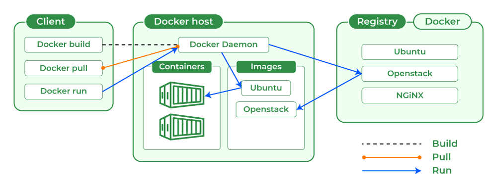

# Contents

- [Docker](#docker)
  - [Containers vs Virtual Machines](#containers-vs-virtual-machines)
  - [Docker CLI vs Docker Desktop](#docker-cli-vs-docker-desktop)
  - [Key Concepts](#key-concepts-of-docker)
  - [Real-World Analogy](#real-world-analogy-of-docker)
  - [Example of Using Docker](#example-of-docker)
  - [What happens under the hood](#what-happens-under-the-hood)
  - [Most Used Command](#most-used-command)
  - [Most Used Flags](#most-used-flags)
  - [Docker Tag](#docker-tag)
  - [Ports in Docker](#ports-in-docker)
  - [Docker Image vs Docker Container](#docker-image-vs-docker-container)
  - [Docker Architecture](#docker-architecture)
    - [Docker Client](#docker-client)
    - [Docker Daemon](#docker-daemon-dockerd)
    - [Docker Registry](#docker-registry)
    - [Docker Images](#docker-images)
    - [Docker Containers](#docker-containers)
    - [Example Workflow](#example-workflow-of-docker-architecture)
    - [Supporting Elements](#supporting-elements-in-docker-architecture)
      - [Docker Engine](#docker-engine)
      - [Storage & Networking](#storage--networking)
  - [Linux Features](#linux-features)
  - [Internal Docker Workflow](#internal-docker-workflow)
  - [Internal Architecture](#internal-architecture)
  - [Others Concepts of Docker](#others-concepts-of-docker)
    - [Detach Mode](#detach-mode)
    - [Memory Uses](#memory-uses)
- [Dockerfile](#dockerfile)
  - [Common Instructions](#common-dockerfile-instructions)
  - [Step-by-Step Explanation](#step-by-step-explanation)
  - [Dockerfile to Image](#dockerfile-to-image)
  - [Tips for Dockerfile](#tips-for-dockerfile)
  - [`dockerignore`](#dockerignore)
- [Docker Compose](#docker-compose)
  - [Example](#example-of-docker-compose)
    - [How it works](#how-it-works)
  - [Most Used Command](#most-used-command-of-docker-compose)
- [`docker-compose.yml`](#docker-composeyml)
  - [Key Fields](#key-fields-of-docker-composeyml)
  - [Basic Structure](#basic-structure-of-docker-composeyml)
  - [`.env` File Support](#env-file-support)
- [Comparison of Docker and Docker Compose](#comparison-of-docker-and-docker-compose)
  - [Relationship Between Docker and Docker Compose](#relationship-between-docker-and-docker-compose)
  - [Differences Between Docker and Docker Compose](#differences-between-docker-and-docker-compose)
  - [Run app with Docker alone (manually)](#run-app-with-docker-alone-manually)
  - [Run app with Docker Compose](#run-app-with-docker-compose)
  - [Clean Up Docker](#clean-up-docker)
- [Docker Hub](#dockerhub)
  - [Key Features](#key-features-of-docker-hub)
  - [Docker Hub Workflow](#basic-docker-hub-workflow)
- [Docker Volume](#docker-volume)
  - [Types of Docker Storage](#types-of-docker-storage)
  - [Example of Creating and Using a Volume](#example-of-creating-and-using-a-volume)
  - [Docker Compose setup for Docker Volume](#docker-compose-setup-for-docker-volume)
  - [Manage Volumes](#manage-volumes)
- [Docker Network](#docker-network)
  - [Types of Docker Networks](#types-of-docker-networks)
  - [Default Docker Networks](#default-docker-networks)
  - [Custom Bridge Network](#example-using-a-custom-bridge-network)
  - [Docker Compose setup for Docker Network](#docker-compose-setup-for-docker-network)
  - [Benefits of Custom Bridge Networks](#benefits-of-custom-bridge-networks)
  - [Docker Compose and Networking](#docker-compose-and-networking)
- [Run Microservices with docker](#run-microservices-with-docker)
  - [Services](#services)
  - [Architecture](#architecture)
  - [Dockerfile](#dockerfile-1)
  - [`docker-compose.yml`](#docker-composeyml-1)
  - [Running Everything](#running-everything)
- [GitHub Actions](#github-actions)
  - [Key Concepts](#key-concepts-of-github-actions)
  - [Folder Structure](#folder-structure-of-github-actions)
  - [Sample Workflow](#sample-github-actions-workflow)
  - [Events in GitHub Actions](#events-in-github-actions)
  - [Jobs in GitHub Actions](#jobs-in-github-actions)
  - [Types of Job](#types-of-job)
  - [Example of Full Stack Application](#example-of-full-stack-application)

# Docker

## Key Concepts of Docker

| Concept           | Description                                                                                                                |
| ----------------- | -------------------------------------------------------------------------------------------------------------------------- |
| **Image**         | A **read-only template** with instructions to create a container. Think of it like a snapshot of your app and environment. |
| **Container**     | A **running instance of an image**. It’s isolated, lightweight, and portable.                                              |
| **Dockerfile**    | A **text file** with step-by-step instructions to build a Docker image.                                                    |
| **Docker Hub**    | A **cloud-based registry** where Docker users can share images.                                                            |
| **Docker Engine** | The **runtime** that builds and runs containers.                                                                           |

## Real-World Analogy of Docker

Imagine a shipping company:

- A Docker Image is like the blueprint of a product.
- A Container is like a sealed shipping container holding a product.
- No matter which ship (environment) you put the container on, it works the same way.

## Example of Docker

**Project Structure:**

```
myapp/
├── app.js
├── package.json
└── Dockerfile
```

**Dockerfile:**

```Dockerfile
# Use official Node.js image as base
FROM node:18

# Create app directory
WORKDIR /usr/src/app

# Copy dependency files
COPY package*.json ./

# Install dependencies
RUN npm install

# Copy app source
COPY . .

# Expose port 3000
EXPOSE 3000

# Command to run the app
CMD ["npm", "start"]
```

- The difference between `.` and `./` is stylistic, not functional.

- `WORKDIR` directory:

  - exists only inside the container, not on your host machine (i.e., your laptop), unless you explicitly mount a volume.
  - Is virtual — created inside the container’s isolated filesystem (which Docker builds from the base image like `node:18`).
  - It has no direct link to a folder on your laptop unless you create that link with Docker volumes (`-v`).

**Where all the build image actually located?**

Docker Desktop uses a VM (Hyper-V or WSL2) to run the Docker daemon. So images are not stored directly in your Windows filesystem. Instead:

- WSL2 backend (default):

  - Docker stores images inside the WSL2 virtual filesystem.
  - You can find them in the WSL2 VM, not as normal files.
  - Example path inside WSL2: `/var/lib/docker/overlay2/…`
  - You can access WSL2 with:

    ```bash
    wsl -d docker-desktop
    ```

- Hyper-V backend (older Docker Desktop):
  - Images are stored inside the Hyper-V virtual disk.

**When Does It Connect to Your Laptop?**

Only if you bind a volume like:

```shell
docker run -v /host/path:/usr/src/app your-image
```

Then `/usr/src/app` in the container will map to `/host/path` on your real laptop. Without this, it's completely isolated.

### How to Run Docker File

1. **Build the image**

   ```shell
   docker build -t my-node-app .
   ```

2. **Run the container**

   ```shell
   docker run -p 3000:3000 my-node-app
   ```

## What happens under the hood

1. Docker reads the Dockerfile to build a custom image.
2. That image is stored locally.
3. When you run the container:
   - It spins up a lightweight virtual environment.
   - Maps port 3000 on your machine to port 3000 in the container.
   - Executes the app inside the isolated container.

## Docker Image vs Docker Container

| Feature        | **Docker Image**                                                                               | **Docker Container**                                                                         |
| -------------- | ---------------------------------------------------------------------------------------------- | -------------------------------------------------------------------------------------------- |
| **Definition** | A **read-only template** with instructions to create a container (like a snapshot of a system) | A **runtime instance** of a Docker image (like a running virtual machine based on the image) |
| **State**      | Static                                                                                         | Dynamic                                                                                      |
| **Mutability** | Immutable                                                                                      | Mutable                                                                                      |
| **Usage**      | Used to create containers                                                                      | Used to run the application                                                                  |
| **Storage**    | Stored on disk as a layered file system                                                        | Stored in memory and disk during runtime                                                     |
| **Lifecycle**  | Built once; does not change                                                                    | Created, started, stopped, restarted, deleted                                                |
| **Example**    | `node:18`, `ubuntu:22.04`, `nginx:alpine`                                                      | A running instance of `node:18` that serves your Node.js app                                 |
| **Analogy**    | Class (blueprint) in OOP                                                                       | Object (instance) in OOP                                                                     |

### Docker Image

A Docker image is immutable, meaning:

- Once built, it does not change.
- All the layers (created from the Dockerfile commands) are read-only.
- If you want to "change" an image, you must build a new one.

**Read-Only File System:** When Docker creates an image, it consists of layers. Each layer is read-only and stacked on top of each other.

**Base Images vs Child Images**

- Base image: Doesn’t depend on any other image (e.g., ubuntu, alpine).
- Child image: Built on top of another image (e.g., your app built on top of python:3.11).

### Docker Container

A Docker container is mutable, meaning:

- While it runs, you can change files, write logs, install packages, etc.
- It has a read-write(I/O) layer on top of the image’s read-only layers.
- These changes only exist inside that container.

**Read-Write Layer:**

- When a container starts from an image, Docker adds a thin writable layer.
- All file changes (create, delete, modify) happen in this top layer.
- Underneath, the image’s layers are still read-only.

## Docker Architecture

Docker is a client–server architecture for building, shipping, and running applications in containers.
It has three main components:

1. Docker Client
2. Docker Daemon (Server)
3. Docker Registry

Alongside these, Docker uses images and containers as the building blocks.



### Core Components and Their Roles

#### Docker Client

- Command-line tool (`docker`) or GUI tool (like Docker Desktop).
- Used by the user to interact with Docker (e.g., `docker build`, `docker run`).
- Sends commands to the Docker daemon via REST API over Unix socket or network.

```shell
docker run hello-world
```

This sends a request to the daemon to create and start a container from the `hello-world` image.

#### Docker Daemon (`dockerd`)

- Runs in the background on your host machine.
- Responsible for:
  - Building, running, and distributing containers.
  - Managing images, networks, and volumes.
- Listens for Docker API requests from the client.

**Workflow:**

```
Client → API request → Daemon pulls image → Creates container → Runs container.
```

#### Docker Registry

- A place to store and distribute Docker images.
- Default public registry: Docker Hub.
- You can have private registries too (e.g., AWS ECR, GitHub Container Registry).
- When you run a container with an image that doesn’t exist locally, the daemon pulls it from a registry.

#### Docker Images

- Read-only templates used to create containers.
- Built using a Dockerfile (instructions + base image).
- Layered file system — each instruction in a Dockerfile creates a new image layer (via Union File System).

#### Docker Containers

- Running instances of Docker images.
- They have:
  - Isolated filesystem (from the host).
  - Their own CPU, memory, network namespace.
- Containers are lightweight because they share the host OS kernel.

### Example Workflow of Docker Architecture

1. Docker Client command:

```bash
docker run -d -p 8080:80 nginx
```

2. Docker Daemon actions:

   - Checks if `nginx` image exists locally.
   - If not, pulls it from Docker Hub registry.
   - Creates a container from that image.
   - Starts it.

3. Registry:
   - Supplies the nginx image to the daemon.
4. Image:
   - `nginx` image contains everything needed to run Nginx server.
5. Container:
   - A running instance of Nginx server, accessible on `http://localhost:8080`.

### Supporting Elements in Docker Architecture

#### Docker Engine

- Combines:
  - Docker Daemon
  - Docker REST API
  - Docker CLI
- Available for Linux, Windows, Mac.

#### Storage & Networking

**Storage:**

- Images are stored in /var/lib/docker on Linux by default.
- Persistent data stored via volumes or bind mounts.

**Networking:**

- Bridge network (default)
- Host network
- Overlay networks (for multi-host setups)

### How the Architecture Works Together

Let’s walk through docker run nginx:

1. Docker Client sends docker run nginx to Docker Daemon.
2. Docker Daemon checks if the nginx image exists locally:
   - If not, it pulls from Docker Hub.
3. Daemon creates a container from the nginx image.
4. Daemon sets up:
   - Filesystem from image layers
   - Network bridge
   - Container ID & metadata
5. The container starts and serves on port 80 inside the isolated environment.

## Linux Features

When Docker says “lightweight,” it means it doesn’t simulate an entire OS like a virtual machine.
Instead, it uses Linux kernel features to isolate processes while sharing the same kernel.

The three main building blocks are.

### Namespaces – Isolation

Namespaces create separate views of system resources for each container.
When you run a container, the Docker daemon starts a process inside its own set of namespaces.

Types of namespaces Docker uses:

| Namespace | Purpose                    | Example                                                   |
| --------- | -------------------------- | --------------------------------------------------------- |
| **PID**   | Process IDs                | Container has its own PID 1, doesn’t see host processes.  |
| **NET**   | Networking                 | Each container has its own IP, routing table, interfaces. |
| **IPC**   | Interprocess Communication | Separate shared memory and semaphores.                    |
| **MNT**   | Mount points               | Isolated filesystem view.                                 |
| **UTS**   | Hostname                   | Container can have its own hostname.                      |
| **USER**  | User IDs                   | Map container users to host users for security.           |

Example: Inside a container, running `ps aux` only shows processes from that container.

### cgroups – Resource Limiting

Control Groups (cgroups) control how much CPU, memory, I/O, etc., a container can use.

- Limit memory usage: `docker run --memory="256m" ...`
- Limit CPU usage: `docker run --cpus="1.5" ...`

Without cgroups, one container could hog all resources.

### Union File System (OverlayFS) – Layered Images

Docker images are made up of read-only layers stacked together, plus a read-write layer for the container.

- Base layer (e.g., `python:3.10-slim`)
- Application layer (your code, dependencies)
- Read-write layer (changes while container runs)

When a container stops, the writable layer can be removed (`--rm`) or persisted with a volume.

## Internal Docker Workflow

Let’s trace `docker run nginx` step-by-step with internals:

1. Docker Client → Docker Daemon
   CLI sends API call over Unix socket `/var/run/docker.sock`.

2. Image Check
   Daemon checks local storage for `nginx` image. If missing, pulls from registry.

3. Create Container Metadata

Daemon prepares JSON metadata:

- Container ID
- Namespace mappings
- cgroup configs
- Network settings

4. Filesystem Setup

Using OverlayFS:

- Mounts read-only image layers.
- Adds a writable layer.

5. Namespace & cgroup Creation

Kernel creates:

- PID namespace → isolated process table.
- NET namespace → veth interface + bridge.
- MNT namespace → mount image layers as root filesystem.
- IPC, UTS, USER namespaces.

6. Container Process Start

   Daemon executes the container’s entrypoint command (`nginx -g 'daemon off;'`) inside these namespaces with applied cgroup limits.

## Internal Architecture

```
+-------------------------------------------------------+
| Docker Client                                         |
|   CLI / REST API                                      |
+--------------------------+----------------------------+
                           |
                           v
+-------------------------------------------------------+
| Docker Daemon (dockerd)                               |
| - Manages images, containers, volumes, networks       |
| - Talks to kernel for namespaces & cgroups            |
+--------------------------+----------------------------+
                           |
      +--------------------+--------------------+
      |                    |                    |
      v                    v                    v
+-----------+        +-----------+        +-----------+
| Namespaces|        | cgroups   |        | OverlayFS |
| (PID, NET)|        | CPU, Mem  |        | Layers    |
+-----------+        +-----------+        +-----------+
```

## Others Concepts of Docker

### Detach mode

Detach mode (`--detach` or `-d`) in Docker is a way to run containers in the background instead of attaching to their terminal output.

**Detach Mode:**

- Start the container
- Run it in the background (like a background process)
- Print just the container ID
- Not show the container’s logs/output in your terminal
- You cannot provide interactive(`-i`) input (input()) to a container running detached.

**Common Use Cases:**

- Running web servers (e.g., Nginx, Node.js, Django)
- Background services like databases (PostgreSQL, Redis)
- Any long-running processes where you don’t need to interact immediately

#### Compare With Foreground Mode

| Mode                 | Command         | Behavior                                |
| -------------------- | --------------- | --------------------------------------- |
| Foreground (default) | `docker run`    | You see logs and interact via terminal  |
| Detached             | `docker run -d` | No logs in terminal, runs in background |

### Memory Uses

#### Real-Time Stats for All Containers

Run `docker stats`

Output:

```bash
CONTAINER ID   NAME         CPU %     MEM USAGE / LIMIT     MEM %     ...
abc123         my-app       2.34%     150MiB / 1.95GiB       7.69%     ...
```

- MEM USAGE / LIMIT: Current memory used by the container and the total available
- MEM %: How much of its memory limit the container is using
  This is the best command for live monitoring per container.

#### Detailed stats

```bash
docker container inspect <container_id_or_name>
```

This gives a JSON output. For memory limits or usage, look under the `HostConfig` and `MemoryStats` fields (e.g., if you've set memory limits).

# Dockerfile

A Dockerfile is a text file containing a set of instructions used to build a Docker image. It automates the process of packaging your application, its dependencies, environment settings, and configuration.

Think of a Dockerfile as a recipe to create a container image.


## Step-by-Step Explanation

| Line                    | Meaning                                                             |
| ----------------------- | ------------------------------------------------------------------- |
| `FROM node:18`          | Uses the official Node.js v18 image from Docker Hub as the base     |
| `WORKDIR /usr/src/app`  | Sets `/usr/src/app` as the working directory in the container       |
| `COPY package*.json ./` | Copies dependency files first (for optimized caching)               |
| `RUN npm install`       | Installs Node.js dependencies                                       |
| `COPY . .`              | Copies all files in current dir (host) into working dir (container) |
| `EXPOSE 3000`           | Declares that the app will use port 3000                            |
| `CMD ["npm", "start"]`  | Default command that starts the Node.js app                         |

## Dockerfile to Image

Here’s what happens when you run:

```bash
docker build -t my-app .
```

1. Docker reads the `Dockerfile` line by line.
2. Each instruction (`FROM`, `COPY`, `RUN`, etc.) becomes a layer.
3. Docker caches each layer — if nothing changes, it reuses the previous build.
4. Docker assembles these layers into a final image.
5. You can now run the image as a container.

**Layered Architecture: Why It Matters**

- Each Dockerfile instruction creates a new image layer.
- Layers are stacked and cached.
- Docker only rebuilds layers that changed — this is key for fast rebuilds.

You can inspect image layers using:

```bash
docker history my-node-app
```

### Docker Layers

Every command in a Dockerfile creates a layer in the final image.

Layers are:

- Read-only snapshots
- Stacked on top of each other
- Reused (cached) if they haven't changed

Docker uses these layers to build images efficiently and speed up rebuilds.

Each layer is content-addressed via its SHA256 hash, so if the content is the same, the hash is the same — no reupload needed.

**Visual Representation:**

```yaml
Docker Image:
┌────────────────────────────┐
│ Layer 7: CMD               │ ← default command
├────────────────────────────┤
│ Layer 6: EXPOSE 3000       │
├────────────────────────────┤
│ Layer 5: COPY . .          │ ← your app code
├────────────────────────────┤
│ Layer 4: RUN npm install   │ ← dependencies
├────────────────────────────┤
│ Layer 3: COPY package*.json│
├────────────────────────────┤
│ Layer 2: WORKDIR /app      │
├────────────────────────────┤
│ Layer 1: FROM node:18      │ ← base image
└────────────────────────────┘
```

Each layer is:

- Immutable (cannot be changed after it’s built)
- Shared across images (saves disk space)
- Cacheable (saves build time)

**How Layering Helps**

Imagine you're baking a cake (your app). Each ingredient is a layer:

- Base (e.g., flour + sugar)
- Add eggs
- Add chocolate
- Bake

If next time you just change the frosting (top layer), you don’t need to redo the earlier steps. Same logic with Docker.

### Why not copy all files first, then install dependencies?

When Docker builds an image from a `Dockerfile`, it processes each instruction (like `COPY`, `RUN`, etc.) as a separate layer.

If a layer hasn't changed, Docker will reuse the cached layer from the last build.
But if anything changes in that layer (or in any previous one), Docker rebuilds all subsequent layers.

That’s key to understanding this technique.

#### Step: 1 `COPY package*.json ./`

You are copying only `package.json` and `package-lock.json` (if it exists) into the Docker image.

These files define your app's dependencies.

Why this first?

- These files don’t change often compared to your source code.
- So Docker can cache the `RUN npm install` step that comes next.
- It avoids reinstalling dependencies every time you change your source code.

#### Step 2: `RUN npm install`

Now that `package*.json` is present, you install dependencies.

Normally this takes time (downloading packages from npm).

But Docker checks:

Has `package.json` changed since last build?

- If no, Docker uses the cached result of npm install.
- If yes, Docker runs `npm install` again.

Result: Much faster builds when you only change app code.

#### Step 3: `COPY . .`

Now that dependencies are installed and cached, you copy the rest of your app — source files, configuration, assets, etc.

This includes:

- Your `src/` folder
- Any `*.js`, `*.ts` files
- README, `.env`, etc.

Even if this part changes, Docker won't redo npm install, because that already happened in a previous cached layer.

#### What Happens If You Don’t Do This?

Suppose you did this instead:

```Dockerfile
COPY . .
RUN npm install
```

Now if any file in your project changes — a `.js` file, a README, a `.env`, etc.:

Docker sees the `COPY . .` step as changed

- It invalidates the cache
- It re-runs `RUN npm install`
- Slow builds every time

Even if you didn't change any dependencies, Docker would reinstall them, which is costly.

### Reduce Docker Layers

- **Use `.dockerignore` Properly:** Reduce the build context size, which reduces time and avoids unnecessary layers.
- **Use Minimal Base Images:** Choose lighter base images like `alpine`, `debian-slim`, or `distroless`.
- **Avoid `ADD` Unless Needed:** `ADD` does more than `COPY` (e.g., extracting archives, downloading URLs), which can add unintended complexity and layers.

#### Combine `RUN` Instructions

Each `RUN` command creates a layer. Combine them with `&&` to create a single layer.

Bad (multiple layers)

```dockerfile
RUN apt update
RUN apt install -y curl
RUN apt install -y git
```

Good (single layer)

```dockerfile
RUN apt update && \
    apt install -y curl git && \
    rm -rf /var/lib/apt/lists/*
```

`rm -rf /var/lib/apt/lists/*` cleans up cache to reduce final image size.

#### Chain `COPY` Instructions

Instead of multiple `COPY`, combine files into one instruction if they are from the same directory.

Bad

```dockerfile
COPY package.json .
COPY package-lock.json .
COPY src/ src/
```

Good

```dockerfile
COPY . .
```

Note: This only works if you're excluding unneeded files via `.dockerignore`.

## Tips for Dockerfile

- Always start with the most stable or slim base image you need (`node:alpine` is smaller).
- Use `COPY package*.json ./` before copying the whole source to leverage caching.
- Use `.dockerignore` to exclude unnecessary files (like `node_modules` or `.git`).
- Combine commands with `&&` in `RUN` to reduce image layers.

## `dockerignore`

Like `.gitignore`, `dockerignore` helps keep your image clean

```
node_modules
.git
*.log
Dockerfile
.dockerignore
```

### Best Practices for .dockerignore

- Always exclude:
  - `.git`, `.svn`, `.hg` (version control)
  - `node_modules`, `vendor`, `target` (dependencies)
  - `*.log`, `tmp/`, `cache/` (runtime files)
  - `.env`, API keys, secrets
- Keep `.dockerignore` in sync with `.gitignore`, but don’t blindly copy (sometimes you need files in Git but not in Docker, or vice versa).
- Test by running:

```bash
docker build -t testapp .
docker run -it --rm testapp sh
```

Then check if excluded files are inside the image.

# Docker Compose

Docker Compose is a tool for defining and running multi-container Docker applications using a simple YAML file (`docker-compose.yml`).

**Benefits:**

- Manage multiple services (e.g., web + database).
- Use one command (`docker-compose up`) to start everything.
- Networking between containers is handled automatically.

## Example of Docker Compose

`docker-compose.yml`

```yaml
version: "3.8"

services:
  web:
    build: .
    ports:
      - "3000:3000"
    depends_on:
      - mongo

  mongo:
    image: mongo:6
    ports:
      - "27017:27017"
    volumes:
      - mongo-data:/data/db

volumes:
  mongo-data:
```

### Run Docker Comppose

**Start All Services:**

```shell
docker-compose up
```

- It builds the Node.js app container.
- Pulls MongoDB image.
- Sets up a network so the `web` container can talk to `mongo`.

### How it works

| Component         | Role                                     |
| ----------------- | ---------------------------------------- |
| **web** service   | Builds and runs your Node.js app.        |
| **mongo** service | Runs MongoDB as a database container.    |
| `depends_on`      | Ensures MongoDB starts before Node.js.   |
| **Volumes**       | Data persists across container restarts. |

## Most Used Command of Docker Compose

| Command                                  | Description                                                        |
| ---------------------------------------- | ------------------------------------------------------------------ |
| `docker-compose up`                      | Start all services defined in `docker-compose.yml`                 |
| `docker-compose up -d --build`           | Starts all services in the background and rebuilds them if needed. |
| `docker-compose up -d`                   | Start all services in **detached** mode                            |
| `docker-compose down`                    | Stop and remove all containers, networks, volumes                  |
| `docker-compose build`                   | Build or rebuild services                                          |
| `docker-compose pull`                    | Pull service images from the registry                              |
| `docker-compose stop`                    | Stop all services                                                  |
| `docker-compose start`                   | Start stopped services                                             |
| `docker-compose restart`                 | Restart services                                                   |
| `docker-compose logs`                    | View logs from all services                                        |
| `docker-compose logs -f`                 | Follow logs (like `tail -f`)                                       |
| `docker-compose ps`                      | List running containers from Compose                               |
| `docker-compose exec <service> bash`     | Open a shell inside a running service                              |
| `docker-compose run <service> <command>` | Run a one-off command in a new container                           |
| `docker-compose config`                  | Validate and view the final merged configuration                   |
| `docker-compose down -v`                 | Remove volumes as well                                             |
| `docker-compose rm`                      | Remove stopped service containers                                  |

# `docker-compose.yml`

`docker-compose.yml` is a configuration file used by Docker Compose, a tool that allows you to define and run multi-container Docker applications.

Instead of running individual `docker build`, `docker run`, or `docker network` commands manually, Compose lets you declare everything in one file and run it.

## Key Fields of docker-compose.yml

| Field         | Description                                               |
| ------------- | --------------------------------------------------------- |
| `version`     | Compose file format version (3.8 is common)               |
| `services`    | Main section containing definitions for each container    |
| `build`       | Tells Docker to build an image using the local Dockerfile |
| `image`       | Use an existing image from Docker Hub or other registry   |
| `ports`       | Maps container ports to host ports                        |
| `volumes`     | Persist or share data between host and container          |
| `depends_on`  | Controls startup order of services                        |
| `environment` | Pass environment variables into the container             |
| `command`     | Override the default container command                    |

## Basic Structure of docker-compose.yml

```yaml
version: "3.8" # Define the Docker Compose file version

services: # Define all the containers (services)
  web: # Name of the first service (container)
    build: . # Build image from Dockerfile in current directory
    ports:
      - "3000:3000" # Map host:container ports
    depends_on:
      - db # Wait for db service to be ready

  db: # Name of second service (MongoDB/PostgreSQL/etc)
    image: mongo # Use an official image from Docker Hub
    ports:
      - "27017:27017" # Expose MongoDB port
```

### Breakdown

| Key           | Purpose                                                                           |
| ------------- | --------------------------------------------------------------------------------- |
| `web`         | Runs your Node.js app, builds image from `Dockerfile`, exposes port 3000          |
| `db`          | Pulls and runs official MongoDB image                                             |
| `depends_on`  | Ensures MongoDB starts before Node.js                                             |
| `volumes`     | - Web: syncs current code into container<br>- DB: saves MongoDB data persistently |
| `environment` | Sets `NODE_ENV=development` in the container                                      |

## `.env` File Support

You can move environment variables into a `.env` file:

```env
NODE_ENV=development
```

Then reference it in `docker-compose.yml`:

```yaml
environment:
  - NODE_ENV=${NODE_ENV}
```

# Comparison of Docker and Docker Compose

## Relationship Between Docker and Docker Compose

| Concept            | Description                                                                                                                |
| ------------------ | -------------------------------------------------------------------------------------------------------------------------- |
| **Docker**         | The **core platform** to build, run, and manage **containers**. It works with one container at a time (typically via CLI). |
| **Docker Compose** | A **tool built on top of Docker** to manage **multi-container applications** using a YAML file (`docker-compose.yml`).     |

Docker Compose uses Docker under the hood. It's not a replacement — it automates and simplifies Docker workflows for complex apps.

## Differences Between Docker and Docker Compose

| Feature           | Docker                                          | Docker Compose                               |
| ----------------- | ----------------------------------------------- | -------------------------------------------- |
| **Focus**         | Managing single containers (manually)           | Managing **multiple containers** as one app  |
| **Configuration** | CLI commands (e.g., `docker run`) or Dockerfile | `docker-compose.yml` (declarative YAML)      |
| **Complexity**    | Good for simple apps                            | Better for full stack / multi-service apps   |
| **Networking**    | Must be created manually                        | Automatic private network between services   |
| **Startup**       | One container at a time                         | Starts all services with `docker-compose up` |
| **Use Cases**     | Running a single service or debugging           | Web apps with backend, database, cache, etc. |

## Run app with Docker alone (manually)

It will required multiple command

```shell
# Step 1: Build the app image
docker build -t my-node-app .

# Step 2: Run MongoDB container (manual network setup required)
docker network create myapp-network
docker run -d --name mongo --network myapp-network mongo:6

# Step 3: Run Node.js container and connect it to MongoDB
docker run -d -p 3000:3000 --name web \
  --network myapp-network my-node-app
```

**Downsides:**

- More commands
- You must manage the network, naming, and startup order manually
- No single source of truth for the stack

## Run app with Docker Compose

Just create `docker-compose.yml` and run

```shell
docker-compose up
```

**Benefits:**

- All services start with one command
- Network and service linking is automatic
- Easy to modify/configure
- Cleaner teardown: docker-compose down

## Clean Up Docker

```shell
# Docker Compose
docker-compose down

# Docker manual
docker rm -f web mongo
docker network rm myapp-network
```

# Docker Storage

Understanding where Docker containers, images, WORKDIR, and volumes live on your hard drive is crucial for troubleshooting, performance tuning, and disk management.

## Docker Image

### Location

- Linux (default storage driver: `overlay2`):
  `/var/lib/docker/overlay2/`

- Windows (Docker Desktop, WSL2 backend):
  Inside the WSL2 VM (not directly in C: drive)

- macOS (Docker Desktop):
  Inside the Docker VM disk image:
  `~/Library/Containers/com.docker.docker/Data/vms/0/`

### Example:

When you pull an image like:

```bash
docker pull nginx
```

Docker stores image layers in:

```bash
/var/lib/docker/overlay2/<layer_id>/
```

Each layer is a directory with the file system diff, managed by OverlayFS (on Linux). You don’t interact with this directly, but it's how the image's root filesystem is built.

## Docker Container

### Location:

- Linux:
  `/var/lib/docker/containers/<container_id>/`

- Windows/macOS (Docker Desktop):
  Stored in the internal Docker VM's disk image.

### Example:

If you run a container:

```bash
docker run --name test-nginx -d nginx
```

Docker will create a directory like:

```bash
/var/lib/docker/containers/90d3a3bc8.../
```

That directory includes:

- The container's logs
- Metadata (`config.v2.json`)
- Mount points

However, the actual filesystem seen by the container is layered with the image via `overlay2`.

## `WORKDIR`

`WORKDIR` in Dockerfile sets the working directory inside the container filesystem for any `RUN`, `CMD`, or `ENTRYPOINT`.

### Location

Inside the container's own layered file system, not your host OS.

### Example

When you run the container built from the Dockerfile above, /app is created inside the container (not your machine), even if not pre-existing.

```bash
docker exec -it myapp bash
cd /app  # ← you are now inside the container's WORKDIR
```

So you won’t see `/app` on your host OS unless it's mounted via a volume.

## Docker Volume

### Location:

- Linux:
  `/var/lib/docker/volumes/<volume_name>/_data/`

- Windows/macOS (Docker Desktop):
  Stored in Docker's internal virtual disk.

### Example

```bash
docker volume create mydata
docker run -v mydata:/data busybox sh -c "echo hello > /data/hello.txt"
```

You’ll find:

```bash
/var/lib/docker/volumes/mydata/_data/hello.txt
```

This is outside the container, but mounted inside it, so containers can persist and share data.

## Diagram Summary of Wsl

```
Windows Filesystem (Host)
│
├── C:\Users\<YourName>\.docker\
│   └── (Configuration, not actual images/volumes)

├── \\wsl$\docker-desktop-data\
│   └── docker/
│       ├── containers/                ← Container metadata & logs
│       ├── overlay2/                  ← Image & container filesystem layers
│       ├── volumes/                   ← Named volumes
│       │   └── <volume_name>/
│       │       └── _data/
│       └── image/
│           └── overlay2/
│               └── imagedb/
│
├── \\wsl$\docker-desktop/            ← Runtime Linux VM used by Docker
│   └── (Active Linux Docker daemon)
│
└── (Optional) Bind Mount Paths
    └── C:\Users\<YourName>\project\   ← Mount to /app in container
```

It somewhere like `\\wsl.localhost\docker-desktop\mnt\docker-desktop-disk\data`.

## Desktop with WSL2 backend on Windows

### WSL2 Virtual Disk

Located at:

```shell
C:\Users\<YourName>\AppData\Local\Docker\wsl\data\ext4.vhdx
```

- This is the main virtual hard disk where Docker stores all images, containers, and volumes.
- It grows dynamically as you use Docker (but it never shrinks automatically).

### What Consumes the Most Space?

| Component      | What It Stores                         | Consumes Space? | Grows Over Time? |
| -------------- | -------------------------------------- | --------------- | ---------------- |
| **Images**     | Base OS, application binaries          | ✅ Yes          | ✅ Yes           |
| **Containers** | Runtime diffs, logs                    | ✅ Yes          | ✅ Yes           |
| **Volumes**    | Persistent app data (DBs, files)       | ✅ Yes          | ✅ Yes           |
| **ext4.vhdx**  | All the above, packed inside WSL2 disk | ✅ Yes          | ✅ Yes           |

## Move Docker Data to Another Drive

If you’re running low on space on C:, you can:

1. Stop Docker Desktop
2. Move `ext4.vhdx` to another drive (e.g., `D:\DockerData\ext4.vhdx`)
3. Use a symbolic link or change config (**advanced** setup)

# Docker Volume

A Docker Volume is a persistent storage mechanism used by Docker containers. Volumes allow data to exist independently of the container’s lifecycle—meaning the data will persist even if the container is deleted or recreated.

**Why Use Volumes?**

- **Persistence:** Data remains intact even if the container is removed.
- **Sharing:** Volumes can be shared between multiple containers.
- **Isolation from container file system:** Decouples data from the container's image.
- **Backup and Restore:** Easy to back up and restore.
- **Performance:** Optimized for Docker (better than bind mounts in most cases).

## Types of Docker Storage

| Storage Type | Location                                    | Persistent | Use Case                                         |
| ------------ | ------------------------------------------- | ---------- | ------------------------------------------------ |
| Volumes      | Docker-managed (`/var/lib/docker/volumes/`) | ✅ Yes     | Best for production                              |
| Bind Mounts  | User-defined path on host                   | ✅ Yes     | Specific host directory access                   |
| tmpfs Mounts | In-memory only                              | ❌ No      | Temporary data, disappears after container stops |

## Example of Creating and Using a Volume

### Step 1: Create a Docker Volume

```bash
docker volume create my_data_volume
```

This creates a volume named `my_data_volume`.

### Step 2: Use Volume in a Container

```bash
docker run -d \
  --name my_container \
  -v my_data_volume:/app/data \
  busybox \
  sh -c "echo Hello from container > /app/data/hello.txt && sleep 3600"
```

- `my_data_volume` - The name of the volume on your host or the hosts path
- `/app/data` - The mount point inside the container — this is where the volume will appear.

What this does:

- `-v my_data_volume:/app/data`: Mounts the volume into the container at `/app/data`.
- Writes `hello.txt` into the volume.
- Runs for 1 hour (`sleep 3600`) to allow us to inspect.
- To execute command inside the volume, just use `sh`.
- Run command `create` and `run` volume.

### Step 3: Inspect Volume Contents

To access the content, you can use another container:

```bash
docker run --rm -v my_data_volume:/data busybox ls /data
```

- To make the volume read-only use `ro` flag(eg. `-v my_data_volume:/data:ro`)

You’ll see: `hello.txt`

### Step 4: Delete the Original Container

```bash
docker rm -f my_container
```

Now the container is gone, but the volume (and its data) still exists!

### Between Host & Container

We can share data between host to container without creating docker volume by directly mounting host directory to container directory.

- `docker run -it --name container-name -v C:\Users\USER\...:/myapp python` - It create a container and allocate python run time for `container-name` at `/myapp` directory which files store at `C:\Users\USER\...`.
- `-it` is used so that you can interact with python shell
- `sh` is used so that you can interact at `/` directory and acess `/myapp` via `cd /myapp` and access all the files frome `C:\Users\USER\...` to `/myapp`.

### Between Container

To share a volume between two Docker containers, you can create a Docker volume and then mount it to both containers.

1. **Create volume then mount to container**
   ```shell
   docker run --name c1 -itd -v myvol:/myapp1 python
   docker run --name c2 -itd -v myvol:/myapp2 python
   ```
2. **Create Container with volume**
   ```bash
   docker run --name c1 -itd -v /myvol python
   docker run --name c2 -itd --volume-from c1 python
   ```
   This way volume are not persisted.

### Volume with Dockerfile

```Dockerfile
FROM ubuntu
VOLUME ["/data"]
```

- It tell docker to create a mount point for a volume inside the container. It specifies that the directory `/data` should be **treated** as a volume not the exact volume.
- It means that any data written to or read from the `/data` directory within the container will be stored outside the container in a volume.
- Note that the `VOLUME` instruction in the Dockerfile does not create the volume itself.
- It merely sets up the mount point within the container. The actual volume created when you run the container and specify a volume name or path using the `-v` flag.

### Where are Volumes Stored?

On the host machine, volumes live in:

```bash
/var/lib/docker/volumes/my_data_volume/_data
```

**You shouldn't modify this directly.**

## Docker Compose setup for Docker Volume

```yaml
version: "3.9"

services:
  mysql:
    image: mysql:8
    container_name: mysql_db
    environment:
      MYSQL_ROOT_PASSWORD: root123
      MYSQL_DATABASE: app_db
      MYSQL_USER: app_user
      MYSQL_PASSWORD: app_pass
    volumes:
      - mysql_data:/var/lib/mysql
    ports:
      - "3306:3306"

  node:
    build: ./node
    container_name: node_app
    depends_on:
      - mysql
    environment:
      DB_HOST: mysql
      DB_USER: app_user
      DB_PASSWORD: app_pass
      DB_NAME: app_db
    ports:
      - "3000:3000"
    volumes:
      - ./node:/app

volumes:
  mysql_data:
```

## Manage Volumes

| Command                                | Description           |
| -------------------------------------- | --------------------- |
| `docker volume ls`                     | List volumes          |
| `docker volume inspect my_data_volume` | View volume details   |
| `docker volume rm my_data_volume`      | Delete a volume       |
| `docker volume prune`                  | Delete unused volumes |

## Methods for Persisting Data

Docker provides two main mechanisms:

**When to Use What?**
| Use Case | Best Option |
| ------------------------------------------- | -------------- |
| Database storage (MySQL, Postgres, MongoDB) | **Volume** |
| Development (live code changes) | **Bind Mount** |
| Sharing data across multiple containers | **Volume** |
| Temporary testing (no need to persist) | No mount |

### Volumes (Preferred)

- Managed by Docker (`/var/lib/docker/volumes/...`).
- Independent of the container lifecycle.
- Can be shared across multiple containers.
- Portable between environments.

### Bind Mounts

- Map a host directory/file to a container directory.
- Useful for development (e.g., editing code on host, auto-updates in container).
- Not as portable → depends on host file paths.

# Docker Network

Docker networking enables communication between containers and the host system or the internet. By default, Docker sets up several types of networks when installed. You can also define your own custom networks depending on your requirements.

## Types of Docker Networks

| Network Type        | Description                                                                                   |
| ------------------- | --------------------------------------------------------------------------------------------- |
| **bridge**          | Default network for standalone containers. Allows containers to communicate on the same host. |
| **host**            | Removes the network isolation. Container shares the host’s networking namespace.              |
| **none**            | Container is isolated from all networks. No internet or inter-container access.               |
| **overlay**         | Allows containers running on different Docker hosts (in a swarm) to communicate securely.     |
| **macvlan**         | Assigns a MAC address to a container, making it appear as a physical network device.          |
| **custom networks** | User-defined bridge or overlay networks, more flexible and preferred for microservices.       |

### Bridge (default)

- Containers get an internal IP (usually `172.17.x.x`).
- They can talk to each other if attached to the same bridge network.
- You can map ports to expose services.

```bash
docker run -d --name web1 nginx
docker run -d --name web2 nginx
```

- Both are attached to `bridge` network.
- They each get a private IP (`172.17.0.x`).
- They cannot reach each other by name unless you create a custom bridge network.

Check IPs:

```bash
docker inspect -f '{{range .NetworkSettings.Networks}}{{.IPAddress}}{{end}}' web1
```

**What Happens with Default `bridge`?**

If you didn’t use a custom network and just ran both containers on the default bridge, you would not get automatic DNS resolution. You’d need to connect using IP addresses, which can change every time a container restarts.

That’s why custom networks are preferred.

#### Custom Bridge Newtowrk

With a custom bridge network, Docker sets up automatic DNS-based service discovery.

```bash
# Create a custom network
docker network create mynet

# Run containers on this network
docker run -d --name db --network mynet mysql:8.0
docker run -d --name app --network mynet nginx
```

- Both `db` and `app` containers are in `mynet`.
- `app` can reach `db` using the container name `db` instead of IP.

Inside app:

```bash
docker exec -it app ping db
```

### Host

- The container shares the host’s network stack.
- No isolation (useful for performance or if container needs to bind to host network).

```bash
docker run -d --network host --name mynginx nginx
```

- The container shares the host’s network stack.
- Nginx runs directly on host ports (e.g., `localhost:80`) without port mapping.
- Useful for high-performance networking or when apps need host’s IP.
- Downside: No isolation → security risk.

### None

- No network access.
- Useful for security or jobs that don’t need networking.

```bash
docker run -d --network none --name isolated busybox sleep 1000
```

- Container has no network access (no internet, no communication with others).
- Good for security-sensitive workloads.

## Default Docker Networks

```bash
docker network ls
```

Example Output:

```bash
NETWORK ID     NAME      DRIVER    SCOPE
b1f7...        bridge    bridge    local
29f7...        host      host      local
9a7a...        none      null      local
```

## Example: Using a Custom Bridge Network

### Step 1: Create a Custom Bridge Network

```bash
docker network create my_custom_network
```

This creates a bridge network named `my_custom_network`. It allows containers to resolve each other by name and communicate internally.

### Step 2: Create Two Containers on That Network

```bash
docker run -dit --name container1 --network my_custom_network alpine sh
docker run -dit --name container2 --network my_custom_network alpine sh
```

These are two Alpine containers running in the same custom network.

### Step 3: Test Communication Between Containers

Now enter into one container and ping the other by container name:

```bash
docker exec -it container1 sh
```

Inside the container:

```bash
ping container2
```

You should see ping replies — meaning the two containers can communicate using DNS resolution (via container names) on the same network.

## Docker Compose setup for Docker Network

```yaml
version: "3"
services:
  app:
    build: .
    depends_on:
      - mongo
  mongo:
    image: mongo
    environment:
      MONGO_INITDB_ROOT_USERNAME: root
      MONGO_INITDB_ROOT_PASSWORD: example
```

## Benefits of Custom Bridge Networks

| Feature                     | Description                                                                   |
| --------------------------- | ----------------------------------------------------------------------------- |
| **DNS-based discovery**     | Containers can refer to each other by name (e.g., `container1`, `db`, `api`). |
| **Isolation**               | Services are isolated from other containers unless explicitly connected.      |
| **Better control**          | You can attach/disconnect containers dynamically from networks.               |
| **Port mapping not needed** | If containers are on the same custom network, you don’t need to expose ports. |

## Docker Compose and Networking

When using Docker Compose, all services in a file are automatically connected to a default network with DNS resolution:

```yaml
version: "3"
services:
  web:
    image: nginx
  app:
    image: node
```

Here, `web` and `app` can communicate using their service names (e.g., `http://web`, `http://app`).

# Run Microservices with docker0

## Services

| Service     | Tech Stack                   |
| ----------- | ---------------------------- |
| Auth API    | **Django** + **MySQL**       |
| User API    | **Node.js** + **MongoDB**    |
| Product API | **Node.js** + **PostgreSQL** |
| Order API   | **Node.js** + **MySQL**      |

## Architecture

```
microservices/
├── auth-service/         (Django + MySQL)
│   ├── Dockerfile
│   ├── requirements.txt
│   └── ...
├── user-service/         (Node.js + MongoDB)
│   ├── Dockerfile
│   ├── package.json
│   └── ...
├── product-service/      (Node.js + PostgreSQL)
│   ├── Dockerfile
│   ├── package.json
│   └── ...
├── order-service/        (Node.js + MySQL)
│   ├── Dockerfile
│   ├── package.json
│   └── ...
└── docker-compose.yml    ← main entry point
```

## Dockerfile

### `auth-service/Dockerfile`(Django)

```Dockerfile
FROM python:3.11
WORKDIR /app
COPY requirements.txt .
RUN pip install -r requirements.txt
COPY . .
CMD ["python", "manage.py", "runserver", "0.0.0.0:8000"]
```

### `user-service/Dockerfile` (Node.js + MongoDB)

```Dockerfile
FROM node:18
WORKDIR /app
COPY package*.json ./
RUN npm install
COPY . .
CMD ["npm", "start"]
```

## `docker-compose.yml`

```yaml
version: "3.8"

services:
  # ------------------ AUTH SERVICE (Django + MySQL) ------------------
  auth-db:
    image: mysql:8
    environment:
      MYSQL_ROOT_PASSWORD: root
      MYSQL_DATABASE: authdb
      MYSQL_USER: user
      MYSQL_PASSWORD: pass
    ports:
      - "3306:3306"
    volumes:
      - auth-db-data:/var/lib/mysql

  auth-service:
    build: ./auth-service
    command: python manage.py runserver 0.0.0.0:8000
    volumes:
      - ./auth-service:/app
    ports:
      - "8000:8000"
    depends_on:
      - auth-db
    environment:
      - DB_HOST=auth-db
      - DB_NAME=authdb
      - DB_USER=user
      - DB_PASSWORD=pass

  # ------------------ USER SERVICE (Node.js + MongoDB) ------------------
  user-db:
    image: mongo:6
    ports:
      - "27017:27017"
    volumes:
      - user-db-data:/data/db

  user-service:
    build: ./user-service
    volumes:
      - ./user-service:/app
    ports:
      - "8001:8001"
    depends_on:
      - user-db
    environment:
      - MONGO_URL=mongodb://user-db:27017/userdb

  # ------------------ PRODUCT SERVICE (Node.js + PostgreSQL) ------------------
  product-db:
    image: postgres:15
    environment:
      POSTGRES_USER: user
      POSTGRES_PASSWORD: pass
      POSTGRES_DB: productdb
    ports:
      - "5432:5432"
    volumes:
      - product-db-data:/var/lib/postgresql/data

  product-service:
    build: ./product-service
    volumes:
      - ./product-service:/app
    ports:
      - "8002:8002"
    depends_on:
      - product-db
    environment:
      - PG_HOST=product-db
      - PG_DB=productdb
      - PG_USER=user
      - PG_PASSWORD=pass

  # ------------------ ORDER SERVICE (Node.js + MySQL) ------------------
  order-db:
    image: mysql:8
    environment:
      MYSQL_ROOT_PASSWORD: root
      MYSQL_DATABASE: orderdb
      MYSQL_USER: user
      MYSQL_PASSWORD: pass
    ports:
      - "3307:3306"
    volumes:
      - order-db-data:/var/lib/mysql

  order-service:
    build: ./order-service
    volumes:
      - ./order-service:/app
    ports:
      - "8003:8003"
    depends_on:
      - order-db
    environment:
      - DB_HOST=order-db
      - DB_NAME=orderdb
      - DB_USER=user
      - DB_PASSWORD=pass

volumes:
  auth-db-data:
  user-db-data:
  product-db-data:
  order-db-data:
```

## Running Everything

From the microservices/ root directory, run:

```bash
docker-compose up --build
```

**Each service will:**

- Be built from its own Dockerfile
- Connect to its respective database via service name (e.g., `auth-db`, `user-db`)
- Expose on different ports (`8000`, `8001`, `8002`, `8003`)

# GitHub Actions

GitHub Actions is a CI/CD (Continuous Integration/Continuous Deployment) tool built into GitHub that allows you to automate workflows like building, testing, and deploying code whenever there is a change in your GitHub repository.

It uses YAML files to define workflows, and these files are stored in `.github/workflows/` directory of your repo.

**Real-World Use Cases**

1. **CI/CD for Web App** – Automatically run tests and deploy if all pass.
2. **Lint & Format Check** – Run ESLint or Prettier on every pull request.
3. **Scheduled Jobs** – Automatically back up data or run cron jobs.
4. **Docker Build & Push** – Build Docker images and push to Docker Hub.
5. **Deploy to AWS, Firebase, Netlify, etc.** – Auto-deploy after merging code.

**Advanced Features (Optional)**

- Matrix builds – Test code in multiple environments (e.g., different Node.js versions).
- Caching – Speed up builds by caching dependencies.
- Secrets – Store sensitive data like API keys.
- Reusable Workflows – Modularize and reuse your CI/CD logic across repos.

## Key Concepts of GitHub Actions

| Term         | Description                                                                                                         |
| ------------ | ------------------------------------------------------------------------------------------------------------------- |
| **Workflow** | Automated process triggered by an event (like push, pull request). Defined in `.yml` file.                          |
| **Event**    | Triggers the workflow (e.g., `push`, `pull_request`, `schedule`).                                                   |
| **Job**      | A set of steps executed on the same runner. Each job runs in its own virtual environment.                           |
| **Step**     | A single task within a job (e.g., run a script or use an action).                                                   |
| **Action**   | A reusable piece of code that performs a specific task. GitHub provides official actions or you can write your own. |
| **Runner**   | A server (GitHub-hosted or self-hosted) that runs your jobs.                                                        |

## Folder Structure of GitHub Actions

```
your-project/
├── .github/
│   └── workflows/
│       └── ci.yml   <-- your GitHub Actions workflow file
├── src/
├── tests/
└── package.json
```

## Sample GitHub Actions Workflow

```yaml
# .github/workflows/nodejs.yml
name: Node.js CI

on:
  push:
    branches: [main]
  pull_request:
    branches: [main]

jobs:
  build-and-test:
    runs-on: ubuntu-latest

    steps:
      - name: Checkout code
        uses: actions/checkout@v4

      - name: Setup Node.js
        uses: actions/setup-node@v4
        with:
          node-version: "18"

      - name: Install dependencies
        run: npm install

      - name: Run tests
        run: npm test
```

### Explanation of the Workflow

| Line                    | Description                                                                    |
| ----------------------- | ------------------------------------------------------------------------------ |
| `name: Node.js CI`      | Sets a name for the workflow.                                                  |
| `on:`                   | Defines events that trigger the workflow (`push` or `pull_request` to `main`). |
| `jobs:`                 | Defines a job called `build-and-test`.                                         |
| `runs-on:`              | Uses an Ubuntu virtual machine to run the job.                                 |
| `steps:`                | Sequence of tasks to execute.                                                  |
| `actions/checkout@v4`   | Checks out your repo code to the runner.                                       |
| `actions/setup-node@v4` | Sets up a Node.js environment.                                                 |
| `npm install`           | Installs dependencies.                                                         |
| `npm test`              | Runs the tests defined in your project.                                        |

## Events in GitHub Actions

Events are triggers that start your workflow. Here are the most commonly used ones:

### a. `push`

Triggers when code is pushed to the repository.

```yaml
on:
  push:
    branches: [main]
```

**Use case:** Run tests/build/deploy when you push to the main branch.

### b. `pull_request`

Triggers when a pull request is opened, updated, or reopened.

```yaml
on:
  pull_request:
    branches: [main]
```

**Use case:** Run lint/tests before merging PRs into the main branch.

### c. `workflow_dispatch`

Manually trigger the workflow from GitHub’s Actions tab.

```yaml
on:
  workflow_dispatch:
    inputs:
      environment:
        description: "Environment to deploy to"
        required: true
        default: "staging"
```

**Use case:** Manual deploy to staging/production by clicking a button.

### d. `schedule` (cron)

Run a workflow periodically using a cron schedule.

```yaml
on:
  schedule:
    - cron: "0 0 * * *" # Every day at midnight UTC
```

**Use case:** Daily backups, cleanup tasks, or scheduled checks.

### e. `release`

Trigger when a new GitHub release is published.

```yaml
on:
  release:
    types: [published]
```

**Use case:** Automatically publish packages or deploy when a release is made.

### Other Examples

- `issues`, `issue_comment`, `pull_request_review` — for automating GitHub issues.
- `deployment` — tied with GitHub Environments API.
- `push.tags` — trigger on tag push for versioning workflows.

## Jobs in GitHub Actions

A job is a group of steps that run together on the same runner. Jobs can run:

- Sequentially (one after another)
- In parallel (independently)
- Conditionally (based on results or input)

### Job Structure

```yaml
jobs:
  job_name:
    name: Descriptive Job Name
    runs-on: ubuntu-latest
    needs: [another_job] # Optional dependency
    if: <condition> # Optional conditional execution
    strategy: # Optional matrix build
      matrix:
        node: [16, 18]
    steps:
      - name: Step 1
        run: echo "Hello, world!"

      - name: Step 2
        uses: some/action@v1
```

#### Breakdown of Job Fields

| Key        | Description                                                                                  |
| ---------- | -------------------------------------------------------------------------------------------- |
| `job_name` | The internal identifier (used in `needs`).                                                   |
| `name`     | Optional human-readable label shown in GitHub UI.                                            |
| `runs-on`  | Required. Specifies the OS/runner (e.g., `ubuntu-latest`, `windows-latest`, `macos-latest`). |
| `needs`    | Optional. Makes the job **dependent** on another job’s success.                              |
| `if`       | Optional. Runs job **only if** the condition is true.                                        |
| `strategy` | Optional. Used for **matrix builds** (run job multiple times with different inputs).         |
| `steps`    | Required. List of **actions or shell commands** to execute in the job.                       |

### Inside `steps`: Common Syntax

Each job contains a list of steps, and each step can either:

1. Run shell commands using `run`, or
2. Use reusable actions with `uses`, or
3. Set outputs and environment variables.

#### `run`: Execute Shell Commands

```yaml
- name: Print a message
  run: echo "Hello World"
```

Shell commands run in `bash` (Linux/macOS) or `PowerShell` (Windows) depending on runner.

#### `uses`: Use a GitHub Action

```yaml
- name: Checkout code
  uses: actions/checkout@v4
```

Reusable actions from GitHub or your own repo.

#### `with`: Pass Inputs to Actions

```yaml
- name: Setup Node.js
  uses: actions/setup-node@v4
  with:
    node-version: "18"
```

Used when `uses`: is present.

#### `env`: Set Environment Variables for the Step

```yaml
- name: Print ENV var
  run: echo "API key is $API_KEY"
  env:
    API_KEY: ${{ secrets.API_KEY }}
```

#### `working-directory`: Change Working Directory

```yaml
- name: Run in subfolder
  run: npm install
  working-directory: ./frontend
```

#### `continue-on-error`: Prevent Step Failure

```yaml
- name: Try something risky
  run: risky-command
  continue-on-error: true
```

#### `timeout-minutes`: Set Step Timeout

```yaml
- name: Long running job
  run: long-script.sh
  timeout-minutes: 10
```

### Job with All Key Fields

```yaml
jobs:
  test-node:
    name: Test on Node.js versions
    runs-on: ubuntu-latest
    strategy:
      matrix:
        node: [16, 18]
    steps:
      - name: Checkout code
        uses: actions/checkout@v4

      - name: Setup Node.js
        uses: actions/setup-node@v4
        with:
          node-version: ${{ matrix.node }}

      - name: Install dependencies
        run: npm install

      - name: Run tests
        run: npm test
```

### Key Expression Syntax

- ``${{ github.ref }}` → current git ref (branch/tag)
- ``${{ matrix.node }}` → current matrix value
- ``${{ secrets.MY_SECRET }}` → access repo secret
- ``${{ env.MY_VAR }}` → access environment variable
- ``${{ github.actor }}` → the person who triggered the workflow

### Summary of Job Components

| Section           | Purpose                          |
| ----------------- | -------------------------------- |
| `job_id`          | Internal identifier              |
| `runs-on`         | OS runner (required)             |
| `needs`           | Job dependency                   |
| `strategy.matrix` | Run job with multiple variations |
| `steps`           | The tasks that job executes      |
| `uses`            | Reuse GitHub actions             |
| `run`             | Run shell commands               |
| `env`             | Define environment variables     |
| `if`              | Conditional execution            |

## Types of Job

### Single Job

A job with steps that run in a single execution environment.

```yaml
jobs:
  lint:
    runs-on: ubuntu-latest
    steps:
      - name: Checkout code
        uses: actions/checkout@v4

      - name: Install dependencies
        run: npm install

      - name: Run linter
        run: npm run lint
```

For small projects where you just want to run tests or lint once.

### Parallel Jobs

Multiple jobs defined independently — they run at the same time unless dependencies are set.

```yaml
jobs:
  backend-test:
    runs-on: ubuntu-latest
    steps:
      - run: echo "Running backend tests..."

  frontend-test:
    runs-on: ubuntu-latest
    steps:
      - run: echo "Running frontend tests..."
```

Speed up CI by testing parts of your app (e.g., frontend/backend) in parallel.

### Dependent Jobs

A job that waits for another job to finish before it runs.

```yaml
jobs:
  build:
    runs-on: ubuntu-latest
    steps:
      - run: echo "Building the app..."

  test:
    needs: build
    runs-on: ubuntu-latest
    steps:
      - run: echo "Testing the app..."

  deploy:
    needs: [build, test]
    runs-on: ubuntu-latest
    steps:
      - run: echo "Deploying the app..."
```

- Run `test` only after `build` is complete.
- Run `deploy` only if both `build` and `test` succeed.

### Matrix Jobs

Run the same job multiple times with different input values (e.g., Node versions, OS).

```yaml
jobs:
  test:
    runs-on: ubuntu-latest
    strategy:
      matrix:
        node: [16, 18, 20]
    name: Node.js ${{ matrix.node }}
    steps:
      - uses: actions/setup-node@v4
        with:
          node-version: ${{ matrix.node }}

      - run: npm install
      - run: npm test
```

- Test your app across different versions of Node.js.
- Verify cross-platform compatibility.

### Reusable Jobs

Jobs that come from other workflow files and can be reused across multiple projects or repos.

```yaml
jobs:
  call-workflow:
    uses: my-org/my-repo/.github/workflows/reusable.yml@main
    with:
      environment: production
    secrets:
      token: ${{ secrets.MY_SECRET }}
```

- Create reusable build/test/deploy pipelines.
- DRY principle across mono-repos or teams

### Conditional Jobs

Jobs that run only if certain conditions are met.

```yaml
jobs:
  deploy:
    if: github.ref == 'refs/heads/main'
    runs-on: ubuntu-latest
    steps:
      - run: echo "Deploying only from main branch"
```

- Only deploy on `main` branch.
- Skip jobs for specific commit messages or paths.

### Summary of Jobs

| Job Type              | Description                         | Best Use Case          |
| --------------------- | ----------------------------------- | ---------------------- |
| **Single**            | One job, runs standalone            | Lint, simple test      |
| **Parallel**          | Multiple jobs run independently     | Frontend/backend split |
| **Dependent**         | Uses `needs:` to define order       | Test after build       |
| **Matrix**            | Same job, multiple input values     | Test in Node 16/18/20  |
| **Reusable**          | Use jobs from another workflow      | Shareable pipelines    |
| **Conditional**       | Use `if:` to conditionally run jobs | Deploy only on main    |
| **Manual (Dispatch)** | Triggered manually from GitHub UI   | Manual deployment      |

## Example of Full Stack Application

```yaml
name: Fullstack Next.js CI/CD

on:
  push:
    branches: [main]
  pull_request:
    branches: [main]
  workflow_dispatch:
    inputs:
      environment:
        description: "Environment to deploy to (staging or production)"
        required: true
        default: "staging"

env:
  NODE_ENV: production

jobs:
  lint:
    name: Lint Code
    runs-on: ubuntu-latest
    steps:
      - uses: actions/checkout@v4
      - uses: actions/setup-node@v4
        with:
          node-version: 18
      - run: npm install
      - run: npm run lint

  test:
    name: Run Tests
    runs-on: ubuntu-latest
    needs: lint
    steps:
      - uses: actions/checkout@v4
      - uses: actions/setup-node@v4
        with:
          node-version: 18
      - run: npm install
      - run: npm run test

  build-docker:
    name: Docker Build
    runs-on: ubuntu-latest
    needs: test
    steps:
      - uses: actions/checkout@v4
      - name: Set up Docker Buildx
        uses: docker/setup-buildx-action@v3
      - name: Login to DockerHub
        uses: docker/login-action@v3
        with:
          username: ${{ secrets.DOCKER_USERNAME }}
          password: ${{ secrets.DOCKER_PASSWORD }}
      - name: Build & Push Docker Image
        uses: docker/build-push-action@v5
        with:
          context: .
          file: ./Dockerfile
          push: true
          tags: yourdockerhub/your-nextjs-app:${{ github.sha }}

  deploy:
    name: Deploy to Server
    runs-on: ubuntu-latest
    needs: build-docker
    if: github.event_name == 'workflow_dispatch' || github.ref == 'refs/heads/main'
    steps:
      - name: Deploy via SSH
        uses: appleboy/ssh-action@v1.0.0
        with:
          host: ${{ secrets.SSH_HOST }}
          username: ${{ secrets.SSH_USER }}
          key: ${{ secrets.SSH_KEY }}
          port: 22
          script: |
            docker pull yourdockerhub/your-nextjs-app:${{ github.sha }}
            docker stop nextjs-app || true
            docker rm nextjs-app || true
            docker run -d --name nextjs-app -p 3000:3000 --env-file /home/${{ secrets.SSH_USER }}/.env.production yourdockerhub/your-nextjs-app:${{ github.sha }}
```

### Required Secrets

| Secret Name       | Purpose                                 |
| ----------------- | --------------------------------------- |
| `DOCKER_USERNAME` | Docker Hub username                     |
| `DOCKER_PASSWORD` | Docker Hub access token or password     |
| `SSH_HOST`        | IP/Domain of your VPS/server            |
| `SSH_USER`        | SSH username                            |
| `SSH_KEY`         | Private SSH key (with access to server) |
