# Contents

- [Introduction](#introduction)
  - [Characterstics](#characterstics)
  - [Transparency](#transparency)
  - [Goals of Distributed Systems](#goals-of-distributed-systems)
  - [Architecture of Distributed Systems](#architecture-of-distributed-systems)
  - [Advantges of Distributed Systems](#advantges-of-distributed-systems)
  - [Challenges of Distributed Systems](#challenges-of-distributed-systems)
  - [Service Models](#service-models)
    - [IaaS](#iaas)
    - [PaaS](#paas)
    - [SaaS](#saas)
  - [Network Protocols](#network-protocols)
- [Synchronization](#synchronization)
  - [Synchronization in centralized vs. distributed systems](#synchronization-in-centralized-vs-distributed-systems)
  - [Types of Synchronization](#types-of-synchronization)
  - [Coordinated Universal Time - UTC](#coordinated-universal-time)
  - [Physical Clock Synchronization](#physical-clock-synchronization)
    - [Cristian's Algorithm](#cristians-algorithm)
    - [Berkeley Algorithm](#berkeley-algorithm)
  - [Logical Clock Synchronization](#logical-clock-synchronization)
    - [Lamport Timestamps](#lamport-timestamps)
- [Mutual Exclusion](#mutual-exclusion)
  - [Centralized Algorithm](#centralized-algorithm)
  - [Distributed Algorithm](#distributed-algorithm)
  - [Token-Based Algorithm](#token-based-algorithm)
- [Election Algorithm](#election-algorithm)
  - [Bully Algorithm](#bully-algorithm)
  - [Ring Algorithm](#ring-algorithm)
  - [Comparison](#comparison-of-bully-vs-ring-algorithm)
- [MapReduce](#mapreduce)
  - [Map Phase](#map-phase)
  - [Reduce Phase](#reduce-phase)
  - [Shuffle and Sort](#shuffle--sort)
  - [Advantages](#advantages-of-mapreduce)
  - [Disadvantages](#disdvantages-of-mapreduce)
  - [Example](#example-3)
- [Code Migration](#code-migration)
  - [Types of Code Migration](#types-of-code-migration)
  - [Resource Migration](#resource-migration)
    - [Types of Resources](#types-of-resources)
    - [How Work](#how-work)
  - [Differences between code migration and resource migration](#differences-between-code-migration-and-resource-migration)
  - [Migration Direction](#migration-direction)
  - [Migration Model](#migration-model)
  - [Migration in Heterogeneous Systems](#migration-in-heterogeneous-systems)
- [Distributed Message](#distributed-message)
  - [Synchronous vs Asynchronous](#synchronous-vs-asynchronous)
  - [Message Ordering](#message-ordering)
  - [Reliability Guarantees](#reliability-guarantees)
  - [Components](#components)
  - [Architecture](#architecture)
  - [Modeling Processors](#modeling-processors)
  - [Modeling Channels](#modeling-channels)
  - [Message Passing](#message-passing)
  - [Buffered Message Passing](#buffered-message-passing)
- [Remote Method Invocation](#remote-method-invocation)
  - [Components](#components-1)
  - [Architecture](#architecture-1)
    - [How They Interact](#how-they-interact)
    - [Stub](#stub)
    - [Skeleton](#skeleton)
  - [How it works](#working)
- [Remote Procedure Call](#remote-procedure-call)
  - [Concepts](#concepts)
  - [Workflow](#workflow)
  - [Advantages](#advantages)
  - [Challenges](#challenges)
  - [Differences Between RPC and RMI](#differences-between-rpc-and-rmi)
  - [Relationship between RPC and RMI](#relationship-between-rpc-and-rmi)
- [Distributed Object](#distributed-object)
  - [Working Conditions](#working-conditions)
  - [Evolution of Distributed Objects](#evolution-of-distributed-objects)
  - [Common Object Request Broker Architecture - CORBA](#common-object-request-broker-architecture)
    - [Architecture](#architecture-2)
      - [Client Stubs](#1-client-stubs)
      - [Object Request Broker](#2-object-request-brokerorb)
      - [Interface Definition Language](#3-interface-definition-language)
      - [Skeleton](#skeleton)
    - [Workflow](#corba-workflow)
    - [Limitations](#limitations-of-corba)

# Introduction

A distributed system is a collection of independent computers that appear to the users of the system as a single coherent system.

These computers or nodes work together, communicate over a network, and coordinate their activities to achieve a common goal by sharing resources, data, and tasks.

[More Details](https://www.geeksforgeeks.org/what-is-a-distributed-system/)

## Characterstics

| Feature              | Description                                                             |
| -------------------- | ----------------------------------------------------------------------- |
| Concurrency          | Multiple processes run simultaneously on different machines.            |
| No global clock      | Each node has its own clock; time must be synchronized logically.       |
| Independent failures | Any machine may fail without affecting the rest of the system directly. |
| Transparency         | The system hides the fact that resources are distributed.               |

## Transparency

| Transparency Type | Meaning                                                      |
| ----------------- | ------------------------------------------------------------ |
| Access            | Remote and local resources accessed the same way.            |
| Location          | Users don’t need to know where resources are located.        |
| Replication       | Multiple copies of data are invisible to users.              |
| Concurrency       | Multiple users can access shared resources without conflict. |
| Failure           | System continues to work even if some components fail.       |

## Goals of Distributed Systems

- **Resource Sharing:** Share hardware, software, and data across nodes.
- **Scalability:** Easily add new machines to handle more workload.
- **Fault Tolerance:** Continue operating despite failures.
- **Transparency:** Hide the complexities of the underlying system from users.

## Architecture of Distributed Systems

1. **Client-Server:** Clients request services; servers respond - web browser (client) and web server.
2. **Peer-to-Peer (P2P):** All nodes are equal and can act as both client and server - BitTorrent.
3. **Three-tier (N-tier):** Presentation (UI), logic, and data layers are separated - online banking systems.
4. **Microservices / Service-Oriented Architecture (SOA):** Services are small, independently deployable units that communicate over a network - Netflix or Amazon architecture.

## Advantges of Distributed Systems

| Benefit              | Explanation                                           |
| -------------------- | ----------------------------------------------------- |
| **Scalability**      | Can add more machines easily.                         |
| **Fault tolerance**  | If one machine fails, others continue.                |
| **Resource sharing** | Devices and data can be shared across systems.        |
| **Performance**      | Can handle large computations in parallel.            |
| **Availability**     | Services remain available even if some nodes go down. |

## Challenges of Distributed Systems

| Challenge                | Description                                                          |
| ------------------------ | -------------------------------------------------------------------- |
| **Network Issues**       | Latency, bandwidth, packet loss.                                     |
| **Security**             | Data must be protected during transmission.                          |
| **Data consistency**     | Keeping data consistent across nodes is complex.                     |
| **Partial failure**      | One node may fail while others run fine.                             |
| **Time synchronization** | No global clock; requires logical clocks (e.g., Lamport timestamps). |

## Service Models

### IaaS

Infrastructure as a Service delivers **computing resources** over the internet. The user is responsible for managing operating systems, applications, and data. **Example:** AWS.

### PaaS

Platform as a Service offers a platform that includes both infrastructure and software tools, allowing developers to build, deploy, and manage applications without worrying about the underlying hardware or software stack. **Example:** Google App Engine.

### SaaS

Software as a Service delivers complete software applications over the internet. These applications are fully managed by the provider, and users access them through a web browser or client software. The user does not have to worry about the underlying infrastructure, platforms, or software updates. **Example:** Google Workspace.

## Network Protocols

A network protocol is a set of rules that define how data is transmitted and received over a network.

### Commonly Used Network Protocols

1. **Transmission Control Protocol:** TCP is a transport layer protocol that ensures reliable, ordered, and error-checked data transmission between devices.
2. **Internet Protocol:** IP is a network layer protocol that deals with routing and addressing.
3. **Hypertext Transfer Protocol:** HTTP is an application layer protocol used for transferring hypertext (web) data over the internet.
4. **File Transfer Protocol:** FTP is an application layer protocol used to transfer files between a client and a server over a network.
5. **Simple Mail Transfer Protocol:** SMTP is an application layer protocol used to send emails between mail servers.

**ATM (Asynchronous Transfer Mode)** is a high-performance network technology designed for both local area networks (LANs) and wide area networks (WANs) for real-time data.

**Naming** refers to the process of assigning human-readable identifiers to network resources

**Binding** is the association of a network resource (such as a service or device) with a specific address or identifier

# Synchronization

Synchronization in distributed systems ensures that multiple nodes coordinate their actions in time or order.

## Synchronization in centralized vs. distributed systems

| Aspect                | Centralized System                                                                | Distributed System                                                                           |
| --------------------- | --------------------------------------------------------------------------------- | -------------------------------------------------------------------------------------------- |
| System Architecture   | All processes run on a single system or tightly coupled nodes with shared memory. | Processes run on multiple independent nodes connected via a network.                         |
| Clock Synchronization | A single clock or tightly synchronized hardware clocks are used.                  | Each node has its own clock, which may drift; clock synchronization is a major challenge.    |
| Shared Resources      | Easy to access shared memory for resource sharing and synchronization.            | No global shared memory; synchronization must be achieved via message passing.               |
| Communication Delay   | Minimal, since everything is local.                                               | High and unpredictable due to network latency and failures.                                  |
| Mutual Exclusion      | Can use simple constructs like semaphores or monitors.                            | Requires distributed algorithms like Ricart-Agrawala or token-based algorithms.              |
| Failure Handling      | Easier to detect and manage (e.g., through OS support).                           | More complex due to partial failures and unreliable communication.                           |
| Time Coordination     | Easier to coordinate actions using the system clock.                              | Requires protocols like NTP, Cristian’s Algorithm, or Lamport Timestamps for logical clocks. |
| Complexity            | Generally simpler due to centralized control and visibility.                      | More complex due to lack of a global view and need for consensus.                            |

## Types of Synchronization

1. **Clock Synchronization**

   - Ensures all nodes in the system agree on the current time.
   - Important for ordering events, logging, and consistency.

2. **Event Synchronization**

   - Ensures that actions (like sending messages, accessing files) occur in a specific order.

3. **Mutual Exclusion**
   - Ensures that only one process at a time accesses a critical section (shared resource).

[More Details](https://www.geeksforgeeks.org/clock-synchronization-in-distributed-system/)

## Coordinated Universal Time

UTC is the primary time standard used worldwide to synchronize clocks across different locations.

In distributed systems, where multiple computers operate across different time zones, UTC ensures that all systems use a consistent and universal time reference.

**Challenges:**

Even if one machine has a UTC receiver, it must distribute that time to other machines in the system. Use synchronization algorithms to propagate UTC across the system.

## Physical Clock Synchronization

Physical clock synchronization ensures that the real-time clocks (hardware clocks) on all machines in a distributed system show approximately the same time.

### Cristian's Algorithm

Cristian's algorithm is used when there is an external time source (e.g., an NTP server) that provides the correct time to all machines in a distributed system.

#### How It Works

1. A client machine sends a time request to a time server (which has the correct UTC time).
2. The time server responds with the current UTC time.
3. The client adjusts for network delay and updates its local clock.

#### Formula:

T0 = Time request sent by the client.  
T1 = Time received at the server.  
T2 = Time reply sent by the server.  
T3 = Time reply received by the client.

**Round-trip delay:**

$$
\text{Round-trip delay} = (T3 - T0)
$$

**Estimated delay:**

$$
\text{Estimated delay} = \frac{(T3 - T0)}{2}
$$

**New clock time at the client:**

$$
T_{\text{new}} = T2 + \frac{(T3 - T0)}{2}
$$

### Berkeley Algorithm

It uses a master-slave approach where one node (the master) actively adjusts the time on all other nodes.

#### Steps

1. **Master Node Selection:** One node is designated as the master (typically a central server). The remaining nodes act as slaves (clients).
2. **Polling the Clients:** The master node periodically sends a request to all slave nodes to get their local clock times.
3. **Receiving Time from Clients:** Each slave node responds to the master with its current clock time.
4. **Computing the Average Time:** The master calculates an average clock time by considering the time differences and round-trip delays. Faulty clocks (outliers) may be ignored.
5. **Adjusting the Clocks:** The master sends time adjustments (not absolute times) to each slave. Each slave updates its clock accordingly.

#### Example

| Node       | Clock Time (in seconds) |
| ---------- | ----------------------- |
| M (Master) | 100                     |
| A (Slave)  | 95                      |
| B (Slave)  | 102                     |
| C (Slave)  | 98                      |

1. **Master Polls the Slaves:** The master node sends a request to each slave asking for their current time.
2. **Slaves Respond with Their Time:** Each slave responds with its local clock time.
3. **Master Computes Average Time:**
   - Collect times from all nodes:
     - Master (M) = 100 sec
     - Slave A = 95 sec
     - Slave B = 102 sec
     - Slave C = 98 sec
   - Compute the average:
     Average Time = $ \frac{100+95+102+98}{4} = \frac{395}{4} = 98.75 $
     (Rounded to 99 seconds)
4. **Compute Adjustments:** Each node receives an adjustment message from the master.

| Node       | Current Time | Adjustment | New Time |
| ---------- | ------------ | ---------- | -------- |
| M (Master) | 100          | -1         | 99       |
| A (Slave)  | 95           | +4         | 99       |
| B (Slave)  | 102          | -3         | 99       |
| C (Slave)  | 98           | +1         | 99       |

5. **Slaves Adjust Their Clocks:** Each node updates its clock according to the master's adjustments.

Now, all clocks are synchronized to 99 seconds.

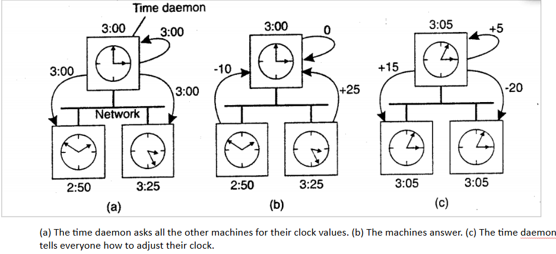

## Logical Clock Synchronization

Logical clock synchronization ensures a consistent ordering of events across processes, regardless of real time.

- In distributed systems, it may be impossible to synchronize real clocks perfectly.
- Instead, we care about which event happened before another.

### Lamport Timestamps

In distributed systems, there's no global clock — each process has its own local clock, and messages are exchanged over the network. Due to unpredictable delays and lack of a central clock, maintaining the correct order of events becomes challenging.

[Explore More](https://www.geeksforgeeks.org/lamports-logical-clock/)

#### Concepts

- Each process maintains a logical clock (an integer counter).
- Events (internal or message sends/receives) are timestamped with this clock.
- Clock values help determine the "happens-before" (`→`) relationship between events.

#### "Happens-before" (`→`) Relation

Defined as:

- If `a` and `b` are events in the same process and `a` occurs before `b`, then `a → b`.
- If `a` is the sending of a message and `b` is the receipt of the same message, then `a → b`.
- Transitivity: if `a → b` and `b → c`, then `a → c`.
- If neither `a → b` nor `b → a`, then the events are concurrent.

#### Lamport Timestamp Rules

Let’s say process P has `a` logical clock `LC`.

1. **Internal Event:** Increment its clock.
   ```ini
   LC = LC + 1
   ```
2. **Send Event:** Before sending a message, increment the clock and include the timestamp in the message.
   ```ini
   LC = LC + 1
   send(message, LC)
   ```
3. **Receive Event:** When receiving a message with timestamp T, update its clock:
   ```ini
   LC = max(LC, T) + 1
   ```

#### Example


# Mutual Exclusion

Mutual exclusion ensures that only one process at a time can access a shared resource or critical section — such as a file, database record, or printer — to prevent race conditions and inconsistencies.

Unlike centralized systems where shared memory can be locked, distributed systems require coordination without a global clock or shared memory, which makes achieving mutual exclusion more complex.

- **At most one process** is allowed in the critical section at a time.
- **No deadlock:** If processes are waiting for a resource, at least one should eventually proceed.
- **No starvation:** Every request must eventually be granted.
- **Fairness:** Requests are granted in the order they arrive (FIFO).

## Centralized Algorithm

- One process is elected as the coordinator (central server).
- All other processes (clients) send requests to the coordinator whenever they want to enter the critical section.
- The coordinator grants permission to one process at a time.
- When the process is done, it notifies the coordinator that it has exited the CS.

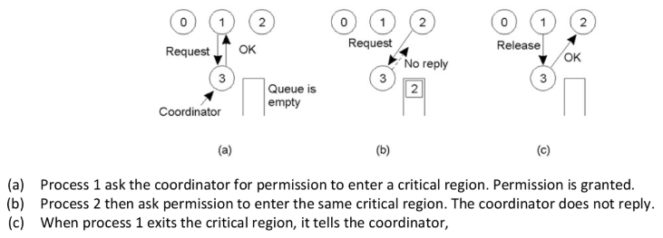

**Advantages:**

- **Simple to implement:** Easy coordination logic
- **Efficient (low messages):** Only 3 messages per CS entry
- **Fair (FIFO):** Requests handled in order

**Disadvantages:**

- **Single point of failure:** If the coordinator fails, the system halts
- **Scalability issue:** Coordinator may become a bottleneck
- **Latency:** Adds delay if coordinator is far from client

## Distributed Algorithm(Ricart-Agrawala)

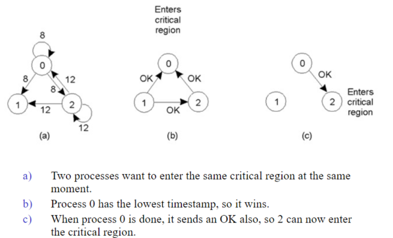

## Token-Based Algorithm

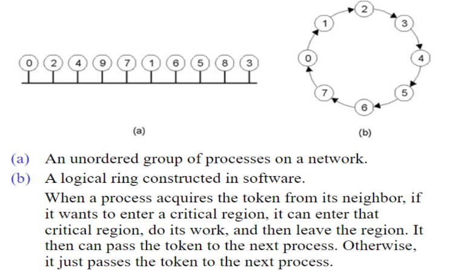

# Election Algorithm

An election algorithm is used in distributed systems to select a coordinator among multiple nodes.

This is crucial when a leader node fails and the system must choose a new leader to maintain proper operation.

## Why is an Election Algorithm Needed?

- Need one process to act as a coordinator.
- Technique to pick a unique coordinator(leader node).
- Take over the role of a failed process.

## Types of Election Algorithm

- [Bully Algorithm](#bully-algorithm)
- [Ring Algorithm](#ring-algorithm)

### Bully Algorithm

The process with the highest ID is elected as the new leader.

- Each process has a unique numerical ID.
- All node directly connected to each other.
- Each process know the IDs of every other process.
- Communication is assumed reliable.

**Youtube:**

- [Bully Algorithm](https://www.youtube.com/watch?v=z6PQGVcKXrk)
- [Bully Algorithm - Example](https://www.youtube.com/watch?v=R1FfoED7OGo)

#### Steps:

1. **Detection of Failure:** A node detects that the current leader has failed.
2. **Election Initiation:** The node that detected failure sends an election message to all nodes with **higher IDs than itself**.
3. **Response Handling:**
   - If a higher-ID node responds, it takes over the election and starts a new election with nodes that have even higher IDs.
   - If no higher-ID node responds, the initiating node declares itself the leader.
4. **Leader Announcement:** The newly elected leader broadcasts a coordinator message to all nodes.

#### Example

| Process ID  | Status         |
| ----------- | -------------- |
| P1 (ID = 1) | Alive          |
| P2 (ID = 2) | Alive          |
| P3 (ID = 3) | Leader (Fails) |
| P4 (ID = 4) | Alive          |
| P5 (ID = 5) | Alive          |

- P3 (Leader) fails.
- P2 detects failure and sends an election message to P3, P4, and P5.
- P4 and P5 respond, indicating they have a higher ID.
- P5 (highest ID) wins and broadcasts that it is the new leader.

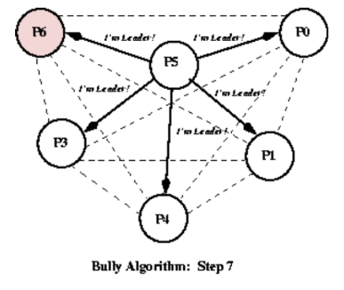

### Ring Algorithm

The processes are arranged in a logical ring, and the election process circulates clockwise to find the highest-ID process as the new leader.

- Processes have unique IDs and arranged in a logical ring.
- Each process knows its neighbors.

**Youtube:**

- [Ring Algorithm](https://www.youtube.com/watch?v=pOhEVBTBwm0)
- [Ring Algorithm - Example](https://www.youtube.com/watch?v=RSA7bQImkM8)

#### Steps:

1. **Detection of Failure:** A node detects that the current leader has failed.
2. **Election Message Circulation:**
   - The process sends an election message to its neighbor.
   - The message passes around the ring, collecting the highest process ID.
3. **Leader Selection:** Once the message completes a full cycle, the process with the highest ID is elected as the leader.
4. **Coordinator Announcement:** The elected leader sends a coordinator message to notify all nodes.

#### Example

| Process ID  | Status         |
| ----------- | -------------- |
| P1 (ID = 1) | Alive          |
| P2 (ID = 2) | Alive          |
| P3 (ID = 3) | Leader (Fails) |
| P4 (ID = 4) | Alive          |
| P5 (ID = 5) | Alive          |

- P3 (Leader) fails.
- P2 detects failure and starts an election by **sending a message to P4 → P5 → P1 → P2**.
- Each process compares its ID with the message ID and forwards the highest.
- P5 has the highest ID, so it becomes the new leader.
- P5 announces itself as leader to all nodes.

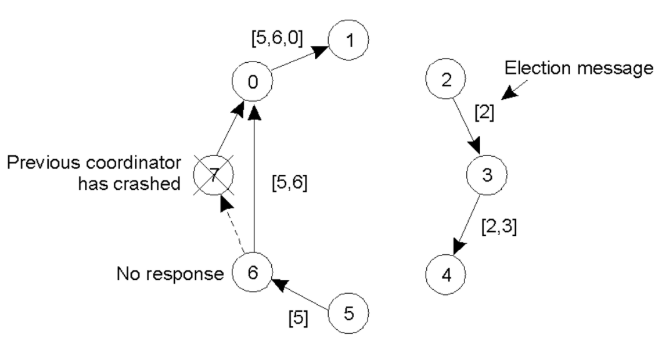

## Comparison of Bully vs. Ring Algorithm

| Feature            | Bully Algorithm                            | Ring Algorithm                                    |
| ------------------ | ------------------------------------------ | ------------------------------------------------- |
| Selection Criteria | Highest ID wins                            | Highest ID in the ring wins                       |
| Message Complexity | O(n²) (many messages)                      | O(n) (only one round)                             |
| Fault Tolerance    | Faster recovery, but more message overhead | Efficient, but slower recovery                    |
| Best Use Case      | When failure detection must be fast        | When the system is stable and can tolerate delays |

# MapReduce

MapReduce is a programming model used for processing and generating large datasets in a distributed system.

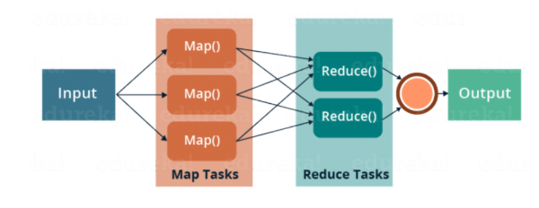

[Explore More](https://www.geeksforgeeks.org/mapreduce-architecture/)

## Components

MapReduce operates in two main phases:

1. [Map Phase](#map-phase)
2. [Reduce Phase](#reduce-phase)

Additionally, there is an intermediate **[Shuffle and Sort](#shuffle--sort)** Phase between them.

### Map Phase

- The input data is split into chunks (input splits), and these chunks are processed in parallel by multiple worker nodes.
- A mapper function is applied to each split, transforming the input into **key-value pairs**.

### Shuffle & Sort

- The intermediate key-value pairs from the Map phase are shuffled and sorted.
- Similar keys are grouped together before being sent to the Reducer.

### Reduce Phase

- The reducer processes each group of key-value pairs to generate a final aggregated result.
- The output is stored in a distributed file system (e.g., HDFS in Hadoop).

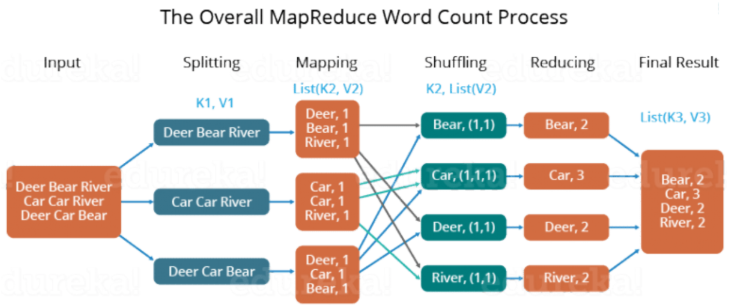

## Advantages of MapReduce

| Advantage                      | Description                                                                                                               |
| ------------------------------ | ------------------------------------------------------------------------------------------------------------------------- |
| **Scalability**                | Easily handles petabytes of data by distributing processing across thousands of machines.                                 |
| **Fault Tolerance**            | Automatically retries failed tasks on another node; uses intermediate storage (e.g., HDFS in Hadoop).                     |
| **Parallel Processing**        | Divides tasks into independent units that can run in parallel, improving speed and efficiency.                            |
| **Simplicity**                 | Programmers just need to write `map` and `reduce` functions; the framework handles parallelization and data distribution. |
| **Cost-Effective**             | Runs on commodity hardware, reducing infrastructure costs.                                                                |
| **Data Locality Optimization** | Moves computation to where the data resides, minimizing data transfer over the network.                                   |
| **Language Agnostic**          | Can be written in many programming languages (Java, Python, etc.) depending on the implementation.                        |

## Disdvantages of MapReduce

| Disadvantage                           | Description                                                                                                                                  |
| -------------------------------------- | -------------------------------------------------------------------------------------------------------------------------------------------- |
| **Latency**                            | Not suitable for real-time processing; it's a batch-processing model, which means results are available only after the entire job completes. |
| **Complex for Iterative Algorithms**   | Algorithms like machine learning and graph processing (e.g., PageRank) require multiple iterations, which are inefficient in MapReduce.      |
| **High Disk I/O Overhead**             | Intermediate results are written to disk (e.g., in Hadoop), causing significant I/O and slowing performance.                                 |
| **Difficult Debugging and Monitoring** | Distributed nature makes it harder to debug; log tracing across multiple nodes can be complex.                                               |
| **Rigid Programming Model**            | Only supports operations that can be expressed as `map` and `reduce`; complex operations like joins are cumbersome.                          |
| **No Built-in Optimization**           | Unlike SQL engines, MapReduce lacks query optimization and indexing features.                                                                |
| **Not Interactive**                    | Cannot support interactive data queries like SQL-based engines (e.g., Hive, Spark SQL).                                                      |

## Example

**Let's consider a simple input file:**

```csharp
Hello world
Hello MapReduce
MapReduce is powerful
```

### Map Phase

- The input is divided into splits.
- The mapper function processes each line and emits (word, 1) key-value pairs.

| Input                   | Mapper Output                                |
| ----------------------- | -------------------------------------------- |
| "Hello world"           | ("Hello", 1), ("world", 1)                   |
| "Hello MapReduce"       | ("Hello", 1), ("MapReduce", 1)               |
| "MapReduce is powerful" | ("MapReduce", 1), ("is", 1), ("powerful", 1) |

### Shuffle & Sort

- All pairs with the same key are grouped together.

| Key (Word) | Values |
| ---------- | ------ |
| Hello      | (1, 1) |
| world      | (1)    |
| MapReduce  | (1, 1) |
| is         | (1)    |
| powerful   | (1)    |

### Reduce Phase

- The reducer function sums up all values for each key.

| Key (Word) | Final Count |
| ---------- | ----------- |
| Hello      | 2           |
| world      | 1           |
| MapReduce  | 2           |
| is         | 1           |
| powerful   | 1           |

**Output:**

```csharp
Hello 2
world 1
MapReduce 2
is 1
powerful 1
```

# Code Migration

Code migration refers to moving code (programs, processes, or objects) from one machine (host) to another in a distributed system to execute there.

**Why do we migrate code?**

- Load balancing
- Data locality (move code to where the data is)
- Fault tolerance
- Performance optimization

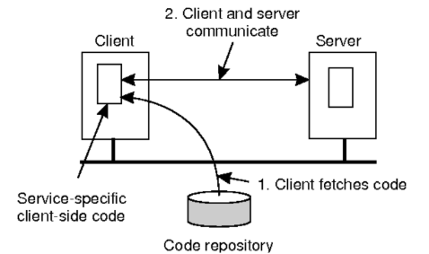

## Types of Code Migration

| Type             | Description                                                                        | Example                                                 |
| ---------------- | ---------------------------------------------------------------------------------- | ------------------------------------------------------- |
| Strong Migration | Code + current execution state (variables, stack, program counter) is moved.       | Process checkpointing and restarting on another server. |
| Weak Migration   | Only the code and input data are transferred, execution starts from the beginning. | Java applets sent to client browsers.                   |

## Resource Migration

Resource migration means moving resources (like files, databases, or devices) from one host to another.

**Why do we migrate resource?**

- Load balancing
- Fault tolerance
- Performance optimization

### Types of Resources

| Type                     | Description                            | Migration Feasibility  |
| ------------------------ | -------------------------------------- | ---------------------- |
| **Persistent Resources** | Can be moved (e.g., files, databases). | Easy                   |
| **Fastened Resources**   | Hard to move (e.g., printers).         | Difficult              |
| **Bound Resources**      | Tied to a specific location.           | Usually not migratable |

### How Work

- Client/Initiator: Initiates the migration
- Host/Server: Destination machine that executes the code
- Execution Environment: Supports running mobile code (e.g., JVM, Docker, sandbox)
- Migration Mechanism: Handles transferring code and (optionally) execution state

## Differences between code migration and resource migration

| Concept    | Code Migration                 | Resource Migration                      |
| ---------- | ------------------------------ | --------------------------------------- |
| Moves      | Code                           | Files/Devices                           |
| Motivation | Bring computation to data      | Bring data closer to users              |
| Example    | Mobile agent visiting a server | File moved to a faster or closer server |

## Migration Direction

1. **Sender-initiated:**

   - Client sends code to server
   - A web app uploading a script to a server

2. **Receiver-initiated:**
   - Client downloads and runs code
   - Java Applet downloaded from a website

## Migration Model

A program can be split into three segments:

- **Code Segment:** The actual code to execute (functions, classes, etc.)
- **Resource Segment:** External libraries, files, databases, devices
- **Execution Segment:** Runtime information like program counter, variables, stack

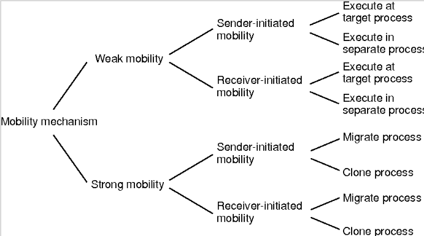

## Migration in Heterogeneous Systems

**Challenge:** Systems may use different architectures or OS.

**Solution:**

- Use a migration stack in a platform-independent format (e.g., Java bytecode).
- Migrate only at well-defined checkpoints (before/after method calls).

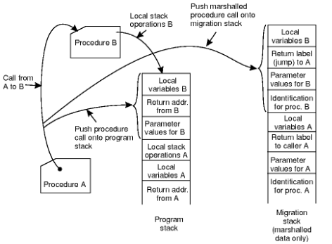

# Distributed Message

Message passing is the method used by processes in different systems (nodes) to communicate and coordinate by sending messages over a network.

Since distributed systems don't share memory, message passing is the only way processes can interact.

## Features

### Synchronous vs Asynchronous

| Mode         | Description                          | Example                      |
| ------------ | ------------------------------------ | ---------------------------- |
| Synchronous  | Sender waits for receiver to respond | RPC (Remote Procedure Call)  |
| Asynchronous | Sender sends and continues           | Message queues (e.g., Kafka) |

### Message Ordering

- **FIFO (First In, First Out)**: Messages are delivered in order per sender
- **Causal Ordering**: Reflects causality (if A causes B, A arrives before B)
- **Total Ordering**: All processes see messages in the same order

### Reliability Guarantees

| Guarantee         | Description                                                         |
| ----------------- | ------------------------------------------------------------------- |
| **At-most-once**  | Message is delivered 0 or 1 time (may be lost)                      |
| **At-least-once** | Message is delivered 1 or more times (may be duplicated)            |
| **Exactly-once**  | Message is delivered once and only once (ideal, but hard to ensure) |

## Components

| Component | Role                                                              |
| --------- | ----------------------------------------------------------------- |
| Processes | Independent nodes (P1, P2, P3, …)                                 |
| Messages  | Data units sent over the network (request, reply, acknowledgment) |
| Channels  | Communication paths (e.g., TCP, sockets, queues)                  |
| Events    | Sending, receiving, processing messages                           |

## Architecture

```
Producer (Sender) ──► [ Message Broker ] ──► Consumer (Receiver)
```

- **Producer:** Sends messages (e.g., web server, API)
- **Message:** The data payload or event (JSON, XML, etc.)
- **Broker/Queue:** Middleware that receives, stores, and routes messages (e.g., Kafka, RabbitMQ)
- **Consumer:** Listens for and processes messages

## Modeling Processors

A processor (also called a process or node) is an independent computing entity in a distributed system. It runs its own thread of control and can send/receive messages.

**Processor Model Includes:**
| Aspect | Description |
| -------------------- | ------------------------------------------------------- |
| Local State | Variables, buffers, program counter |
| Events | Send, receive, compute |
| Determinism | Can be deterministic or non-deterministic |
| Knowledge | May or may not know about other processors |
| Failure Behavior | May crash, halt, or recover (fail-stop, crash-recovery) |

## Modeling Channels

**Channel Model Includes:**
| Feature | Description |
| --------------- | ----------------------------------------------- |
| Direction | Unidirectional or Bidirectional |
| Delay | Fixed or variable latency |
| Reliability | May lose, delay, duplicate, or reorder messages |
| Ordering | FIFO (First-In-First-Out) or Non-FIFO |
| Capacity | Bounded or Unbounded (buffer size) |

## Message Passing

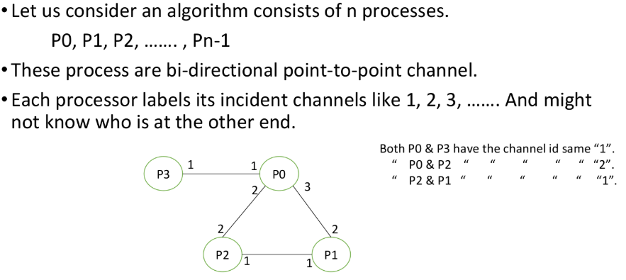

## Buffered Message Passing

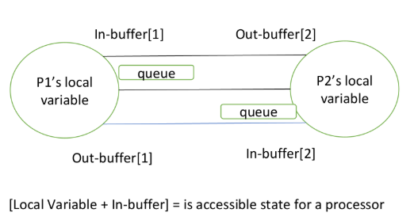

# Remote Method Invocation

RMI (Remote Method Invocation) is a Java API that allows objects running on different Java Virtual Machines (JVMs) to invoke methods on each other as if they were local.

With RMI, a Java program can call a method on a remote object (on another machine or process) and get a result — just like calling a local method.

- It provides remote communication between the applications using two objects stubs and skeleton.
- I consists of three layers:
  - stub/skeleton layers
  - remote reference layer
  - transport layer

**Goals of RMI**

- Simplify distributed programming in Java
- Preserve type safety (compile-time checks)
- Support for Distributed Garbage Collection
- Make remote objects feel like local ones

[Explore More](https://www.geeksforgeeks.org/remote-method-invocation-in-java/)

## Components

- **Client:** The Java program that wants to invoke a method remotely.
- **Stub:** Acts as a proxy for the remote object. Handles communication with the server.
- **Skeleton:** Resides on the server, receives requests from the stub and forwards them to the actual object. (Not needed in Java 1.2+; handled internally)
- **Remote Interface:** Defines the methods that can be called remotely.
- **Remote Object:** The actual implementation of the remote methods.
- **RMI Registry:** A simple naming service to locate remote objects.
- **Transport Layer:** Handles TCP/IP networking under the hood.

## Architecture

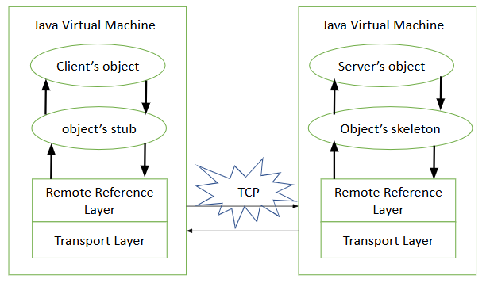

### How They Interact

**Client Side:** The stub (client proxy) communicates with the Remote Reference Layer and then to the Transport Layer to send the method call to the server.

**Server Side:** The Transport Layer receives the request and passes it up through RRL to the Skeleton, which invokes the actual method on the remote object.

### Stub

Acts as a gateway to the remote object. All the outgoing request are routed through it. It resides at the client side and represents the remote object. When the caller invokes method on the stub object, it does the following tasks:

- Connects to remote JVM
- Sends (marshals) method parameters
- Waits for response
- Reads (un-marshals) the result
- Returns result to client

### Skeleton

Gateway to the server object. All the incoming requests are routed through it. When the skeleton receives the incoming request, it does the following tasks:

- Reads method parameters from request
- Invokes method on real object
- Marshals result and sends it back

## Working

1. Remote object is created on the server.
2. Remote object is registered with the RMI Registry.
3. Client looks up the remote object using the registry.
4. Client invokes a method on the remote object through a stub.
5. Stub sends the request to the server over the network.
6. Skeleton receives the request (in older Java versions) and invokes the actual method on the server object.
7. The result is sent back to the client through the stub.

# Remote Procedure Call

Remote Procedure Call (RPC) is a communication protocol used in distributed systems where a program on one machine (client) can invoke a function (procedure) on another machine (server) as if it were local.

It abstracts the network communication, allowing developers to call functions that are actually executed on a remote server, making distributed computing feel like local computing.

## Concepts

| Term          | Description                                                                                                   |
| ------------- | ------------------------------------------------------------------------------------------------------------- |
| Client        | The machine or process that initiates the RPC.                                                                |
| Server        | The machine or process that contains the actual implementation of the function.                               |
| Stub          | A piece of code that acts as a proxy – client stub on the caller’s side and server stub on the server’s side. |
| Marshalling   | Converting parameters into a transmittable format over the network.                                           |
| Unmarshalling | Reconstructing the parameters at the destination.                                                             |

## Workflow

- Client calls a local stub function (proxy for the remote function).
- The client stub marshals the parameters and sends a request to the server.
- The server stub receives the request, unmarshals the data, and calls the actual function.
- The function executes on the server and returns the result.
- The server stub marshals the result and sends it back.
- The client stub receives the result, unmarshals it, and returns it to the caller.

## Advantages

- **Transparency:** Developers can call remote functions as if they’re local.
- **Modularity:** Applications can be split across multiple machines.
- **Language independence:** Many RPC frameworks support different languages (e.g., gRPC with Python, Java, Go)

## Challenges

- **Latency:** Network delay affects performance.
- **Partial Failures:** Server may fail, client may not know.
- **Serialization overhead:** Parameters and return values must be converted to a transmissible format.
- **Tight Coupling:** If the server interface changes, the client might break.

## Differences Between RPC and RMI

| Feature                 | **RPC (Remote Procedure Call)**                                                  | **RMI (Remote Method Invocation)**                                       |
| ----------------------- | -------------------------------------------------------------------------------- | ------------------------------------------------------------------------ |
| **Paradigm**            | **Procedural** (C-like functions)                                                | **Object-Oriented** (Java-based methods on objects)                      |
| **Language Support**    | Language-agnostic (supports many: C, Python, Go, etc.)                           | Java-only                                                                |
| **Function Type**       | Calls **remote procedures (functions)**                                          | Invokes **remote object methods**                                        |
| **Data Handling**       | Transfers **simple data types** (e.g., integers, strings)                        | Transfers **objects**, including **state** and behavior                  |
| **Underlying Protocol** | Usually uses **JSON, XML**, or binary formats over TCP/HTTP (e.g., gRPC, Thrift) | Uses **Java RMI protocol** over TCP/IP                                   |
| **Stubs**               | Requires client/server stubs for marshalling data                                | Uses **Java-generated stubs** and **skeletons** for object communication |
| **Object Pass**         | Not supported (only data is passed)                                              | Supports **pass-by-reference** and **serialization** of Java objects     |
| **Ease of Use**         | Simpler for procedural applications                                              | More powerful in **Java OOP** systems                                    |

## Relationship between RPC and RMI

- RMI is a specialized form of RPC that is specific to Java and object-oriented programming.
- You can think of RMI as "RPC for objects" in Java.
- Both follow similar concepts: stubs, marshalling, network calls, and return values.
- RPC is more general and widely used in cross-platform distributed systems.

# Distributed Object

Distributed objects are software components that work together while residing in different memory spaces, but can be accessed and manipulated as if it were a local object. This is done by abstracting the complexities of the underlying communication between systems.

## Working Conditions

1. **Remote Object Reference:** A globally unique ID to identify remote objects.
2. **Distributed Actions:** One method call can trigger a chain of invocations across many objects.
3. **Distributed Exceptions:** Errors due to distributed nature: message loss, timeout, or server crash.
4. **Remote Interfaces:** Abstract specification of methods a remote object exposes.

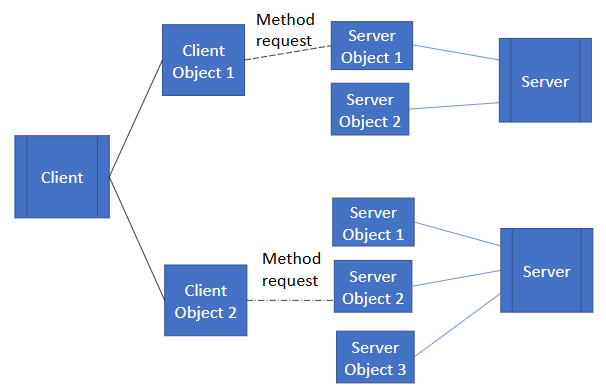

## Evolution of Distributed Objects

1. **Distributed Systems:** Grew from client-server models to complex distributed objects with richer behavior.
2. **Programming Languages:** Originated from Simula-67 and Smalltalk → evolved into Java, C++, enabling object-oriented distributed development.
3. **Software Engineering:** Progress in design principles (like UML) helped model and manage distributed objects effectively.

## Common Object Request Broker Architecture

CORBA is a middleware standard enabling communication between distributed objects written in different languages and running on different platforms.

### Architecture

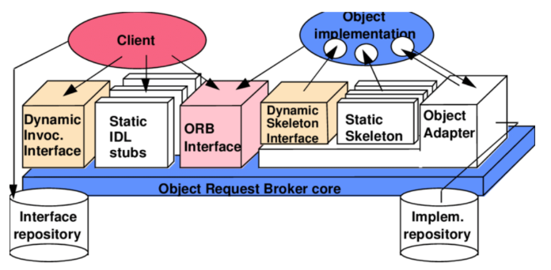

#### 1. Client Stubs

- Client-side proxy representing the remote object.
- Intercepts client method calls and forwards them to the ORB.
- Acts as a local representative of the remote object.
- Generated from the interface definition.

#### 2. Object Request Broker(ORB)

- Handles all communication between clients and servers.
- Manages object invocation, locating objects, passing messages, etc.
- Seperate Server and client implementation.

#### 3. Interface Definition Language

Defines the interfaces that objects expose, independently of the programming language.

#### 4. Skeleton

- The server-side equivalent of the stub.
- Receives method calls from the ORB and invokes the corresponding method on the server object.

### CORBA Workflow

1. Interface is written in IDL.
2. IDL compiler generates stub and skeleton.
3. The server implements the object.
4. ORB registers the object with a naming service.
5. Client looks up the object via the ORB.
6. Method call is sent from stub → ORB → network → ORB → skeleton → object.
7. Response travels back the same way.

### Limitations of CORBA

- Complex to set up compared to modern solutions.
- Performance overhead due to abstraction.
- Limited modern support; now mostly replaced by gRPC, REST, SOAP, etc.
