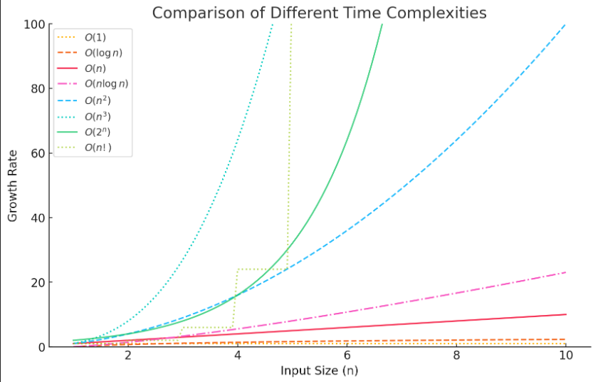

# Contents

- [Memory Management](#memory-management)
  - [Types](#types)
  - [Stack vs Heap](#comparison-stack-vs-heap)
  - [Allocation](#allocation)
    - [Static Memory Allocation]()
    - [Dynamic Memory Allocation]()
- [Data Structure](#data-structure)
  - [Physical Data Structure]()
  - [Logical Data Structure]()
- [Asymptotic Notations](#asymptotic-notations)
  - [Big O](#1-big-o-notation-o--upper-bound-worst-case)
  - [Omega](#2-omega-notation-ω--lower-bound-best-case)
  - [Theta](#3-theta-notation-θ--tight-bound-average-case)
- [Backtracking](#backtracking)
  - [When do we use Backtracking?](#when-do-we-use-backtracking)
  - [Backtracking Process](#backtracking-process)
  - [General Template](#general-template)
    - [Iterative Template](#iterative-template-of-backtracking)
    - [Recursive Approach](#recursive-template-of-backtracking)
  - [Example Problem](#example-problem-of-backtracking)
    - [Generate All Binary String](#generate-all-binary-strings-of-length-n)
    - [N-Queens](#n-queens)
- [Dynamic Programming](#dynamic-programming)
  - [Key Characteristics](#key-characteristics-of-dp-problems)
    - [Optimal Substructure](#optimal-substructure)
    - [Overlapping Subproblems](#overlapping-subproblems)
  - [Two Main Approaches](#two-main-approaches-of-dp)
    - [Top-Down (Memoization)](#top-down-memoization)
    - [Bottom-Up (Tabulation)](#bottom-up-tabulation)
  - [Example Problem](#example-problem-of-dynamic-programming)
    - [Naive Recursive Solution (Exponential Time)](#naive-recursive-solution-exponential-time)
    - [Memoization (Top-Down)](#dp-with-memoization-top-down)
    - [Tabulation (Bottom-Up)](#dp-with-tabulation-bottom-up)
  - [General Template](#general-template)
    - [1D DP Template](#1d-dp-template)
    - [2D DP Template](#2d-dp-template)

<!--


- [Abstract Data Type](#abstract-data-type)
  - [Array Example](#array-example)
    - [Array Data Structure](#array-data-structure)
    - [Array ADT](#array-adt)
    - [Array ADT vs Data Structure](#array-adt-vs-data-structure)
  - [Stack Example](#stack-example)
    - [Stack Data Structure](#stack-data-structure)
    - [Stack ADT](#stack-adt)
    - [Stack ADT vs Data Structure](#stack-adt-vs-data-structure)
- [Recursion](#recursion)
  - [Direct Recursion](#direct-recursion)
  - [Indirect Recursion](#indirect-recursion)
  - [Tail Recursion](#tail-recursion)
  - [Head Recursion](#head-recursion)
  - [Tree Recursion](#tree-recursion)
  - [Nested Recursion](#nested-recursion)
- [Binary Search]()
  - [Conditions](#conditions-of-binary-search)
  - [Complexity](#complexity-of-binary-search)
  - [Lower Bound](#lower-bound)
  - [Upper Bound](#upper-bound)
  - [Binary Search on 2D Arrays](#binary-search-on-2d-arrays)
  - [Search in Unknown Size Arrays](#search-in-infiniteunknown-size-arrays)
- [Graph](#graph)
  - [Graph Representation](#graph-representation)
    - [Adjacency Matrix](#adjacency-matrix)
    - [Adjacency List](#adjacency-list)
    - [Edge List](#edge-list)
    - [Adjacency Set](#adjacency-set--map)
    - [Incidence Matrix](#incidence-matrix)
    - [Quick Comparison](#quick-comparison)

-->

# Memory Management

A program stores in hard drive, executes in CPU.

Think of it like a book:

- **Hard Drive** = A bookshelf where the book (program) is stored when not in use.
- **RAM** = A desk where you place the book while reading it (temporary workspace).
- **CPU** = Your brain, which reads and processes the information from the book.

## Types

**Code Segment**

- Store compiled code.
- It uses stack and heap memory.

**Stack Memory**

- Store global, static variable, function call
- Automatically managed(created, removed)
- Size decided at compile time
- Store data organized way

**Heap Memory**

- Memory allocated during program execution
- Automatically created but manually removed
- when the programs terminates, OS automatically reclaims all allocated heap
- Size decided at run time
- Store data unorganized way
- Treat like resources
- Can't directly use, you have to use pointer to use it

## Comparison: Stack vs Heap

| Feature          | Stack Memory                          | Heap Memory                                            |
| ---------------- | ------------------------------------- | ------------------------------------------------------ |
| **Creation**     | Automatically created                 | Automatically available but requires manual allocation |
| **Deallocation** | Automatic (when function exits)       | Manual (using free() or delete)                        |
| **Speed**        | Faster                                | Slower                                                 |
| **Size**         | Limited                               | Large (depends on system)                              |
| **Lifetime**     | Exists only during function execution | Persists until manually freed                          |
| **Usage**        | Local variables, function calls       | Dynamically allocated memory                           |

- Array created in both heap(`int *p=new int(5)`) and stack(`int arr[]={1,2,3,4,5}`).
- Linkedlist created only in heap.

## Allocation

### Static Memory Allocation

- Memory allocated at **compile time** and doesn't change during program execution, deallocated automatically when program terminates.
- It is stored in the **stack**/data segment.
- Global variable store in data segement and local variable store in stack.

### Dynamic Memory Allocation

- Memory allocated at **runtime** using **pointers**.
- It is store in the **heap** memory.
- Explicit deallocation requires.

**Example:**

```cpp
int *p;  // store at stack as it is local variable
p=new int(5);  // store at heap
```

# Data Structure

Logical data structure uses physical data structure to implement itself.

## Physical Data Structure

- How data is actually stored in memory(RAM, disk).
- Deals with the real-world representation.
- Involves memory management, allocation, data storage.
- Impact performance and access speed.
- Examples: **Array, Linked List**.

## Logical Data Structure

- How data is conceptually organized and how operation performed on it.
- It define relationships, hierarchy.
- Examples: **Stack, Queue**.

# Asymptotic Notations

Asymptotic notation is a mathematical tool used in computer science to describe the efficiency of algorithms in terms of time and space complexity. It helps us analyze how the runtime or space requirements of an algorithm grow as the input size increases.

Asymptotic notation ignores constant factors and lower-order terms, focusing only on the dominant factor that affects performance for large inputs.

## **Types of Asymptotic Notations**

### **1. Big-O Notation (O) – Upper Bound (Worst Case)**

- Represents the worst-case complexity.
- Describes the maximum amount of time an algorithm will take for any input.
- Example: If an algorithm runs in at most `c · f(n)` time for large `n` , we write `T(n) = O(f(n))`

### **2. Omega Notation (Ω) – Lower Bound (Best Case)**

- Represents the best-case complexity.
- Guarantees that the algorithm takes at least a certain amount of time.
- Example: If an algorithm runs in at least `c · f(n)` time for large `n`, we write `T(n) = Ω(g(n))`

### **3. Theta Notation (Θ) – Tight Bound (Average Case)**

- Represents both upper and lower bounds.
- Used when an algorithm always runs in a specific range of time complexity.
- Example: If an algorithm runs in both `O(f(n))` and `Ω(f(n))`, we write: `T(n) = Θ(f(n)) `



- Polynomial - 1, log n, n log n
- Exponential - 2<sup>n</sup>, 3<sup>n</sup>, n<sup>n</sup>

# Adiitional Notes

- Always use call by reference for recursive call.
- When declare integer vector set default value as `-1`.

# Abstract Data Type

An Abstract Data Type (ADT) is a mathematical model for certain kinds of data structures.
It tells you:

- What operations can be performed on the data.
- What the operations do (the behavior).

But it does not tell you how the operations are implemented.

Think of ADT as a contract or blueprint:

- It says what you can do (like insert, delete, search).
- It hides how it’s done (whether internally it uses arrays, linked lists, etc.).

## Array Example

### Array Data Structure

An array is a collection of elements stored in contiguous memory locations, accessed using an index.

```cpp
int arr[5] = {10, 20, 30, 40, 50};
cout << arr[2]; // Direct access using index
arr[3] = 99;    // Update value
```

### Array ADT

We define what operations can be done on an array, without worrying about how they’re implemented.

For example: `insert(position, value)` ,`delete(position)` ,`search(value)` ,`get(index)` ,`update(index, value)` ,`traverse()`

The implementation (array in memory, pointer arithmetic, etc.) is hidden from the user.

```cpp
class Array {
private:
    int *arr;       // pointer to store array elements
    int capacity;   // maximum size
    int length;     // current number of elements

public:
    // constructor
    Array(int size) {
        capacity = size;
        arr = new int[capacity];
        length = 0;
    }

    // insert at end
    void insert(int value) {
        if (length == capacity) {
            cout << "Array Overflow!" << endl;
            return;
        }
        arr[length++] = value;
    }

        // display array
    void display() {
        for (int i = 0; i < length; i++) {
            cout << arr[i] << " ";
        }
        cout << endl;
    }

    // destructor
    ~Array() {
        delete[] arr;
    }
};
int main() {
    Array a(5);

    a.insert(10);
    a.insert(20);
    a.insert(30);
    a.display(); // 10 20 30
}
```

### Array ADT vs Data Structure

| Aspect                      | **Array as ADT (Abstract Data Type)**                                                                                                              | **Array as Data Structure (Implementation)**                                                                                               |
| --------------------------- | -------------------------------------------------------------------------------------------------------------------------------------------------- | ------------------------------------------------------------------------------------------------------------------------------------------ |
| **Definition**              | Logical model that defines _what operations_ can be performed on an array.                                                                         | Concrete way of storing elements in **contiguous memory** with fixed indexing.                                                             |
| **Focus**                   | _What_ the array can do (operations).                                                                                                              | _How_ the array is implemented in memory.                                                                                                  |
| **Operations (example)**    | - `insert(position, value)` <br> - `delete(position)` <br> - `search(value)` <br> - `get(index)` <br> - `update(index, value)` <br> - `traverse()` | - Uses **indices** for access. <br> - Uses pointer arithmetic (`arr[i] = *(arr + i)`). <br> - Handles shifting elements for insert/delete. |
| **Implementation details**  | Hidden from the user (black box).                                                                                                                  | Explicit — we know it’s stored in **contiguous memory** and manipulated using loops/pointers.                                              |
| **Flexibility**             | Can be implemented in multiple ways (static array, dynamic array like `vector` in C++, linked structure, etc.).                                    | Only one way → fixed-size contiguous memory block.                                                                                         |
| **Example (specification)** | “An array supports insert, delete, search, get, update, traverse.”                                                                                 | `int arr[5] = {1, 2, 3, 4, 5};` <br> Access via `arr[2] = 3`.                                                                              |
| **User’s View**             | User only sees the operations, not how they are carried out.                                                                                       | Programmer must manage size, shifting, memory allocation, etc.                                                                             |
| **Analogy**                 | Like a **remote control** → you know what each button does, not how the circuit inside works.                                                      | Like the **circuit inside the remote** → the actual working mechanism.                                                                     |

## Stack Example

A stack is a collection of elements that follows the LIFO (Last In, First Out) principle.
That means the last element inserted is the first one removed.

- **Array**: First a data structure, then wrapped as an ADT.
- **Stack**: First an ADT, then implemented using data structures.

### Stack Data Structure

```cpp
class Stack {
private:
    int *arr;
    int capacity;
    int top;

public:
    Stack(int size) {
        capacity = size;
        arr = new int[capacity];
        top = -1;
    }

    void push(int value) {
        if (isFull()) {
            cout << "Stack Overflow!" << endl;
            return;
        }
        arr[++top] = value;
    }

    ~Stack() { delete[] arr; }
};
```

### Stack ADT

```cpp
// Client code using Stack ADT (just knows operations)
Stack s(5);

s.push(10);
s.push(20);
s.push(30);

cout << s.peek() << endl;  // 30
cout << s.pop() << endl;   // 30
cout << s.pop() << endl;   // 20
cout << s.isEmpty() << endl; // 0 (false)
```

### Stack ADT vs Data Structure

| Aspect                      | **Stack as ADT (Abstract Data Type)**                                           | **Stack as Data Structure (Implementation)**                             |
| --------------------------- | ------------------------------------------------------------------------------- | ------------------------------------------------------------------------ |
| **Definition**              | Logical model that defines _what operations_ a stack supports.                  | Concrete way of implementing stack using array, linked list, etc.        |
| **Focus**                   | _What_ can be done (push, pop, peek).                                           | _How_ it’s done (index pointer `top`, node linking, etc.).               |
| **Operations (example)**    | - `push(x)` <br> - `pop()` <br> - `peek()` <br> - `isEmpty()` <br> - `isFull()` | - Array: shifting index, resizing. <br> - Linked List: nodes & pointers. |
| **Implementation details**  | Hidden from the user (black box).                                               | Explicit — memory management, pointer updates, overflow checks.          |
| **Access Rule**             | LIFO (Last In, First Out).                                                      | Enforced via array index (`top`) or linked nodes.                        |
| **Flexibility**             | Can be implemented using array, linked list, or STL.                            | Tied to chosen approach (fixed-size array vs dynamic linked list).       |
| **Example (specification)** | “A stack supports push, pop, peek, isEmpty, isFull.”                            | `arr[++top] = value;` (array) <br> or `new Node(value)` (linked).        |
| **User’s View**             | User just uses operations, without caring about details.                        | Programmer deals with actual memory & algorithm.                         |
| **Analogy**                 | Like a **stack of plates** — you know you can only put/take from the top.       | The actual cupboard structure (array shelves vs linked chain).           |

# Recursion

**Recursion Tracing** means following the execution flow of recursive calls:

- How functions are called (going down the call stack).
- How results come back (unwinding, going up the call stack).

It helps us see what happens inside memory (stack frames) during recursion.

## Direct Recursion

When a function calls itself directly.

```cpp
int factorial(int n) {
    if (n == 0) return 1;        // Base case
    return n * factorial(n - 1); // Direct recursion
}
```

**Tracing**

```
factorial(4)
 → 4 * factorial(3)
     → 3 * factorial(2)
         → 2 * factorial(1)
             → 1 * factorial(0)
                 → return 1   (base case)
             return 1
         return 2 * 1 = 2
     return 3 * 2 = 6
 return 4 * 6 = 24
```

## Indirect Recursion

When a function calls another function, and that function eventually calls the first one back.

```cpp
void B(int n);

void A(int n) {
    if (n > 0) {
        cout << n << " ";
        B(n - 1);   // A calls B
    }
}

void B(int n) {
    if (n > 1) {
        cout << n << " ";
        A(n / 2);   // B calls A
    }
}
```

**Tracing**

```
A(5) → prints A:5
    B(4) → prints B:4
        A(2) → prints A:2
            B(1) → prints B:1
                A(0) stops
```

## Tail Recursion

When the recursive call is the last statement in the function (nothing to do after recursion returns). Can be optimized by the compiler (Tail Call Optimization).

```cpp
int tailFactorial(int n, int result = 1) {
    if (n == 0) return result;       // Base case
    return tailFactorial(n - 1, n * result); // Tail recursion
}
```

Here, no pending operations after the recursive call.

**Tracing**

```
tailRec(3) → prints 3
    tailRec(2) → prints 2
        tailRec(1) → prints 1
            tailRec(0) → stops
```

## Head Recursion

When the recursive call happens first, before any other statements. Work happens after recursive call returns.

```cpp
void headRecursion(int n) {
    if (n > 0) {
        headRecursion(n - 1);  // Recursive call first
        cout << n << " ";      // Work after return
    }
}
```

**Tracing (it is different from other print is done returning time)**

```cpp
headRec(3)
 → headRec(2)
     → headRec(1)
         → headRec(0)   (base case, returns)
         print 1
     print 2
 print 3
```

## Tree Recursion

When a function calls itself more than once.

```cpp
int fib(int n) {
    if (n <= 1) return n;
    return fib(n - 1) + fib(n - 2);  // Two recursive calls
}
```

**Tracing**

```
fib(4)
 → fib(3) + fib(2)

fib(3)
 → fib(2) + fib(1)

fib(2)
 → fib(1) + fib(0)

fib(1) → 1
fib(0) → 0
So fib(2) = 1 + 0 = 1

fib(1) → 1
So fib(3) = 1 + 1 = 2

fib(2) again
 → fib(1) + fib(0)
 → 1 + 0 = 1

So fib(4) = 2 + 1 = 3
```

## Nested Recursion

When a recursive function passes a recursive call as an argument.

```cpp
int nested(int n) {
    if (n > 100) return n - 10;
    return nested(nested(n + 11));
}
```

**Tracing**

```cpp
nested(95)
 → nested(nested(106))   // first call argument is another call
     nested(106) → returns 96   (since >100, returns 106 - 10)
 → nested(96)
     → nested(nested(107))
         nested(107) → returns 97
     → nested(97)
         → nested(nested(108))
             nested(108) → returns 98
         → nested(98)
             ...
 eventually reaches nested(101) → returns 91
```

# Backtracking

Backtracking is an algorithmic technique used to solve problems by trying out all possible solutions and eliminating (backtracking from) the ones that don’t satisfy the problem’s conditions.

It is often described as a depth-first search (DFS) with undo:

- You explore a path (make a choice).
- If the path leads to a valid solution, keep going.
- If the path turns out to be invalid, go back (undo the choice) and try another path.

In short: Try → Check → Undo → Try Next.

## When do we use Backtracking?

Backtracking is commonly used in problems where:

1. You need to generate all solutions (e.g., permutations, combinations).
2. You need to find one valid solution (e.g., Sudoku solver, N-Queens).
3. You need to optimize and stop early when an invalid choice is detected.

## Backtracking Process

1. Choose – Select a possible option.
2. Explore – Recurse with the chosen option.
3. Unchoose (Backtrack) – If it doesn’t work, undo the choice and try another.

This is usually implemented with recursion.

## General Template

### Iterative Template of Backtracking

```cpp
// Recursive backtracking function
void backtrack(vector<int>& current, vector<int>& nums, vector<vector<int>>& result) {
    // Base case: if the current solution is complete
    if (current.size() == nums.size()) {
        result.push_back(current);  // Save the solution
        return;
    }

    // Loop through all possible choices
    for (int i = 0; i < nums.size(); i++) {
        // Skip the choice if it's already used (check for duplicates, or already in the current solution)
        if (/* condition to check if nums[i] is already in current */) continue;

        // Make the choice
        current.push_back(nums[i]);

        // Recur to the next level
        backtrack(current, nums, result);

        // Undo the choice (backtrack)
        current.pop_back();
    }
}

// Driver function
vector<vector<int>> solve(vector<int>& nums) {
    vector<vector<int>> result;  // This will hold all the valid solutions
    vector<int> current;         // This holds the current solution
    backtrack(current, nums, result);
    return result;
}
```

### Recursive Template of Backtracking

```cpp
// Recursive backtracking function
void backtrack(int index, vector<int>& current, vector<int>& nums, vector<vector<int>>& result) {
    // Base case: if the current solution is complete (e.g., size equals to nums)
    if (current.size() == nums.size()) {
        result.push_back(current);  // Store the solution
        return;
    }

    // Recursive case: explore the next possible choice
    if (index >= nums.size()) {
        return;  // Base case when index exceeds the array bounds
    }

    // Option 1: Include nums[index] in the current solution
    current.push_back(nums[index]);
    backtrack(index + 1, current, nums, result);  // Recursively move to the next step

    // Option 2: Exclude nums[index] and try without it
    current.pop_back();
    backtrack(index + 1, current, nums, result);  // Recursively move to the next step
}

// Driver function
vector<vector<int>> solve(vector<int>& nums) {
    vector<vector<int>> result;  // This will hold all the valid solutions
    vector<int> current;         // This holds the current solution
    backtrack(0, current, nums, result);  // Start the recursion from the first index
    return result;
}
```

## Example Problem of Backtracking

### Generate All Binary Strings of Length `n`

Suppose we want to generate all possible binary strings of length `n`.

**Step-by-Step Approach**

- At each position, we have two choices: put `0` or `1`.
- Place a digit and recursively move to the next position.
- If we reach length `n`, print the string.
- If not, backtrack and try the other option.

### N-Queens

Place `N` queens on an `N x N` chessboard such that:

- No two queens attack each other.
- A queen can attack another queen in the same row, column, or diagonal.

The task: Print all possible arrangements.

**Why Backtracking?**

- At each row, we try placing a queen in one column.
- If it’s safe (no queen in same column or diagonal), we continue to the next row.
- If not safe, we backtrack (remove queen) and try the next column.
- If we reach row N, we found a solution.

**Step-by-Step Process**

1. Start with the first row.
2. For each column in that row:
   - Check if placing a queen is safe.
   - If safe → place queen and move to next row.
   - If not safe → try next column.
3. If all rows are filled, print solution.
4. If stuck, backtrack (remove queen) and try a different column.

# Dynamic Programming

Dynamic Programming (DP) is a method used to solve complex problems by breaking them down into smaller overlapping subproblems and solving each subproblem only once.

The results of these subproblems are stored (memoized or tabulated) and reused, which saves computation time.

In short: DP = Recursion + Memoization/Tabulation

## Key Characteristics of DP Problems

A problem can be solved using Dynamic Programming if it has:

### Optimal Substructure

- The solution of a big problem can be built using solutions of its smaller subproblems.
- Example: In shortest path problems, the shortest path from A → C via B is built from shortest(A→B) + shortest(B→C).

### Overlapping Subproblems

- The same subproblems are solved multiple times.
- Example: In Fibonacci, to calculate `fib(5)`, we need `fib(4)` and `fib(3)`. But `fib(4)` also needs `fib(3)`.
- Without DP → `fib(3)` is recalculated many times. With DP → we store it.

## Two Main Approaches of DP

### Top-Down (Memoization)

- Use recursion.
- Store results of subproblems in a map/array (so they aren’t recomputed).
- Example: `fib(5)` → compute recursively, but remember results.

### Bottom-Up (Tabulation)

- Iterative approach.
- Build solutions for smaller subproblems first, then use them to build the final answer.
- Usually more space-efficient.

## Example Problem of Dynamic Programming

### Naive Recursive Solution (Exponential Time)

```cpp
int fib(int n) {
    if (n <= 1) return n;
    return fib(n-1) + fib(n-2);
}
```

- Time Complexity: O(2^n)
- Space Complexity: O(n)
- Because many values (like `fib(3)`) are recalculated multiple times.

### DP with Memoization (Top-Down)

```cpp
int fibMemo(int n, vector<int> &dp) {
    if (n <= 1) return n;

    if (dp[n] != -1) return dp[n];  // already computed

    return dp[n] = fibMemo(n-1, dp) + fibMemo(n-2, dp);
}

int main() {
    int n = 10;
    vector<int> dp(n+1, -1);
    cout << "Fibonacci(" << n << ") = " << fibMemo(n, dp);
}
```

- Stores results in dp array.
- Time Complexity: O(n)
- Space Complexity: O(n) (stack + dp array).

### DP with Tabulation (Bottom-Up)

```cpp
int fibTab(int n) {
    vector<int> dp(n+1, 0);
    dp[0] = 0;
    dp[1] = 1;

    for (int i = 2; i <= n; i++)
        dp[i] = dp[i-1] + dp[i-2];

    return dp[n];
}
```

- Builds solution iteratively.
- Time Complexity: O(n)
- Space Complexity: O(n) (but can be optimized to O(1) by storing only last two values).

## General Template

### 1D DP Template

```cpp
int solveDP(int n) {
    vector<int> dp(n + 1, 0); // DP array initialized to zero

    // Base case value, adjust as needed
    dp[0] = 0;

    // Loop through the problem
    for (int i = 1; i <= n; ++i) {
        // Example transition (adjust this according to the problem)
        dp[i] = min(dp[i - 1] + 1, dp[i - 2] + 2);  // Example DP relation
    }

    return dp[n];  // Return the result (e.g., final value in dp array)
}
```

- To get the **count/min cost/max cost** of dp relation you can **use**:

  ```cpp
  dp[i] = cost[i] + min(dp[i - 1] + 1, dp[i - 2] + 2);
  ```

- To get the **path** you can **add**:

  ```cpp
  parent[i] = (dp[i - 2] < dp[i - 1]) ? i - 2 : i - 1;
  ```

  - Then add the following outside the loop

    ```cpp
    int lastStep = (dp[n - 2] < dp[n - 1]) ? n - 2 : n - 1;
    int minCost = dp[lastStep];

    // Reconstruct the path
    vector<int> path;
    int curr = lastStep;
    while (curr != -1) {
        path.push_back(curr);
        curr = parent[curr];
    }
    reverse(path.begin(), path.end());

    cout << "Minimum cost: " << minCost << "\nPath: ";
    for (int step : path) {
        cout << step << " ";
    }
    cout << endl;
    ```

### 2D DP Template

```cpp
int solveDP2D(int m, int n) {
    // Create a 2D DP array (m+1 x n+1) initialized to 0
    vector<vector<int>> dp(m + 1, vector<int>(n + 1, 0));

    // Base case setup
    for (int i = 0; i <= m; ++i) {
        dp[i][0] = 0;  // Adjust based on the problem
    }
    for (int j = 0; j <= n; ++j) {
        dp[0][j] = 0;  // Adjust based on the problem
    }

    // Fill the DP table
    for (int i = 1; i <= m; ++i) {
        for (int j = 1; j <= n; ++j) {
            // Example DP relation (adjust based on the problem)
            dp[i][j] = max(dp[i - 1][j], dp[i][j - 1]) + 1;  // Modify this according to problem logic
        }
    }

    return dp[m][n];  // Return the result (e.g., final cell in the dp table)
}
```

# Binary Search

## Conditions of Binary Search

1. The data structure (array/list) must be sorted.
2. The elements must allow random access (so binary search works well with arrays, but not linked lists without modifications).

### Why Binary Search is Not Efficient on Linked List

- In a linked list, accessing the middle element requires traversing nodes from the head → O(n).
- Binary Search depends on direct middle access (O(1) in arrays).
- Hence, overall complexity in linked lists becomes O(nlogn), worse than a simple linear search O(n).
- Special cases: binary search can still be implemented using fast and slow pointers, Use slow and fast pointers to find middle node. Then recurse/search left or right half. But it’s rarely used in practice.

## Complexity of Binary Search

- **Time Complexity:**
  - Best case: O(1) (element found at first mid).
  - Worst/Average: O(logn).
- **Space Complexity:**
  - Iterative: O(1).
  - Recursive: O(logn) (stack calls).

## Lower Bound

The lower bound of a target value is the first position in a sorted array where the element is greater than or equal to the target.

- If the target exists → it gives the first index of that target.
- If the target doesn’t exist → it gives the index where the element could be inserted while keeping the array sorted
- Example: In `[1, 2, 4, 4, 5]`, lower bound of 4 = index 2.
- Useful in searching with duplicates.

## Upper Bound

The upper bound of a target value is the first position in a sorted array where the element is greater than the target.

- If the target exists multiple times → it gives the index of the element just after the last occurrence.
- If the target doesn’t exist → it gives the index where an element greater than target could be inserted.
- Example: In `[1, 2, 4, 4, 5]`, upper bound of 4 = index 4.
- Used in range queries, frequency count.

## Binary Search on 2D Arrays

- If matrix is row-wise & column-wise sorted, binary search can be applied:
  - Flatten 2D into 1D index.
  - Or do stepwise search (start from top-right or bottom-left).
- Example: searching element in a matrix efficiently in O(log(m×n)).

## Search in Infinite/Unknown Size Arrays

- When array size is not known (like an infinite stream).
- Technique:
  1. Start with bound = 1.
  2. Double bound (2, 4, 8, …) until arr[bound] >= target.
  3. Apply binary search within last known range.
- Used in problems like searching in online data streams.

# Graph

## Graph Representation

### Adjacency Matrix

- A 2D V×V array (`matrix[i][j]`) where:
  - `1` (or weight) → edge exists between vertex `i` and `j`.
  - `0` → no edge.
- Works for directed/undirected, weighted/unweighted graphs.

**Pros:**

1. Fast edge check: `O(1)` to check if edge `(u, v)` exists.
2. Simple implementation: Very straightforward.
3. Good for dense graphs: When number of edges E ≈ V^2.

**Cons:**

1. Memory heavy: Requires O(V<sup>2</sup>) space, even if sparse.
2. Inefficient for sparse graphs: Most of the matrix might be zeros.
3. Slow to iterate neighbors: Takes O(V) to find all neighbors of a vertex.

**When to use:** Small graphs or dense graphs where checking edge existence quickly is needed.

### Adjacency List

- Each vertex has a list of neighbors.
- Usually implemented as an array of lists or vectors.
- Can store weights if needed.

**Pros:**

1. Space efficient: Uses O(V+E) space, good for sparse graphs.
2. Easy to iterate neighbors: Only iterate over actual edges, not empty slots.
3. Flexible: Can store weights easily.

**Cons:**

1. Edge existence check is slower: Need to search the list → O(k), where k = degree of vertex.
2. Slightly more complex implementation than a matrix.

**When to use:** Large sparse graphs, most real-world networks (social networks, maps).

### Edge List

A list of all edges. Each edge is stored as a pair (u, v) or (u, v, w) if weighted.

**Pros:**

1. Simple and compact: Good for storing edges only.
2. Easy to implement algorithms like Kruskal’s (MST).

**Cons:**

1. Slow to check edge existence: O(E) search needed.
2. Hard to iterate neighbors of a vertex efficiently.

**When to use:** Algorithms that process edges directly, e.g., Kruskal’s MST, or input/output of edges.

### Adjacency Set / Map

- Similar to adjacency list but uses hash sets/maps instead of lists.
- Example: `unordered_map<int, unordered_set<int>>` in C++.

**Pros:**

- Fast edge check: O(1) average for set/map.
- Space efficient for sparse graphs.

**Cons:**

- More memory overhead than simple lists.
- Slightly slower iteration than plain arrays/lists.

**When to use:** Sparse graphs when you need fast existence checks for edges.

### Incidence Matrix

- A V×E matrix: `matrix[i][j] = 1` if vertex `i` is incident to edge `j`.
- Rarely used except in special graph algorithms.

**Pros:**

- Mathematically elegant; good for theoretical analysis.
- Can represent multi-graphs easily.

**Cons:**

1. Memory heavy: O(V×E)
2. Not practical for most programming problems.
3. Edge iteration and neighbor finding is slower.

**When to use:** Academic or theoretical problems, multi-graphs, or algorithms needing incidence info.

### Quick Comparison

| Representation    | Space Complexity | Edge Check | Neighbor Iteration | Best For                        |
| ----------------- | ---------------- | ---------- | ------------------ | ------------------------------- |
| Adjacency Matrix  | O(V²)            | O(1)       | O(V)               | Dense graph, fast edge check    |
| Adjacency List    | O(V+E)           | O(k)       | O(k)               | Sparse graph, iterate neighbors |
| Edge List         | O(E)             | O(E)       | O(E)               | Edge-centric algorithms         |
| Adjacency Set/Map | O(V+E)           | O(1) avg   | O(k)               | Sparse graph, fast edge check   |
| Incidence Matrix  | O(V\*E)          | O(V)       | O(E)               | Multi-graphs, theoretical work  |

## Graph Implementation

### C Programming

```cpp
struct Node {
    int vertex;
    struct Node* next;
};

// Graph structure
struct Graph {
    int numVertices;
    struct Node** adjLists;
    bool* visited;
};

// Create a node
struct Node* createNode(int v) {
    struct Node* newNode = malloc(sizeof(struct Node));
    newNode->vertex = v;
    newNode->next = NULL;
    return newNode;
}

// Create a graph
struct Graph* createGraph(int vertices) {
    struct Graph* graph = malloc(sizeof(struct Graph));
    graph->numVertices = vertices;
    graph->adjLists = malloc(vertices * sizeof(struct Node*));
    graph->visited = malloc(vertices * sizeof(bool));

    for (int i = 0; i < vertices; i++) {
        graph->adjLists[i] = NULL;
        graph->visited[i] = false;
    }
    return graph;
}

// Add edge (undirected)
void addEdge(struct Graph* graph, int src, int dest) {
    // Add edge src -> dest
    struct Node* newNode = createNode(dest);
    newNode->next = graph->adjLists[src];
    graph->adjLists[src] = newNode;

    // Add edge dest -> src
    newNode = createNode(src);
    newNode->next = graph->adjLists[dest];
    graph->adjLists[dest] = newNode;
}

int main() {
    struct Graph* graph = createGraph(4);

    addEdge(graph, 0, 1);
    addEdge(graph, 0, 2);
    addEdge(graph, 1, 2);
    addEdge(graph, 2, 3);
}
```

### C++ Programming

```cpp
class Graph {
    int V;                    // Number of vertices
    vector<list<int>> adj;    // Adjacency list

public:
    Graph(int V) {
        this->V = V;
        adj.resize(V);
    }

    // Add edge (undirected)
    void addEdge(int v, int w) {
        adj[v].push_back(w);
        adj[w].push_back(v);
    }
};

int main() {
    Graph g(4);

    g.addEdge(0, 1);
    g.addEdge(0, 2);
    g.addEdge(1, 2);
    g.addEdge(2, 3);
}
```

## Traversing

### DFS

- **Recursive/Iterative:** Required 3 parameter(adj list, visited nodes, current node)
- **Itertive:** In **stack** which element insert first, pop out at last, which **reverse** the order. So iterate the list from last and insert into stack, whish will pop out at last as well, this way the order of traversing maintain properly.

**Characterstics:**

- It is useful for tasks like **cycle detection**, **topological sorting**, and **maze solving**.
- Find path without shortest path requirement

### BFS

- **Iterative:** Just replace stack with queue in dfs, rest is same.

**Characterstics:**

- Explores neighbors before children(layer by layer)
- Finds **shortest path** in an **unweighted** graph

### When to Use BFS vs DFS?

| **Aspect**                | **BFS**                     | **DFS**                    |
| ------------------------- | --------------------------- | -------------------------- |
| **Shortest Path?**        | ✅ Yes (unweighted graphs)  | ❌ No                      |
| **Memory Usage**          | 🟠 High (stores full layer) | 🟢 Lower (stores one path) |
| **Graph Type?**           | 🟢 Wide, shallow graphs     | 🟢 Deep, narrow graphs     |
| **Cycle Detection?**      | 🟢 Yes                      | 🟢 Yes                     |
| **Connected Components?** | 🟢 Yes                      | 🟢 Yes                     |

### Complexity

- V: Number of vertices (nodes)
- E: Number of edges (connections)

**Time Complexity:** O(V + E)

**Space Complexity:** O(V)

## Shortest path using BFS

- BFS explores all nodes at distance 1 first, then distance 2, and so on.
- The first time you reach a node, you have found the shortest path from the source.
- To extract the path, you need to track the parent of each node.
- Create a `visited` array to mark visited nodes.
- Create a `parent` array to store the predecessor of each node.
  - `parent[v] = u` the node from which you reached `v`.

# Linked List

A linked list is a linear data structure where elements (called nodes) are connected using pointers (or references).
Unlike arrays, linked lists don’t store elements in contiguous memory. Instead, each node contains:

1. Data → The actual value.
2. Pointer (next) → A reference to the next node in the sequence.

Think of it like a chain of boxes:

- Each box has data + an arrow pointing to the next box.
- The last box points to NULL, meaning end of the list.

## Why Use Linked List Instead of Array?

- Dynamic size → No need to declare fixed size like arrays.
- Efficient insertion/deletion → Adding/removing elements doesn’t require shifting.
- Memory utilization → Uses memory as needed (non-contiguous).

But:

- Slower access → Unlike arrays, you can’t access by index directly. You must traverse from the head.
- Extra memory → Each node needs extra space for a pointer.

## Types of Linked Lists

- Singly Linked List → Each node points to the next node. (One direction only)
- Doubly Linked List → Each node has two pointers: `next` (to next node) and `prev` (to previous node). (Two directions)
- Circular Linked List → Last node points back to the head, forming a loop.

## Structure of a Node

### C Programming

```cpp
struct Node {
    int data;          // Value
    struct Node* next; // Pointer to next node
};

struct Node* createNode(int data) {
    struct Node* newNode = (struct Node*)malloc(sizeof(struct Node));
    newNode->data = data;
    newNode->next = NULL;
    return newNode;
}
```

### C++ Programming

```cpp
class Node {
public:
    int data;
    Node* next;

    Node(int value) {
        data = value;
        next = nullptr;
    }
};

class LinkedList {
private:
    Node* head;

public:
    LinkedList() {
        head = nullptr;
    }

    // Insert at end
    void insertEnd(int value) {}
}

int main() {
    LinkedList ll;

    ll.insertEnd(10);
    ll.insertEnd(20);
    ll.insertEnd(30);
}
```
