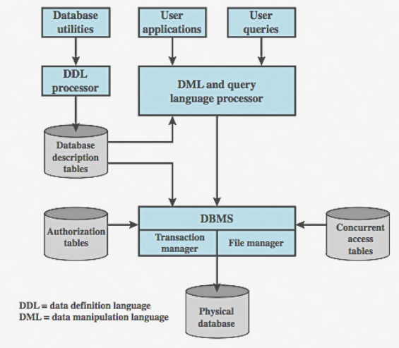

# Contents

- [Electronic User Authentication](#electronic-user-authentication)
  - [Types of Authentication Factors](#types-of-authentication-factors)
  - [Key Principles of Electronic User Authentication](#key-principles-of-electronic-user-authentication)
  - [Password-Based Authentication](#password-based-authentication)
    - [Workflow](#workflow-of-password-based-authentication)
    - [Password Storage Techniques](#password-storage-techniques)
    - [Security Concerns](#security-concerns)
    - [Best Practices](#best-practices-for-password)
  - [Token-Based Authentication](#token-based-authentication)
    - [Workflow](#workflow-of-token-based-authentication)
    - [Features](#features-of-token-based-authentication)
    - [Security Concerns](#security-concerns-1)
  - [Biometric Authentication](#biometric-authentication)
    - [Types](#types-of-biometric-authentication)
    - [Workflow](#workflow-of-biometric-authentication)
    - [Benifits](#benefits-of-biometric-authentication)
    - [Limitations](#limitations-of-biometric-authentication)
- [Access Control](#access-control)
  - [Access Control Principles](#access-control-principles)
  - [UNIX File Access Control](#unix-file-access-control)
    - [Components](#components-of-access-control-in-unix)
    - [File Types](#permission-types)
  - [Role-Based Access Control](#role-based-access-control)
    - [Components](#components-of-rabc)
    - [Workflow](#workflow-of-rbac)
    - [Benifits](#benefits-of-rbac)
    - [RBAC vs Other Models](#rbac-vs-other-models)
  - [Attribute-Based Access Control](#attribute-based-access-control)
    - [Components](#components-of-abac)
    - [Workflow](#abac-workflow)
    - [Benifits](#benifits-of-abac)
    - [ABAC vs RBAC](#abac-vs-rbac)
- [Database Security](#database-security)
  - [Database Architecture](#database-architecture)
  - [RDBMS](#rdbms)
  - [SQL Injection](#sql-injection)
    - [Types](#types-of-sqli)
    - [Example](#example)
    - [Countermeasures](#countermeasures-preventing-sql-injection)
  - [Database Access Control](#database-access-control)
    - [Types](#types-of-database-access-control)
    - [Countermeasures](#countermeasures-for-secure-access-control)
  - [Inference Attack](#inference-attack)
  - [Database Encryption](#database-encryption)
  - [Cross-Site Scripting (XSS)](#cross-site-scripting-xss)
    - [Types](#types-of-xss)
    - [Countermeasures](#countermeasures-against-xss)
  - [Cross-Site Request Forgery (CSRF)](#cross-site-request-forgery-csrf)
    - [Workflow](#workflow-of-csrf)
    - [Countermeasures](#countermeasures-against-csrf)
- [Software Security Lifecycle](#software-security-lifecycle)
  - [Software Development Lifecycle](#software-development-lifecycle)
  - [SSDLC Phases](#ssdlc-phases)
  - [Security Requirements](#security-requirements)
  - [Security Training](#security-training)
  - [Security Metrics](#security-metrics)
  - [Compliance Reporting](#compliance-reporting)
  - [Risk-Based Security Testing](#risk-based-security-testing)
  - [Safe Code Touchpoints](#safe-code-touchpoints)

# Electronic User Authentication

Electronic User Authentication is the process of verifying the identity of a user or system trying to access a software application, service, or resource. It is a fundamental part of access control, ensuring that only legitimate users can gain access and perform authorized actions.

## Types of Authentication Factors

| Factor Type        | Description        | Example                         |
| ------------------ | ------------------ | ------------------------------- |
| Something you know | Knowledge-based    | Password, PIN                   |
| Something you have | Possession-based   | Smart card, OTP token           |
| Something you are  | Inherent/biometric | Fingerprint, facial recognition |
| Somewhere you are  | Location-based     | GPS, IP address                 |
| Something you do   | Behavior-based     | Typing rhythm, mouse movement   |

**Multi-Factor Authentication (MFA):** Combines two or more factors for stronger security.

## Key Principles of Electronic User Authentication

1. **Identification**
   - The process where a user asserts an identity (e.g., username or ID).
   - Example: Typing in "john_doe" on a login page.
2. **Authentication**
   - The verification of the identity claimed in the identification step.
   - Done by validating credentials such as passwords, tokens, biometrics.
   - Example: Entering a password that matches the one stored for "john_doe".
3. **Authorization**
   - Once authenticated, the system checks what resources the user is allowed to access.
   - Example: John is only allowed to view his own documents, not admin panels.
4. **Accountability**
   - Ensuring actions can be traced back to the authenticated user.
   - Requires logging, auditing, and unique user IDs.
   - Example: Keeping a log that shows "john_doe deleted file X at 10:42 AM".
5. **Non-repudiation**
   - The inability of a user to deny having performed an action.
   - Example: A digitally signed transaction proves John authorized a payment.

## Password-Based Authentication

Password-Based Authentication is the most common and traditional method of verifying a user’s identity. It involves the user providing a secret string (password) that only they should know, and the system verifies it against stored credentials.

It is part of the **“something you know”** authentication factor.

### Workflow of Password-Based Authentication

1. **User Registration**
   - The user creates a username and password.
   - The password is hashed and salted, then stored in a secure database.
2. **User Login**
   - The user provides the username and password.
   - The system hashes the input password and compares it to the stored hash.
   - If they match, the user is authenticated.

### Password Storage Techniques

- **Hashing:** Transforms the password into a fixed-length string. One-way, non-reversible.
- **Salting:** Adds a unique random value to each password before hashing to prevent dictionary attacks.
- **Key Stretching:** Uses algorithms like bcrypt, PBKDF2, or Argon2 to make hashing slower and more secure.

### Security Concerns

- **Brute-force attack:** Trying all possible password combinations.
- **Dictionary attack:** Using common passwords from a list.
- **Phishing:** Tricking users into revealing passwords.
- **Keylogging:** Capturing typed passwords with malware.
- **Credential stuffing:** Using leaked credentials from other sites.

### Best Practices for Password

1. **Enforce strong passwords:** Mix of uppercase, lowercase, digits, symbols
2. **Implement account lockout:** Temporarily disable login after several failed attempts
3. **Use salting and hashing:** Prevents password database theft from becoming catastrophic
4. **Support Multi-Factor Authentication (MFA):** Adds a second layer of security
5. **Password expiration policies:** Optional in modern security, but helpful in high-risk systems
6. Do not store plain text passwords

## Token-Based Authentication

Token-Based Authentication is a method where a user is authenticated once, and a token is issued to them. This token is used to access protected resources instead of sending the username and password repeatedly.

It belongs to the **“something you have”** authentication factor.

### Workflow of Token-Based Authentication

1. **Login:** User submits username and password.
2. **Token Generation:** If credentials are valid, the server generates a token (e.g., JWT - JSON Web Token).
3. **Token Storage:** The token is sent to the client. The client stores the token (e.g., in browser local storage or mobile memory).
4. **Subsequent Requests:** Client includes the token in the `Authorization` header: `Authorization: Bearer <token>`
5. **Token Validation:** Server verifies the token on every request without needing to query a session store.
6. **Access Granted:** If the token is valid and not expired, the request is processed.

### Features of Token Based Authentication

- **Stateless:** No need to store sessions on the server.
- **Scalable:** Perfect for distributed or microservice systems.
- **Tamper-Proof:** Tokens are signed (e.g., with HMAC SHA256).
- **Custom Claims:** Can include user info, roles, permissions.

### Security Concerns

| Threat         | Description                                | Mitigation                                     |
| -------------- | ------------------------------------------ | ---------------------------------------------- |
| Token theft    | If attacker steals token, they gain access | Use HTTPS; set short expiration; rotate tokens |
| Replay attacks | Reusing a valid token                      | Use nonce, IP binding, or refresh tokens       |
| Expired tokens | Tokens need to be refreshed periodically   | Use Refresh Tokens and access token rotation   |

## Biometric Authentication

Biometric Authentication is a method of verifying a user's identity using unique biological or behavioral characteristics. It belongs to the "something you are" factor of authentication.

These traits are inherent to the user, making biometric systems more resistant to theft or impersonation compared to passwords or tokens.

### Types of Biometric Authentication

| Type                    | Description                                            | Example                         |
| ----------------------- | ------------------------------------------------------ | ------------------------------- |
| Fingerprint Recognition | Analyzes the unique patterns of a person’s fingerprint | Phone unlock, secure apps       |
| Facial Recognition      | Maps and matches facial features                       | Face ID on iPhones              |
| Iris/Retina Scan        | Scans the eye's patterns                               | High-security facilities        |
| Voice Recognition       | Matches voice patterns                                 | Voice-enabled banking           |
| Hand Geometry           | Measures hand shape, finger length                     | Secure access control           |
| Behavioral Biometrics   | Analyzes typing speed, gait, or mouse use              | Fraud detection in banking apps |

### Workflow of Biometric Authentication

1. **Enrollment:**
   - The user provides a biometric sample (e.g., fingerprint).
   - System creates a template (a digital map, not the actual image).
   - Template is securely stored in a biometric database or device.
2. **Authentication:**
   - The user provides a new biometric sample.
   - The system extracts features from the sample.
   - It compares these with the stored template.
   - If similarity score exceeds the threshold → Access granted.

### Benefits of Biometric Authentication

- **High security:** Hard to steal or duplicate biometric data
- **Convenience No:** need to remember passwords
- **Non-transferable:** Biometrics are unique to each individual
- **Fast authentication:** Often faster than typing a password

### Limitations of Biometric Authentication

| Limitation                  | Description                                  | Mitigation                                            |
| --------------------------- | -------------------------------------------- | ----------------------------------------------------- |
| False Acceptance Rate (FAR) | Unauthorized user is accepted                | Use multi-modal biometrics or lower tolerance         |
| False Rejection Rate (FRR)  | Authorized user is denied                    | Improve sensor quality or re-enroll users             |
| Spoofing attacks            | Use of fake fingerprints or photos           | Use liveness detection (e.g., blink detection, pulse) |
| Data privacy                | Biometric data is sensitive and irreversible | Store templates securely, use on-device storage       |
| Hardware dependency         | Needs specific sensors                       | Limited to supported devices only                     |

# Access Control

Access control is a fundamental concept in software security that ensures only authorized users can access specific resources or perform particular operations. It works alongside authentication to safeguard data and systems from unauthorized use or malicious access.

## Access Control Principles

1. **Least Privilege:** Users or systems should be granted the minimum level of access — or permissions — necessary to perform their tasks.
2. **Need to Know:** Access to sensitive information is granted only if the user needs that information to perform their job functions.
3. **Separation of Duties:** No single user should have full control over all aspects of a critical process. Duties are divided among different people to reduce fraud or error.
4. **Defense in Depth:** Use multiple layers of security controls to protect resources, so if one layer fails, others are still in place.
5. **Fail-Safe Defaults:** By default, access should be denied unless explicitly allowed.
6. **Accountability:** Systems must keep track of who accessed what and when. All actions should be logged and traceable.
7. **Role-Based Access Control:** Users are assigned to roles, and roles have permissions. Access is granted based on the role, not the individual user.
8. **Attribute-Based Access Control:** Access decisions are based on attributes (user, resource, environment, etc.)

## UNIX File Access Control

UNIX systems (including Linux and macOS) implement a simple but effective access control model for files and directories based on:

1. User Authentication (Who are you?)
2. Access Control (What are you allowed to do?)

### Components of Access Control in UNIX:

1. **User (Owner):** The creator or assigned owner of the file.
2. **Group:** A set of users who share permissions to a file.
3. **Others:** All other users on the system.

### Permission Types:

Each file or directory can have three types of permissions:

- r – read
- w – write
- x – execute

Each permission is applied separately for:

- Owner
- Group
- Others

## Role-Based Access Control

RBAcs designed to restrict system access based on the roles assigned to users. RBAC is used in everything from operating systems and databases to enterprise applications and cloud services.

### Components of RABC

1. **Users** – Human or system accounts that need access.
2. **Roles** – A named collection of permissions (e.g., "Admin", "Editor", "Viewer").
3. **Permissions** – Allowed operations (e.g., read file, edit record, delete user).
4. **Sessions** – A user’s active connection that inherits the role’s permissions.

### Workflow of RBAC

Instead of assigning permissions directly to users, you:

- Assign permissions to roles.
- Assign roles to users.

This indirect assignment makes access control easier to manage, especially in large systems.

### Benefits of RBAC

- **Simplicity:** Easy to manage access for large numbers of users
- **Scalability:** Add new users or roles without modifying individual permissions
- **Security:** Reduces chance of granting too many permissions
- **Compliance:** Aligns with regulatory standards like HIPAA, GDPR, etc

### RBAC vs Other Models

- **RBAC:** Access based on user roles
- **DAC (Discretionary Access Control):** Owner controls who has access to resources
- **MAC (Mandatory Access Control):** System-enforced access based on classification levels
- **ABAC (Attribute-Based Access Control):** Access based on attributes (e.g., time, location, user dept)

## Attribute-Based Access Control

Attribute-Based Access Control (ABAC) is a fine-grained access control model used in software security where access decisions are based on attributes of the user, resource, action, and environment.

### Components of ABAC

- **Subject Attributes:** Characteristics of the user (e.g., department, job title, security clearance).
- **Resource Attributes:** Characteristics of the object/data (e.g., sensitivity level, owner).
- **Action Attributes:** The operation being performed (e.g., read, write, delete).
- **Environment Attributes:** Contextual info (e.g., time of day, IP address, location).

### ABAC Workflow

Access is granted when a policy rule evaluates to TRUE using attribute values.

- A user requests to perform an action on a resource.
- The system collects all relevant attributes.
- The access control policy is evaluated.
- Access is granted or denied based on the result.

### Benifits of ABAC

- **Fine-grained control:** Supports complex access rules based on real-time context
- **Dynamic policies:** No need to create/update roles manually for every condition
- **Scalability:** Easily adapts to large, changing environments
- **Separation of policy and logic:** Policies can be changed without modifying application code

### ABAC vs RBAC

| Feature           | RBAC                        | ABAC                              |
| ----------------- | --------------------------- | --------------------------------- |
| Based On          | Roles                       | Attributes                        |
| Flexibility       | Moderate                    | High                              |
| Granularity       | Coarse-grained              | Fine-grained                      |
| Dynamic Decisions | No (static roles)           | Yes (evaluates in real-time)      |
| Scalability       | Challenging with many roles | Scales better with fewer policies |

# Database Security

## Database Architecture



## RDBMS

A relational database is a type of database that organizes data into tables (relations), where each table consists of rows and columns. The tables are related to each other through primary keys and foreign keys.

### Key Concepts

- **Tables:** Data is stored in structured tables.
- **Rows (Records):** Each row represents a unique record.
- **Columns (Fields):** Each column stores a specific type of data.
- **Primary Key:** A unique identifier for each record in a table.
- **Foreign Key:** A column that establishes a relationship between two tables

## SQL Injection

SQL Injection is a security vulnerability that allows attackers to manipulate SQL queries by injecting malicious input into a database query. This can lead to unauthorized access, data leakage, and even deletion of data.

### Types of SQLi

| Type                | Description                                      | Output Visibility | Example                             |
| ------------------- | ------------------------------------------------ | ----------------- | ----------------------------------- |
| In-band (Classic)   | Attack and result use same channel               | Yes               | `' OR 1=1 --`                       |
| Error-Based         | Uses DB error messages                           | Yes               | `' AND 1=CONVERT(int, 'a') --`      |
| Union-Based         | Uses UNION to extract data                       | Yes               | `' UNION SELECT username, pass --`  |
| Blind - Boolean     | Response changes on true/false                   | No                | `' AND 1=1 --` vs `' AND 1=2 --`    |
| Blind - Time-Based  | Uses delay functions to infer data               | No                | `' IF(1=1, SLEEP(5), 0) --`         |
| Out-of-Band (OOB)   | Uses DNS or HTTP for data exfiltration           | Maybe             | `'; EXEC xp_cmdshell('curl ...')--` |
| Second-Order        | Payload stored and executed later                | Maybe             | Stored in user profile              |
| Stored (Persistent) | Malicious input stored in DB for later execution | Yes/No            | Malicious comment                   |

### Example

Consider a login system where users enter their username and password. The system checks credentials with the following SQL query:

```sql
SELECT * FROM users WHERE username = 'user123' AND password = 'password123';
```

An attacker can input the following in the username field:

```sql
' OR '1' = '1
```

This modifies the query to:

```sql
SELECT * FROM users WHERE username = '' OR '1' = '1' AND password = 'password123';
```

Since `1 = 1` is always true, the attacker gains access without a valid password.

### Countermeasures: Preventing SQL Injection

1. **Parameterized Queries:**
   ```py
   cursor.execute("SELECT * FROM users WHERE username = ? AND password = ?", (username, password))
   ```
2. **Input Validation and Sanitization:** Validate input types, lengths, and formats.
3. **Error Handling:** Don’t expose database error messages to users.
4. **Least Privilege Principle:** The database account used by the application should have the least privileges necessary. Never use the root/admin user for app access.

## Database Access Control

Database Access Control is a security mechanism that determines who is allowed to access the database, and what actions they are allowed to perform. It ensures that unauthorized users cannot view, change, or delete sensitive data.

### Types of Database Access Control

| Model                                 | Description                                                      | Example                                              |
| ------------------------------------- | ---------------------------------------------------------------- | ---------------------------------------------------- |
| Discretionary Access Control (DAC)    | Data owner decides who can access data                           | User A grants read access on a table to User B       |
| Mandatory Access Control (MAC)        | System enforces access policies based on classification          | Military systems with "Confidential", "Secret", etc. |
| Role-Based Access Control (RBAC)      | Access rights are assigned based on roles                        | "Manager" role can access salary data                |
| Attribute-Based Access Control (ABAC) | Access is based on attributes of user, resource, and environment | Access only if `user.dept = "HR"` AND `time < 5 PM`  |

### Countermeasures for Secure Access Control

1. **Implement Role-Based Access Control (RBAC):** Assign only necessary privileges per role
2. **Use Least Privilege Principle:** Users and apps should get minimum required permissions
3. **Regularly Audit User Privileges:** Periodically review and revoke unnecessary permissions
4. **Disable Default Accounts & Change Default Passwords:** Remove or secure installation-time users
5. **Enforce Strong Authentication:** Require strong passwords

## Inference Attack

An inference attack is a security threat where an attacker infers sensitive or restricted information by analyzing non-sensitive data that is available to them.

Instead of directly accessing confidential data, the attacker uses indirect clues, statistics, or patterns to deduce protected information.

### Types of Inference Attack

| Type               | Description                                                        | Example                                                                                |
| ------------------ | ------------------------------------------------------------------ | -------------------------------------------------------------------------------------- |
| Direct Inference   | Sensitive data is deduced from allowed queries or outputs.         | Getting salary of a specific employee by querying average salary of a small department |
| Indirect Inference | Combining multiple non-sensitive facts to deduce a sensitive fact. | Inferring health condition based on prescribed drugs or visit frequency                |

## Database Encryption

Database encryption is the process of converting sensitive data stored in a database into ciphertext using encryption algorithms, so that even if an unauthorized party accesses the database, the data remains unreadable without the decryption key.

It is a core data-at-rest protection technique, ensuring confidentiality even if attackers bypass other security layers.

### Types of Database Encryption

| Type                              | Description                                      | Use Case                                |
| --------------------------------- | ------------------------------------------------ | --------------------------------------- |
| Transparent Data Encryption (TDE) | Encrypts entire database files at storage level  | Protects against file-level attacks     |
| Column-Level Encryption           | Encrypts specific sensitive columns              | Useful for credit cards, SSNs, etc.     |
| Application-Level Encryption      | Data encrypted by the app before reaching the DB | Offers highest security, even from DBAs |
| Backup Encryption                 | Encrypts backups separately                      | Protects archives and offsite storage   |

## Cross-Site Scripting (XSS)

Cross-Site Scripting (XSS) is a client-side code injection attack where an attacker injects malicious scripts (usually JavaScript) into content that is served to users. These scripts then execute in the victim’s browser, potentially stealing sensitive data or taking control of user sessions.

### Types of XSS

| Type          | Description                                                            | Example                                     |
| ------------- | ---------------------------------------------------------------------- | ------------------------------------------- |
| Stored XSS    | Script is saved on the server (e.g., in DB), affecting multiple users. | Malicious comment on a blog post            |
| Reflected XSS | Script is part of the request and reflected in the response.           | Malicious link sent via email               |
| DOM-Based XSS | Script is executed through insecure JavaScript in the browser.         | JS reads `window.location` and injects HTML |

### Countermeasures Against XSS

1. **Input Validation and Sanitization:** Reject unexpected input (e.g., script tags, special characters).
2. Output Encoding
3. **HTTPOnly and Secure Cookies:** Prevents JavaScript from accessing session cookies.
4. **Avoid Inline JavaScript:** Move scripts to external files and avoid inline event handlers

## Cross-Site Request Forgery (CSRF)

Cross-Site Request Forgery (CSRF) is a web security vulnerability that tricks a logged-in user’s browser into sending an unauthorized request to a web application without the user’s consent.

- The attacker exploits the user’s active session with the trusted website.
- The victim unknowingly performs actions like changing passwords, transferring funds, or submitting forms.

### Workflow of CSRF

1. User logs into a trusted website (e.g., bank.com) and has an active session cookie.
2. User visits a malicious website controlled by the attacker.
3. The attacker’s site sends a forged request (e.g., form submission) to 4. bank.com using the user’s credentials automatically via the browser.
4. bank.com processes the request because the session cookie is sent automatically.
5. The attacker achieves unauthorized actions on behalf of the user.

### Countermeasures Against CSRF

1. **CSRF Tokens (Anti-CSRF Tokens):** Generate a unique, unpredictable token per user session.
2. **SameSite Cookies:** Set the SameSite attribute on cookies to Strict or Lax. Prevents browser from sending cookies on cross-site requests.
3. **Use HTTP Methods Appropriately:** Use POST for state-changing actions (not GET).
4. **Check Referer or Origin Header:** Reject requests from unknown origins.

# Software Security Lifecycle

The Software Security Lifecycle (SSL) is a systematic approach to integrating security into each phase of the Software Development Lifecycle (SDLC). This ensures that security is not an afterthought but is built into the software from inception to deployment and maintenance.

## Software Development Lifecycle

| Phase          | Security Action                      | Explanation                                                            |
| -------------- | ------------------------------------ | ---------------------------------------------------------------------- |
| Requirements   | Require HTTPS for all user activity  | Prevent data sniffing on login and payment                             |
| Design         | Use role-based access control (RBAC) | Ensure users only access data they are authorized for                  |
| Implementation | Sanitize input on search bar         | Prevent SQL injection and XSS                                          |
| Testing        | Conduct black-box pen test           | External tester finds a flaw in payment flow                           |
| Deployment     | Set Content Security Policy headers  | Prevents many types of client-side injection                           |
| Maintenance    | Monitor logs for anomalies           | Alerts if a user logs in from multiple IPs quickly (could be a hijack) |

## SSDLC Phases

1. **Identify:** Identify critical systems, analyze threats, ensure regularity compilance
2. **Protect:** Implement security controls to protect systems and unauthorized access.
3. **Detect:** Monitor network traffic for threats.
4. **Respond:** Define steps to handle security breaches.
5. **Recover:** Restore affected systems and improve security to prevent future incidents.

## Security Requirements

The five key security principles are:

1. **Confidentiality** – Protecting sensitive data from unauthorized access.
2. **Integrity** – Ensuring data is accurate and unaltered.
3. **Availability** – Ensuring systems are always accessible.
4. **Non-repudiation** – Preventing denial of actions performed.
5. **Authentication** – Verifying user identity.

| Category             | Description                                              | Example                                                 |
| -------------------- | -------------------------------------------------------- | ------------------------------------------------------- |
| Authentication       | Ensure only authorized users can access the system       | Users must log in using username + password + 2FA       |
| Authorization        | Ensure users only access resources they are permitted to | Admins can edit user data; normal users cannot          |
| Data Protection      | Protect sensitive data at rest and in transit            | Encrypt all personal data using AES-256                 |
| Input Validation     | Prevent malicious input from users                       | Validate and sanitize all form inputs                   |
| Logging & Monitoring | Record activity for auditing and detection               | Log all failed login attempts and alert on 10+ failures |
| Error Handling       | Prevent leakage of internal system details               | Show generic error messages to users                    |
| Session Management   | Control how user sessions are created and terminated     | Expire sessions after 15 minutes of inactivity          |
| Compliance           | Meet regulatory standards (GDPR, HIPAA, etc.)            | Store data in a GDPR-compliant EU region only           |

## Security Training

| Role       | Training                                                                     | Why It's Important                                                  |
| ---------- | ---------------------------------------------------------------------------- | ------------------------------------------------------------------- |
| Developers | Secure coding bootcamp (focus: input validation, access control, encryption) | Avoid HIPAA violations by preventing injection, unauthorized access |
| Testers    | Training on how to write and run security test cases using OWASP ZAP         | Catch vulnerabilities before they go to production                  |
| Architects | Threat modeling workshop                                                     | Identify and mitigate attack vectors in early design                |
| DevOps     | Secure CI/CD training: secrets management, image scanning                    | Ensure infrastructure-as-code and builds are hardened               |

## Security Metrics

| Metric                        | Description                                                               | Example                             |
| ----------------------------- | ------------------------------------------------------------------------- | ----------------------------------- |
| Vulnerability Density         | Number of security vulnerabilities per 1,000 lines of code (KLOC)         | 0.5 vulnerabilities/KLOC            |
| Patch Time (MTTR)             | Average time to resolve a reported vulnerability (Mean Time To Remediate) | 3 days                              |
| Static Analysis Findings      | Number of issues found during static scans                                | 10 critical, 30 medium, 50 low      |
| Penetration Test Success Rate | Number of successful exploit attempts during pen test                     | 2 successful out of 50              |
| Security Test Coverage        | % of security test cases executed vs. planned                             | 90%                                 |
| Code Review Compliance        | % of code that underwent secure code review                               | 100% of backend code reviewed       |
| Incident Response Metrics     | Number of incidents reported, resolved, escalated                         | 5 reported, 4 resolved, 1 escalated |
| Training Completion           | % of developers trained in secure coding                                  | 95% completed OWASP Top 10 training |

## Compliance Reporting

Compliance reporting is the process of generating and sharing documentation and evidence that proves your software and development process complies with applicable standards.

| Standard          | Description                                                   |
| ----------------- | ------------------------------------------------------------- |
| **OWASP ASVS**    | Application Security Verification Standard                    |
| **GDPR**          | General Data Protection Regulation (EU data privacy)          |
| **HIPAA**         | Health data protection regulation (US)                        |
| **PCI DSS**       | Payment Card Industry Data Security Standard                  |
| **ISO/IEC 27001** | Information Security Management System standard               |
| **NIST 800-53**   | Security and privacy controls for federal information systems |

## Risk-Based Security Testing

Risk-Based Security Testing (RBST) is a strategic approach to security testing where testing priorities are aligned with the potential business impact and likelihood of security threats.

### Concepts

| Term           | Definition                                                              |
| -------------- | ----------------------------------------------------------------------- |
| **Risk**       | The potential for loss or damage when a threat exploits a vulnerability |
| **Likelihood** | Probability that a given threat will exploit a vulnerability            |
| **Impact**     | Severity of the consequences if a vulnerability is exploited            |
| **Risk Level** | A combination of **likelihood × impact**, used to prioritize            |

### Example

| Component         | Threat              | Likelihood | Impact | Risk Level   |
| ----------------- | ------------------- | ---------- | ------ | ------------ |
| Login System      | Credential stuffing | High       | High   | **Critical** |
| Admin Panel       | SQL injection       | Medium     | High   | High         |
| Static Pages      | XSS                 | Low        | Medium | Medium       |
| Newsletter Signup | CSRF                | Low        | Low    | Low          |

## Safe Code Touchpoints

| SSDLC Phase    | Safe Code Touchpoint                        | Description                                                                               |
| -------------- | ------------------------------------------- | ----------------------------------------------------------------------------------------- |
| Requirements   | **Security Requirements**                   | Define non-functional security requirements like encryption, access control, data privacy |
| Design         | **Architectural Risk Analysis**             | Identify high-level design flaws, threat modeling (e.g., STRIDE)                          |
| Implementation | **Secure Coding**                           | Use safe coding patterns, avoid risky APIs, follow language-specific best practices       |
| Testing        | **Security Testing**                        | Conduct static (SAST), dynamic (DAST), fuzzing, and manual testing of security controls   |
| Code Review    | **Code Review with Security Focus**         | Inspect code for common security mistakes and logic flaws                                 |
| Deployment     | **Security Configuration Management**       | Harden configurations, disable debug/logging modes, enforce secure deployment practices   |
| Maintenance    | **Penetration Testing & Risk-Based Audits** | Test applications in production or staging environments for new and existing risks        |
