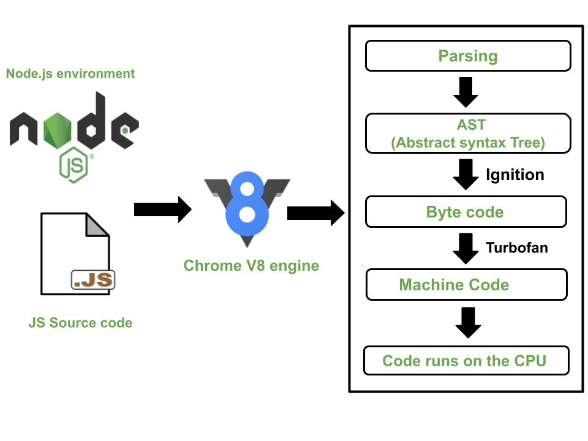

# Contents

## 1. Introduction

- [Introduction](#introduction)
  - [Core Characteristics of JavaScript](#core-characteristics-of-javascript)
  - [Programming Paradigms](#programming-paradigms)
  - [Runtime Behaviour](#runtime-behavior)
- [ECMAScript](#ecmascript)
  - [ECMAScript 2025](#features-introduced-in-ecmascript-2025)
- [DRY vs WET](#dry-vs-wet)
  - [Don’t Repeat Yourself](#dry-dont-repeat-yourself)
  - [We Enjoy Typing](#wet-write-everything-twice--we-enjoy-typing)
  - [Comparison of DRY and WET](#comparison-of-dry-and-wet)
## 2. Fundamentals

- [Data Types](#data-types)
  - [Primitive Data Types](#primitive-data-types)
  - [Non-Primitive Data Types](#non-primitive-reference-data-types)
  - [Value vs Reference](#key-difference-value-vs-reference)
- [Variables](#variable-declaration)
  - [Hoisting](#hoisting)
  - [Temporal Dead Zone](#temporal-dead-zone)
  - [Scope](#scope)
    - [Lexical Scope](#lexical-scope)
    - [Variable Shadowing](#variable-shadowing)
    - [Scope Chain](#scope-chain)
  - [Closure](#closure)
    - [Why Closures Exist?](#why-closures-exist)
    - [Basic Example of Clousure](#basic-example-of-clousure)
    - [Closure with Private Variables](#closure-with-private-variables)
    - [Closure in Loops](#closure-in-loops)
- [Operators](#operator)
  - [`typeof`](#typeof)
  - [Truthy & Falsy](#truthy-and-falsy)

## 3. Control Structures

- [Loops](#loops)
  - [Differences between `for...of` and `for...in`](#differences-between-forof-and-forin)
- [Expression and Statement](#expression-and-statement)
  - [Expression](#expression)
  - [Statement](#statement)

## 4. Functions

- [First Class Functions](#first-class-function)
  - [HOF](#hof)
- [Arrow Functions](#arrow-function)
- [IIFE (Immediately Invoked Function Expression)](#iife)
- [`this` Keyword](#this-keyword)
  - [Global Context](#global-context)
  - [Inside a Function](#inside-a-function)
  - [Object Rules](#object-rules)
  - [Arrow Functions](#arrow-functions)
  - [Explicit Binding](#explicit-binding)
- [`call`, `bind`, `apply`](#call-bind-apply)
- [Function Constructor](#function-constructor)

## 5. Objects & Prototypes

- [Object Basics](#object)
  - [Bracket Notation](#bracket-notation)
- [Prototype](#prototype)
  - [Key Concepts](#key-concepts-of-prototype)
  - [Example](#example-of-prototype)
  - [`Person` vs `Person.prototype`](#person-vs-personprototype)
- [Constructor Functions](#constructor)
  - [Default Function Constructor](#default-function-constructor)
  - [Constructor Inheritance](#constructor-inheritance)
- [Class](#class)
- [OOP](#oop)
  - [Encapsulation](#encapsulation)
  - [Inheritance](#inheritance)
  - [Polymorphism](#polymorphism)
  - [Abstraction](#abstraction)

## 6. Arrays & Strings

- [Array](#array)
  - [`slice()`](#slice)
  - [`splice()`](#splice)
  - [Differences between `slice()` and `splice()`](#differences-between-slice-and-splice)
  - [`map()`](#map)
  - [`filter()`](#filter)
  - [`reduce()`](#reduce)
  - [Differences of `map()`, `filter()`, `reduce()`](#differences-of-map-filter-reduce)
  - [`some()`](#some)
  - [`every()`](#every)
  - [Differences of `some()` and `every()`](#differences-of-some-and-every)
- [String](#string)

## 7. Advanced Features

- [Template Literals](#template-literal)
- [Spread Operator](#spread-opertor)
- [Rest Parameters](#rest-parameter)
- [Type Conversion](#type-conversion)
- [RegEx](#regular-expression)

## 8. Error Handling

- [Error vs Exception](#error)
- [throw](#throw)
- [Error Object](#error-object)
- [try...catch...finally](#exception)

## 9. Asynchronous JavaScript

- [Execution Model](#execution-model)
- [Synchronous](#synchronous)
- [Asynchronous](#asynchronous)
- [Callback Functions](#callback-function)
- [Promises](#promise)
- [async/await](#asyncawait)
- [Ajax](#ajax)
  - [How Does AJAX Work?](#how-does-ajax-work)
  - [Methods](#methods)

## 10. Environment

- [Engine](#engine)
- [Runtime](#runtime)
- [Execution Context](#execution-context)
- [Thread](#thread)

## 11. Browser APIs

- [DOM](#dom)
- [Window Object](#window-object)
- [Console](#console)
- [REPL](#repl)

## 12. Miscellaneous

- [Strict Mode](#strict-mode)
- [Syntactic Sugar](#syntactic-sugar)
- [Math Object](#math-object)
- [Date Object](#date-object)
- [Map](#map)

# Introduction

## Core Characteristics of JavaScript

**High-level:** JavaScript is considered a high-level language because it abstracts away most of the complex details of the computer, such as memory management and low-level operations, allowing developers to focus on logic and problem-solving.

```js
let num = 42; // No need to allocate memory manually
```

**What if JavaScript were not high-level?**

It would be more like Assembly language or machine code. That means:

- You’d have to manage memory yourself (decide where variables live in RAM).
- You’d need to use CPU instructions directly (MOV, ADD, etc.).
- Writing even simple programs would be harder, longer, and less readable.

Example (same x + y):

```asm
MOV A, 5      ; Put 5 into register A
MOV B, 10     ; Put 10 into register B
ADD A, B      ; Add A and B, result in A
PRINT A       ; Print the result
```

### Comparison with C

| Feature            | C                              | JavaScript                    |
| ------------------ | ------------------------------ | ----------------------------- |
| Level              | High-level (but lower than JS) | High-level                    |
| Memory Management  | Manual                         | Automatic (garbage collected) |
| Closest to Machine | Yes, allows pointers           | No, abstracted                |
| Ease of Writing    | Moderate                       | Very easy                     |

**Dynamic Typing:** JavaScript is dynamically typed, meaning you don't need to declare variable types explicitly. The type is determined at runtime.

```js
let x = 10; // number
x = "hello"; // now string
```

**Interpreted & Just-in-time Compiled:** Originally an interpreted language, JavaScript is now executed using Just-In-Time (JIT) compilation by modern engines (like V8 in Chrome). This means code is parsed and optimized into machine code at runtime, combining the flexibility of interpretation with the performance benefits of compilation.

```js
console.log("Executed in real-time by browser/engine");
```

- **Interpreted:** Imagine you are reading a comic book out loud to your friends. You don’t prepare in advance, you just read each line as you go. That’s how interpreted languages work — the computer reads and runs the code line by line.

- **Just-in-time (JIT) Compiled:** Now imagine instead of just reading, you quickly translate the comic into your friend’s language while reading, so they understand faster. That’s JIT — the computer changes the code into its own “machine language” right when it’s running, so it goes faster.

- **If it’s not Interpreted & not Just-in-time Compiled**

  That means it’s a fully compiled language like C or Rust.

  - You have to translate the entire book before reading it.
  - The computer needs the whole program compiled into machine code before it can run at all.
  - No quick changes in the browser — you’d have to “build” every time before testing.

    Node.js is JavaScript outside the browser — for server-side apps. Even though JS is interpreted, there are reasons we “build”(Node.js can run js without even building but can't do it for typescript) Node.js apps:

    - Node.js allows ES6+ syntax (like `import`, `async/await`) and TypeScript.
    - Older Node.js versions may not support all features directly, so we transpile code before running.
    - Building ensures compatibility.

## Programming Paradigms

**Multi-paradigm:** JavaScript supports multiple programming paradigms, including object-oriented, functional, and imperative programming.

```js
// Functional
[1, 2, 3].map((n) => n * 2);

// OOP
class Dog {
  bark() {
    console.log("Woof");
  }
}

// Imperative
for (let i = 0; i < 3; i++) console.log(i);
```

**Prototype-based Object Orientation:** Instead of classical inheritance (like Java or C++), JavaScript uses prototypes, where objects can directly inherit from other objects.

```js
function Animal(name) {
  this.name = name;
}
Animal.prototype.speak = function () {
  console.log(this.name + " makes a sound");
};

const dog = new Animal("Rex");
dog.speak(); // Rex makes a sound
```

**Functional:** With higher-order functions, closures, immutability practices, and functions as first-class citizens, JavaScript allows developers to follow a functional programming style.

```js
function greet(name) {
  return "Hi " + name;
}
function executor(fn, value) {
  return fn(value);
}

console.log(executor(greet, "Alice")); // Hi Alice
```

**Imperative Programming Style:** JavaScript also supports imperative programming, where tasks are defined step by step using constructs like loops, conditionals, and assignments.

If it’s not Imperative Programming Style, that means you wouldn’t give the computer step-by-step instructions. Instead you might use a Declarative style (like SQL or HTML), where you just say what you want, not how to do it.

Instead of saying

```js
// Imperative Style
let sum = 0;
for (let i = 1; i <= 5; i++) {
  sum += i;
}
console.log(sum); // 15
```

you’d just say:

```sql
SELECT SUM(numbers) FROM 1_to_5;
```

and the computer figures out the steps.

## Runtime Behavior

**First-class Functions:** Functions are treated like any other variable—they can be passed as arguments, returned from other functions, and stored in variables.

```js
const sayHi = () => console.log("Hi");
const run = (fn) => fn();
run(sayHi); // Hi
```

**Event-driven:** JavaScript is inherently event-driven, making it suitable for building interactive applications. Events (like user clicks, network responses, or timers) drive execution, supported by asynchronous features such as callbacks, promises, and async/await.

```js
// Browser example
document.querySelector("button").addEventListener("click", () => {
  console.log("Button clicked!");
});

// Async example
setTimeout(() => console.log("Runs later"), 1000);
```

It can executes after triggering an event(input is not an event) that's why it called event-driven.

**Event**

- An event is something that happens in the system or browser.
- It could be user actions (click, key press, typing), or system actions (page loaded, timer finished, data received).
- Events are signals that something occurred.

**Input**

- Input usually means the data that comes from the user into the program.
- It can be text typed in a box, numbers entered, choices made, etc.
- Input is often collected because of an event, but it’s the actual value the user provides.

# ECMAScript

It is the standard that defines JavaScript, providing guidelines for its implementation and the syntax that modern JavaScript adheres to. It is the specification of scripting language which set rules.

Javascript first introduced in 1995 as `LiveScript`, but during development it called `Mocha`. But in the next year, in 1995 it changed to `Javascript`.

**Key Features of ES6:**

- Arrow Functions
- Classes
- Template Literals
- Destructuring Assignment
- Default Parameters
- Modules
- Promises
- Let and Const
- Rest and Spread Operators

## Features Introduced in ECMAScript 2025

### Enhanced Set Methods

- Adds mathematical-style set operations: `.union()`, `.intersection()`, `.difference()`, `.symmetricDifference()`
- Utility checks like `.isSubsetOf()`, `.isSupersetOf()`, and .`isDisjointFrom()`.

### JSON Modules and Import Attributes

- Support for JSON modules, allowing direct import of JSON files as modules.
- Import attributes provide structured metadata alongside imports

### `Promise.try()` Utility

- A convenient method that simplifies Promise chains, making it easier to start them without explicitly constructing a new Promise

### New Typed Array: `Float16Array`

Adds support for 16-bit floating-point numbers, useful for certain graphics or performance-sensitive applications

# DRY vs WET
## DRY (Don’t Repeat Yourself)
DRY is a principle that encourages avoiding duplication of code or logic. If something is repeated in multiple places, it should be abstracted into a single place (function, module, class, etc.).

- Reduce redundancy
- Make maintenance easier
- Avoid bugs that happen due to inconsistent updates

```js
// NOT DRY
console.log("Hello, Alice!");
console.log("Hello, Bob!");
console.log("Hello, Charlie!");

// DRY version
function greet(name) {
  console.log(`Hello, ${name}!`);
}

greet("Alice");
greet("Bob");
greet("Charlie");
```
Now if we want to change the greeting, we only change it in one place.
## WET (Write Everything Twice / We Enjoy Typing)
WET is the opposite of DRY. It’s when code is duplicated instead of abstracted. Sometimes people use WET intentionally for simplicity, or because over-abstraction can make code harder to read.

```js
console.log("Hello, Alice!");
console.log("Hello, Bob!");
console.log("Hello, Charlie!");
```
If we want to change "Hello" to "Hi", we must update every line manually, which is error-prone.
## Comparison of DRY and WET
| Aspect       | DRY                         | WET                                     |
| ------------ | --------------------------- | --------------------------------------- |
| Approach     | Reuse code / abstract logic | Duplicate code                          |
| Maintenance  | Easy, changes in one place  | Hard, multiple changes needed           |
| Risk of Bugs | Low                         | High                                    |
| Example      | Functions, classes, modules | Repeated print statements, copied logic |

# Data Types

## Primitive Data Types

Primitive types are the basic, immutable data types.

- Immutable → The value itself cannot be changed (though variables can be reassigned).
- Stored in stack memory (for fast access).
- Compared by value (two primitives are equal if their values are equal).

### List of Primitive Types:

1. String → Text data
2. Number → Integers, floats, `NaN`, `Infinity`
3. BigInt → Large integers beyond `Number` limit
4. Boolean → `true` or `false`
5. Undefined → Declared but not assigned
6. Null → Intentional absence of value
7. Symbol → Unique identifiers

### Example of Primitive Types

```js
// String
let name = "Masum";
console.log(typeof name); // string

// Number
let age = 25;
let pi = 3.14;
console.log(typeof pi); // number

// BigInt
let bigNumber = 1234567890123456789012345678901234567890n;
console.log(typeof bigNumber); // bigint

// Boolean
let isActive = true;
console.log(typeof isActive); // boolean

// Undefined
let x;
console.log(typeof x); // undefined

// Null
let y = null;
console.log(typeof y); // object (quirk in JS)

// Symbol
let sym1 = Symbol("id");
let sym2 = Symbol("id");
console.log(sym1 === sym2); // false (always unique)
```

`null` is of type `"object"` → This is a historical bug in JavaScript.

## Non-Primitive (Reference) Data Types

Non-primitive types are objects (including arrays, functions, dates, etc).

- Mutable → Values can be changed.
- Stored in heap memory, and variables hold a reference (address), not the actual value.
- Compared by reference, not by value (two objects are equal only if they reference the same memory).

### Examples of Non-Primitive Types:

1. Object → Key-value pairs
2. Array → Ordered list of values
3. Function → Callable objects
4. Date, RegExp, Map, Set, WeakMap, WeakSet, etc.

### Example of Non-Primitive Types

```js
// Object
let person = { name: "Masum", age: 25 };
console.log(typeof person); // object

// Array
let numbers = [1, 2, 3];
console.log(typeof numbers); // object (arrays are special objects)

// Function
function greet() {
  console.log("Hello!");
}
console.log(typeof greet); // function

// Date
let today = new Date();
console.log(typeof today); // object
```

## Key Difference: Value vs Reference

```js
// Primitive (value copy)
let a = 10;
let b = a; // copy value
b = 20;
console.log(a); // 10 (unchanged)
console.log(b); // 20

// Non-Primitive (reference copy)
let obj1 = { value: 10 };
let obj2 = obj1; // copy reference
obj2.value = 20;
console.log(obj1.value); // 20 (changed!)
console.log(obj2.value); // 20
```

- Primitive → copies the value
- Non-Primitive → copies the reference (address)

### Value vs Reference Comparison Table

| Feature         | Primitive                                                | Non-Primitive (Reference)                     |
| --------------- | -------------------------------------------------------- | --------------------------------------------- |
| **Examples**    | String, Number, Boolean, Null, Undefined, BigInt, Symbol | Object, Array, Function, Date, Map, Set, etc. |
| **Mutable?**    | ❌ Immutable                                             | ✅ Mutable                                    |
| **Stored in**   | Stack memory                                             | Heap memory                                   |
| **Assigned by** | Value                                                    | Reference (address)                           |
| **Comparison**  | By value (`===`)                                         | By reference (`===`)                          |
| **Size**        | Fixed                                                    | Dynamic                                       |

# Variable Declaration

- Updating/re-assigning `const` variable create `TypeError: Assignment to constant variable.` error.
  ```js
  const a = "hello";
  a = "hi";
  ```
- A variable with same name can be declare twice with `var` but not with `let` and `const`, it will create `SyntaxError: Identifier 'a' has already been declared`.

  ```JS
  let a='hello'; // ERROR
  let a="hi"; // ERROR

  var b="hello";
  var b="hello";
  ```

  a variable with same name can be declare twice with `let` if both are in different scope, this is not applicable for `const`.

  ```js
  let a = 5;
  console.log(a);
  {
    let a = 4;
    console.log(a);
  }
  console.log(a);
  ```

- `var` maintain function/global scope, `let` and `const` maintain local scope.
- Using any variable before declaration with `var` return `undefined` due to hoisting but with `let` and `const` it will return an error of `ReferenceError: Cannot access 'myVariable' before initialization` due to temporal deadzone.
  ```js
  console.log(myVariable);
  let myVariable = "Hello";
  ```

**ReferenceError**: Occurs when a variable that isn’t declared or isn’t accessible is referenced. This often happens due to misspellings, accessing variables in the temporal dead zone, or outside their scope.

**SyntaxError**: Occurs when code does not conform to the correct syntax of the language. This type of error is detected before the code is executed and typically involves missing or incorrect syntax elements.

**TypeError**: Occurs when a value is not of the expected type, such as calling a non-function as a function, or accessing properties on `null` or `undefined`.

**Explaination:**

```js
let i = 50;
for (let i = 0; i < 5; i++) {
  console.log(i);
}
console.log(i);
```

- memory allocate for initial `i` in script object with global scope
- memory allocate for last `i` in script object with local scope

# Hoisting

It's a mechanism where variables and function declarations are moved to the top of their containing scope during the compile phase, before the code is executed. This means that you can use functions and variables before they are declared in the code.

However, **only declarations are hoisted, not initializations**. The declaration is moved to the top, but the assignment or initialization stays in its place.

## Types of Hoisting

**1.Variable Hoisting**:

- Variables declared with `var` are hoisted to the top of their scope but are initialized with `undefined` until they are assigned a value.
- `let` and `const` declarations are hoisted but are not initialized. They are in a "temporal dead zone" (TDZ) from the start of the block until the declaration is encountered.

**2.Function Hoisting**:

- Function declarations are fully hoisted. This means you can call the function even before it is declared in the code.
- Function expressions assigned to variables (using `var`, `let`, or `const`) are not hoisted in the same way as function declarations

```js
greet(); // Output: Hello, World!

function greet() {
  console.log("Hello, World!");
}
```

**Function Expression:**

```js
sayHello(); // TypeError: sayHello is not a function

var sayHello = function () {
  console.log("Hello!");
};
```

# Temporal Dead Zone

Variables declared with `var` are hoisted at the top of their function scope. It means they are initialized with `undefined` even before the code execution reaches the declaration.

However, variables declared with `let` and `const` are also hoisted but they are not initialized. Instead, they are placed in the Temporal Dead Zone from the start ot the block until the declaration is encountered.

TDZ refers to the period during which a variable is in scope but cannot be accessed because it has not been initialized.

`var` variable allocate memory in global `window` object but `let` and `const` memory allocate memory in `script` object which is why it handle differntly and value is not initialized. you can access `var` variable within `window` object(`window.variable_name`) but you can't access `let`, `const` variable except their name.

```js
console.log(x);
console.log(y); // ReferenceError
var x = 5;
let y = 6;
```

# Scope

## Lexical Scope

It determines how variable names are resolved in nested functions which is by their position within the source code, specifically where they are declared within the nested scopes (such as functions or blocks).

- Functions are lexically scoped, meaning they “remember” the scope in which they were created.
- This leads to closures.

```js
function outer() {
  let outerVar = "I am outer";

  function inner() {
    console.log(outerVar); // can access outerVar
  }

  inner();
}

outer(); // Output: I am outer
```

## Variable Shadowing

If a variable in the inner scope has the same name as one in the outer scope, it “shadows” the outer one.

```js
let name = "Global";

function showName() {
  let name = "Local"; // shadows global variable
  console.log(name);
}

showName(); // Local
console.log(name); // Global
```

## Scope Chain

When you use a variable, JavaScript looks for it:

1. In the current scope
2. If not found, in the outer scope
3. Keeps going up until global scope
4. If still not found → ReferenceError

```js
let globalVar = "Global";

function outer() {
  let outerVar = "Outer";

  function inner() {
    let innerVar = "Inner";
    console.log(innerVar); // Inner
    console.log(outerVar); // Outer
    console.log(globalVar); // Global
  }

  inner();
}

outer();
```

# Closure

A closure is a feature in JavaScript (and many other programming languages) where an inner function "remembers" the variables and scope of its outer function, even after the outer function has finished executing.

In other words:

- A function inside another function forms a closure.
- The inner function can access:
  - Its own variables
  - The outer function’s variables
  - Global variables

## Why Closures Exist?

Closures happen because of lexical scoping.

- JavaScript uses lexical scope, meaning a function’s scope is determined by where it is written in the code, not where it’s called.
- The inner function keeps a reference to the outer function’s scope.

## Basic Example of Clousure

```js
function outerFunction() {
  let outerVar = "I am from outer function";

  function innerFunction() {
    console.log(outerVar); // accessing outer function's variable
  }

  return innerFunction;
}

const closureExample = outerFunction();
closureExample(); // Output: I am from outer function
```

1. `outerFunction` defines a variable `outerVar` and an `innerFunction`.
2. When `outerFunction` returns `innerFunction`, normally `outerVar` should be gone (because `outerFunction` finished execution).
3. But because of closure, `innerFunction` “remembers” the environment in which it was created, so it still has access to `outerVar`

## Closure with Private Variables

```js
function createCounter() {
  let count = 0; // private variable

  return {
    increment: function () {
      count++;
      console.log(count);
    },
    decrement: function () {
      count--;
      console.log(count);
    },
    getValue: function () {
      return count;
    },
  };
}

const counter = createCounter();
counter.increment(); // 1
counter.increment(); // 2
counter.decrement(); // 1
console.log(counter.getValue()); // 1
```

- `count` is not directly accessible from outside.
- But `increment`, `decrement`, and `getValue` functions (inner functions) can access and modify it because of closure.
- This mimics private variables in JavaScript.

## Closure in Loops

```js
for (var i = 1; i <= 3; i++) {
  setTimeout(function () {
    console.log(i);
  }, 1000);
}
```

Output after 1 second:

```
4
4
4
```

- Because `var` is function-scoped, all three inner functions share the same `i` variable.
- By the time they run, the loop has already finished, and `i` is `4`.

**Fix using `let` (block scope):**

```js
for (let i = 1; i <= 3; i++) {
  setTimeout(function () {
    console.log(i);
  }, 1000);
}
// Output: 1 2 3
```

# Operator

## `typeof`

```js
console.log(typeof "Hello"); // "string"
console.log(typeof 123); // "number"
console.log(typeof NaN); // "number"
console.log(typeof Infinity); // "number"
console.log(typeof true); // "boolean"
console.log(typeof undefined); // "undefined"
console.log(typeof Symbol()); // "symbol"
console.log(typeof 123n); // "bigint"
console.log(typeof function () {}); // "function"
console.log(typeof null); // "object"
console.log(typeof {}); // "object"
console.log(typeof []); // "object" (arrays are special objects)
```

### Special Cases & Gotchas

1. `null` returns `"object"`: `null` is actually a primitive, but `typeof` incorrectly reports `"object"`.

2. Functions return `"function"`: Technically functions are objects, but `typeof` distinguishes them.

### Array is a special object

**Arrays are technically Objects**

- In JavaScript, everything except primitives (string, number, boolean, null, undefined, symbol, bigint) is an object.
- Arrays are not a separate data type; they are objects with extra features for handling ordered lists.

Arrays store data in indexed keys, But actually, `arr[0]` is just shorthand for `arr["0"]`. That’s why arrays are just objects with special numeric keys.

## Truthy

A `truthy` value is any value that is considered `true` when encountered a boolean context. All values are truthy unless they are defined as falsy.

- non-zero numbers
- no-empty strings
- objects and arrays even empty object and array
- any function
- `new Date()` is truthy
- `Symbol()` is truthy
- `Infinity` and `-Infinity` both are truthy

## Falsy

A `falsy` value is any value that is considered `false` when encountered a boolean context. There are only few falsy values in javascript:

- `0`, `-0`, `false` are falsy
- BigInt zero `0n` is falsy
- empty string
- `null`, `undefined`, `NaN` is falsy

# Loops

## Differences between `for...of` and `for...in`

| Feature           | `for...of`                              | `for...in`                         |
| ----------------- | --------------------------------------- | ---------------------------------- |
| Works with        | Iterables (arrays, strings, maps, etc.) | Objects and their keys             |
| Iterates over     | Values                                  | Keys (property names)              |
| Suitable for      | Arrays, strings, Maps, Sets             | Objects                            |
| Prototype chain   | Does not include prototype properties   | Includes properties from prototype |
| Example Structure | `for (const item of iterable) {}`       | `for (const key in object) {}`     |

# Expression and Statement

Expression produce value, statement perform an action

## Expression

A valid unit of code that resolves to a value.

- as simple as a number or a variable or a function.
- expression written in a single line
- a function stored in a variable(`var`, `let`, `const`) will be called expression as it's produce(return) value which may stored in that variable.
- Example: `5`, `x+2`, `Mat.max(1,2)`

```js
const someFunc = () => {
  // Function Expression
};
```

## Statement

A complete unit of execution.

- do not return a vaule but execute some some logic.
- a normal function without variable declaration(`var`, `let`, `const`) is a statement as it's perform an action when it is called
- Example: `let x=5;`, `if(x<4){`

```js
someFunc(){
    // Function Statement
}
```

# First Class Function

- Function can be used as value like storing in variable, passing as arguments, returning as value.

## HOF

High Order Function is a function that either:

- takes one or more functions as arguments.
- returns a function as its result.

**Common HOF in Javascript:**

- [map()](#map)
- [filter()](#filter)
- [reduce()](#reduce)
- [forEach()](#forEach)
- [sort()](#sort)

### Custom HOF

**Example:**

```js
const performOperation = (operation) => {
  console.log("Operation Request Accepted");
  return operation;
};
const add = (a, b) => {
  return a + b;
};
const addOperation = performOperation(add);
console.log(addOperation(4, 5));
```

`performOperation` is a HOF

# Arrow Function

## Features of Arrow Function

### Lexical `this`

The biggest difference from normal functions is how arrow functions handle `this`.

In normal functions, `this` depends on how the function is called (dynamic binding).

In arrow functions, `this` is taken from the surrounding scope (lexical binding).

### Cannot Be Used as Constructors

Arrow functions cannot be used with `new`.

They don’t have a `prototype` property, so you can’t create objects from them.

```js
const Student = (name) => {
  this.name = name;
};

const s1 = new Student("Masum"); // ❌ TypeError: Student is not a constructor
```

### No `arguments` Object

In normal functions, you can use the special `arguments` object.
In arrow functions, `arguments` is not available (they inherit from parent scope if used).

# IIFE

`Immediatley Invoked Function Expression` is a function that runs as soon as it is defined.

**Syntax**

```js
(function () {
  // your code here
})();
```

- as it covered with braces, it consider as function expression instead function statement.

Function Expression also works with IIFE

```js
const sum = (function () {
  return 10 + 20;
})();
console.log(sum);
```

`sum` will be `30`, don't need call the function

- it can be used to create private function/variable

```js
(function show(name) {
  var msg = `Hello ${name}`;
  console.log(msg);
})("Masum Billah");
```

- you can't use `show()` neither `msg` outside.
- it's very easy to create private function/variable with ES6s `let` and `const`, just declare it inside `{}`.

# `this` keyword

`this` is a special keyword that refers to the object that is currently executing the code.

Its value depends on how and where the function is called (not where it is defined).

## Global Context

- `this` always (both strict and non-strict mode) refer to global execution context(`window` for browser and `global` for nodejs) without depending on strct or non-strict mode.
  ```js
  console.log(this); // Output: Window [postMessage:...]
  ```

## Inside a Function

- In non-strict mode, this refers to the global object.
- In strict mode, this is undefined.

  ```js
  function fun1() {
    console.log(this); // Output: Window [postMessage:...]
  }
  function fun2() {
    "use strict";
    console.log(this); // Output: undefined
  }
  ```

- This happen because strict mode is used to ignore bad practices. There are things which can stay out of javascript rules, we can create accidental global variable, which is not possible in strict mode. Which is why non-strict mode refer global object and strict mode refer `undefined`.

  ```js
  function unnamed() {
    this.name = "Masum Billah";
  }
  ```

  - it will assign a new variable to gloabl object, which you can access any where. But it will not work in strict mode.

## Object Rules

- If we define custom object, then `this` will refer leading parent(close parent) instead of refering global object.
- In a class, `this` refers to the instance of the class.

## Arrow Functions

- Arrow functions do not have their own `this`.
- They inherit `this` from their surrounding lexical scope.

```js
const person = {
  name: "Rajib",
  normalFunc: function () {
    console.log(this.name);
  },
  arrowFunc: () => {
    console.log(this.name);
  },
};

person.normalFunc(); // "Rajib" → `this` = person object
person.arrowFunc(); // undefined → `this` from global scope
```

Use arrow functions when you want to keep `this` the same as the outer scope.

```js
const student = {
  name: "Masum",
  marks: [85, 90, 95],
  showMarks() {
    this.marks.forEach(function (mark) {
      console.log(this.name + " scored " + mark);
    });
  },
};

student.showMarks();
// ❌ Error: `this.name` is undefined inside normal function

// ✅ Fix with arrow function
student.showMarks = function () {
  this.marks.forEach((mark) => {
    console.log(this.name + " scored " + mark);
  });
};

student.showMarks();
// Output:
// Masum scored 85
// Masum scored 90
// Masum scored 95
```

Here, the arrow function inherits `this` from `showMarks()` method, which points to `student`.

## Explicit Binding

We can manually set `this` using:

- `call()` → immediately invokes function with given `this` and arguments
- `apply()` → same as call, but arguments as an array
- `bind()` → returns a new function with fixed `this`

```js
function introduce(city, country) {
  console.log(`${this.name} from ${city}, ${country}`);
}

const user = { name: "Masum" };

introduce.call(user, "Dhaka", "Bangladesh"); // Masum from Dhaka, Bangladesh
introduce.apply(user, ["Chittagong", "Bangladesh"]); // Masum from Chittagong, Bangladesh

const boundFunc = introduce.bind(user, "Jessore", "Bangladesh");
boundFunc(); // Masum from Jessore, Bangladesh
```

# `call()`, `bind()`, `apply()`

## `call()`

Invokes the function immediately, with a specific this value and arguments passed individually.

**Syntax:**

```js
func.call(thisArg, arg1, arg2, ...);
```

**Example:**

```js
function greet(greeting, punctuation) {
  console.log(greeting + " " + this.name + punctuation);
}

const user = { name: "Masum" };

greet.call(user, "Hello", "!");
// Output: Hello Masum!
```

## `apply()`

Invokes the function immediately, with a specific this value but arguments are passed as an array.

**Syntax:**

```js
func.apply(thisArg, [arg1, arg2, ...]);
```

**Example:**

```js
function greet(greeting, punctuation) {
  console.log(greeting + " " + this.name + punctuation);
}

const user = { name: "Nafisa" };

greet.apply(user, ["Hi", "!!"]);
// Output: Hi Nafisa!!
```

## `bind()`

Does not call the function immediately.

Instead, it returns a new function with `this` permanently bound to the given object.

**Syntax:**

```js
const boundFunc = func.bind(thisArg, arg1, arg2, ...);
```

**Example:**

```js
function greet(greeting, punctuation) {
  console.log(greeting + " " + this.name + punctuation);
}

const user = { name: "Rajib" };

const greetRajib = greet.bind(user, "Hey");
greetRajib("!!!");
// Output: Hey Rajib!!!
```

## Comparison of `call`, `apply`, and `bind`

| Method    | Invokes Immediately? | Arguments Passed As              | Returns         |
| --------- | -------------------- | -------------------------------- | --------------- |
| **call**  | ✅ Yes               | Individually                     | Function result |
| **apply** | ✅ Yes               | Array                            | Function result |
| **bind**  | ❌ No                | Individually (can be pre-filled) | New function    |

# Function Constructor

A function constructor is a special type of function that is used to create objects.
It acts like a blueprint (or class in other languages) for making multiple objects with the same structure.

Most of the javascripts object have constructor function and each one have prototype chain. `Array()`, `String()`, `Number()`, `Boolean()`, `Date()` are some built in constructor.

## Rules of a Function Constructor:

- Its name is usually written in PascalCase (first letter capitalized) by convention.
- Inside it, this refers to the newly created object.
- It doesn’t explicitly return anything; JavaScript automatically returns the new object.

## Example of Function Constructor

```js
// Function constructor
function Student(name, age, university) {
  this.name = name;
  this.age = age;
  this.university = university;

  // method
  this.introduce = function () {
    return `Hi, I'm ${this.name}, ${this.age} years old from ${this.university}.`;
  };
}

// Using the constructor with "new"
const student1 = new Student("Masum", 22, "XYZ University");
const student2 = new Student("Billah", 23, "ABC University");

console.log(student1.name); // "Masum"
console.log(student2.university); // "ABC University"
console.log(student1.introduce()); // "Hi, I'm Masum, 22 years old from XYZ University."
```

- Because of `new` keyword `this` don't refere to global context, it refer to current object.

# Object

Everything is object in javascript except primitive data types.

Primitive data store it's value to it own space. Non-primitive data doesn't store value to it own space, it store somewhere else, just store the refernce and refer it.

## Bracket Notation

- Works like accessing an array index, but here you use the property name inside quotes.
- Useful when:
  - The property name is stored in a variable.
  - The property name contains spaces or special characters.
  - The property name starts with a number.
  - You need to dynamically access properties.

```js
const key = "age";

const student = {
  name: "Masum",
  age: 22,
  university: "XYZ University",
};

console.log(student[key]); // 22
```

### Differences between Bracket and Dot Notation

| Feature                     | Dot Notation               | Bracket Notation                |
| --------------------------- | -------------------------- | ------------------------------- |
| Syntax                      | `obj.prop`                 | `obj["prop"]`                   |
| Property Name Type          | Must be a valid identifier | Can be any string or expression |
| Supports Variables          | ❌ No                      | ✅ Yes                          |
| Special Characters / Spaces | ❌ No                      | ✅ Yes                          |
| More Readable               | ✅ Yes                     | ❌ Sometimes                    |

# Prototype

It is a mechanism by which objects inherit properties and methods from other objects. JavaScript is prototype-based, meaning that inheritance is achieved through prototypes rather than traditional classes (although ES6 introduced `class` syntax, it’s still built on prototypes under the hood).

## Key Concepts of Prototype

1. **Prototype Chain**: Every JavaScript object has an internal link to another object called its prototype. This chain of linked objects continues until it reaches an object with a `null` prototype, known as the end of the prototype chain. When a property or method is accessed on an object, JavaScript will look for it on the object itself first, then on its prototype, and so forth, traversing up the chain until it finds the property or reaches the end of the chain. `_proto_` is called dunder proto which comes from the constructor of the object.

   ```js
   arr.__proto__ === Array.prototype;
   ```

2. **Prototype Property** (**`proto`** and **`.prototype`**):

   - **`proto`**: Every JavaScript object has a hidden **`proto`** property, which points to its prototype.
   - **`.prototype`**: Only functions (constructor functions) have the **`.prototype`** property. This property allows you to add properties and methods that should be inherited by all instances created from the constructor.

3. **Inheritance in JavaScript**: By using prototypes, objects can share properties and methods without duplicating them for each instance. This is memory-efficient and allows methods to be updated or modified once on the prototype, affecting all instances that inherit from it.

4. **Wrapper Function:** `string` is primitive, not object, so it shouldn't have objects property/method. But we can access `str.length`, if `string` is primitive we shouldn't able to access `str.length`. Here comes wrapper function, it can convert a primitive to an object. `new String("Masum Billah")` is an object. Wrapper function is like constructor function which job is to create object. But we normally doesn't create string with wrapper function, then how it can access objects property/method? okay, javascript apply wrapper function forcly. Javascript don't touch the actual data for this case, it's just create a virtual object, use it and vanish.
   ```js
   var str = "Masum Billah";
   console.log(str.length); // what we wrote
   console.log(new String(str).length); // what actually happen under the hood
   ```

## Example of Prototype

```js
// Step 1: Create a constructor function
function Person(name, age) {
  this.name = name;
  this.age = age;
}

// Step 2: Add a method to the prototype
Person.prototype.greet = function () {
  console.log(`Hello, my name is ${this.name} and I am ${this.age} years old.`);
};

// Step 3: Create instances of Person
const person1 = new Person("Alice", 25);
const person2 = new Person("Bob", 30);

// Step 4: Call the prototype method
person1.greet(); // Output: Hello, my name is Alice and I am 25 years old.
person2.greet(); // Output: Hello, my name is Bob and I am 30 years old.
```

### `Person` vs `Person.prototype`

What happens if you try `Person.greet`?

```js
Person.greet = function () {
  console.log("Hi!");
};

const p2 = new Person("Nafisa", 22);
p2.greet(); // ❌ TypeError: p2.greet is not a function
```

- `Person.greet` is a static method on the constructor function itself, not on the instances.
- Objects created with `new Person()` do not inherit from the function, they inherit from `Person.prototype`.

`Person` is a constructor function. `Person.prototype` is an object that will be used as the prototype for all **instances** created by `new Person(...)`.

`greet` is shared among all instances, not duplicated for each object. This is memory-efficient.

# Constructor

## Default Function Constructor

### ES5

```js
var Person = function (name, dob) {
  name ? (name = name) : (name = "masum");
  dob ? (dob = dob) : (dob = "june");

  this.name = name;
  this.dob = dob;
};
```

### ES6

```js
var Person = function (name = "masum", dob = "june") {
  this.name = name;
  this.dob = dob;
};
```

## Constructor Inheritance

```js
var Teacher = function (name, dob, subject) {
  Person.call(this, name, dob);
  this.subject = subject;
};
```

# Class

Unlike other programming language, there is nothing about `class` programming till ES5. Which create confusion about is it really a oop laguage or not?

But the actual scenario is, yes, it is a oop language, but unlike other language it is not `class` based language. ES6 solved the issue.

## ES5

```js
var Parent = function (name, dob) {
  this.name = name;
  this.dob = dob;
  this.details = function () {
    return "name: " + name + " dob:" + dob;
  };
};
```

## ES6

```js
class Parent {
  constructor(name, dob) {
    this.name = name;
    this.dob = dob;
  }
  details = () => {
    return `name: ${this.name} age: ${this.dob}`;
  };
}
```

# OOP

## Encapsulation

Encapsulation is about bundling the data (properties) and methods that operate on that data within a single unit, typically an object or a class.

```js
class BankAccount {
  #accountNumber; // Private field using #

  constructor(accountNumber) {
    this.#accountNumber = accountNumber;
  }

  getAccountNumber() {
    return this.#accountNumber;
  }
}
```

- `public` - all properties and methods of a class are public by default.
- `private` - Properties or methods defined with `#` cannot be accessed or modified outside the class
- `protected`- Properties or methods defined with `_` can be accessible within the class and its subclasses but not from outside.

## Inheritance

```js
class Teacher extends Parent {
  constructor(name, dob, subject) {
    super(name, dob);
    this.subject = subject;
  }
  details = () => {
    return `name: ${this.name} age: ${this.dob} sub: ${this.subject}`;
  };
}
```

## Polymorphism

Polymorphism allows methods to do different things based on the object they are called on. It allows a child class to provide a specific implementation of a method already defined in its parent class.

```js
class Animal {
  speak() {
    return "The animal makes a sound.";
  }
}

class Dog extends Animal {
  speak() {
    return "The dog barks.";
  }
}

class Cat extends Animal {
  speak() {
    return "The cat meows.";
  }
}

const myDog = new Dog();
const myCat = new Cat();

console.log(myDog.speak());
console.log(myCat.speak());
```

## Abstraction

Abstraction means hiding the complexity of the implementation and exposing only the essential details.

```js
class BankAccount {
  constructor(balance) {
    this._balance = balance; // Private variable (conventionally)
  }

  deposit(amount) {
    if (amount > 0) {
      this._balance += amount;
      console.log(`Deposited: $${amount}`);
    } else {
      console.log("Invalid deposit amount.");
    }
  }

  withdraw(amount) {
    if (amount > 0 && amount <= this._balance) {
      this._balance -= amount;
      console.log(`Withdrew: $${amount}`);
    } else {
      console.log("Invalid withdrawal amount.");
    }
  }

  getBalance() {
    return this._balance;
  }
}

const account = new BankAccount(1000);
account.deposit(500);
console.log(account.getBalance()); // Output: 1500
account.withdraw(300);
console.log(account.getBalance()); // Output: 1200
```

**Explaination:**

- The `_balance` property is conventionally treated as private (though it can still be accessed directly). This encapsulates the balance from direct modification.
- `deposit()`, `withdraw()`, and `getBalance()` methods provide controlled ways to interact with \_balance.
- The user of the `BankAccount` class doesn't need to know how the balance is updated internally—they just use the methods

# Array

The first argument of `map()`, `filter()` is used to define the callback function and second argument is used to define the value of `this` keyword.

The argument of the callback function are: item, index, the array itself.

## `slice()`

It returns a shallow copy of a portion of an array without changing the original array.

```js
array.slice(start, end);
```

- `start` → index to begin (default = 0)
- `end` → index to stop (not included). If omitted, goes till end.
  Example:

```js
const fruits = ["apple", "banana", "cherry", "date", "mango"];

console.log(fruits.slice(1, 3));
// ["banana", "cherry"] (from index 1 to 2)

console.log(fruits.slice(2));
// ["cherry", "date", "mango"] (from index 2 to end)

console.log(fruits.slice(-2));
// ["date", "mango"] (last two items)

console.log(fruits);
// Original array unchanged
```

It does not modify the original array — it returns a new array.

## `splice()`

It changes the original array by adding, removing, or replacing elements.

```js
array.splice(start, deleteCount, item1, item2, ...)
```

- `start` → index to begin changes
- `deleteCount` → how many elements to remove
- `item1, item2...` → items to insert at position start

Example

```js
const fruits = ["apple", "banana", "cherry", "date", "mango"];

// 1. Remove elements
fruits.splice(2, 2);
console.log(fruits);
// ["apple", "banana", "mango"] (removed "cherry" and "date")

// 2. Insert elements
fruits.splice(1, 0, "grape", "orange");
console.log(fruits);
// ["apple", "grape", "orange", "banana", "mango"]

// 3. Replace elements
fruits.splice(2, 1, "kiwi");
console.log(fruits);
// ["apple", "grape", "kiwi", "banana", "mango"]
```

It modifies the original array and also returns an array of removed items.

## Differences between `slice()` and `splice()`

| Feature           | **slice()**                | **splice()**                               |
| ----------------- | -------------------------- | ------------------------------------------ |
| Changes original? | ❌ No                      | ✅ Yes                                     |
| Return value      | New array (copied portion) | Array of removed items                     |
| Purpose           | Extract elements           | Add, remove, replace elements              |
| Syntax            | `arr.slice(start, end)`    | `arr.splice(start, deleteCount, ...items)` |

## `map()`

- **creates a new array** by applying a function to each element of the original array.
- It does not modify the original array
- callback return transformed value

## `filter()`

- **creates a new array** with all elements that pass a test (specified by a function).
- It does not modify the original array
- callback return boolean value

## `reduce()`

- **applies a function against an accumulator / state variable** and each element in the array (from left to right) to reduce it to a single value.
- callback return updated accumulator

## Uses of `this` keyword

```js
arr.map(function () {
  console.log(this); // Output: Window{postMessage...}
});
```

- `this` will indicate global context here.

  ```js
  obj = {
    name:`Masum Billah`
    age: 22
  }
  arr.map(function () {
    console.log(this)// Output: { name: `Masum Billah`, age: 22 }
  }, obj)
  ```

- `this` will indicate `obj` object here
- but `this` will work differently for arrow function as arrow function have lexical(outer scope) `this` keyword.

## Differences of `map()`, `filter()`, `reduce()`

| Aspect                   | `map()`                                                     | `filter()`                                                                                   | `reduce()`                                                   |
| ------------------------ | ----------------------------------------------------------- | -------------------------------------------------------------------------------------------- | ------------------------------------------------------------ |
| **Purpose**              | Transforms each element in the array                        | Selects elements that pass a test                                                            | Reduces all elements to a single value                       |
| **Return Value**         | New array with transformed elements                         | New array with filtered elements                                                             | Single accumulated value                                     |
| **Callback Behavior**    | Callback should return a transformed value for each element | Callback should return `true` or `false` (indicating whether the element should be included) | Callback should return an updated accumulator                |
| **Use Cases**            | Data transformation, like multiplying each element          | Filtering out elements, like even numbers                                                    | Aggregating values, like calculating sum or product          |
| **Callback Parameters**  | Element, index (optional), and array (optional)             | Element, index (optional), and array (optional)                                              | Accumulator, element, index (optional), and array (optional) |
| **Initial Value Needed** | No                                                          | No                                                                                           | Yes (recommended but not required)                           |

## `some()`

It tests whether **at least one element** in the array passes the condition defined in the callback function. If it finds an element that satisfies the condition, it returns `true`; otherwise, it returns `false`.

## `every()`

It tests whether **all elements** in the array passes the condition defined in the callback function. If it finds all elements that satisfies the condition, it returns `true`; otherwise, it returns `false`.

## Differences of `some()` and `every()`

| Method    | Description                                                     | Stops at      |
| --------- | --------------------------------------------------------------- | ------------- |
| `some()`  | Returns `true` if at least one element satisfies the condition. | First `true`  |
| `every()` | Returns `true` only if all elements satisfy the condition.      | First `false` |

# String

- [repeat](#repeat)
  String methods are only used with string, never use it with other data type

## repeat

It is used to repeat a string multiple time

```js
console.log(`${"Alhamdulillah ".repeat(5)}`);
// Alhamdulillah Alhamdulillah Alhamdulillah Alhamdulillah Alhamdulillah
```

## Type Conversion

It happens in two forms:

- [Implicit Conversion (Type Coercion)](#implicit-conversion-type-coercion)
- [Explicit Conversion](#explicit-conversion)

### Implicit Conversion (Type Coercion)

JavaScript automatically converts types when needed. This can happen with operations like addition, comparison, or when using logical operators.

1. JavaScript will convert a value to a string when it is used with the `+` operator alongside a string.

```js
let result1 = "Hello" + 5;
console.log(result1); // Output: "Hello5"
let result2 = "10" + 20 + 30;
console.log(result2); // Output: "102030"
let result3 = 20 + 30 + "40";
console.log(result3); // Output: "5040"
```

2. When using arithmetic operators other than `+` (like `-`, `*`, `/`, `%`), JavaScript converts non-numeric values to numbers.

```js
let result1 = "5" - 2;
console.log(result1); // Output: 3
let result2 = "10" * "2";
console.log(result2); // Output: 20
```

3. JavaScript considers certain values as **truthy** or **falsy**.
4. JavaScript performs implicit conversion in loose equality checks (`==`). It tries to make both values the same type before comparing them.

### Explicit Conversion

Explicit conversion is done manually using JavaScript's built-in functions. Common methods include:

- `String()` to convert to string
- `Number()` to convert to number
- `Boolean()` to convert to boolean
- `parseInt()` and `parseFloat()` to convert strings to numbers

# Template Literal

It enclosed by backticks(`) rather than a single quote or double quote.

1. **String Interppolation** - embed expressions directly within the string using `${}`

   ```js
   const name = "Masum";
   console.log(`Hello ${name}`);
   consle.log(`The sume of 5 and 6: ${5 + 6}`);
   ```

   It memorize space, new line and display as you written it like `<pre>` tag in html

2. **Multi-line String** - create multi-line string without using special character like `\n`
3. **Nesting**

   ```js
   const person = {
     name: "Masum",
     school: "SSS",
     college: "HAC",
     university: "NSTU",
   };
   console.log(`
   Name: ${person.name}
   Education:
   ${`School: ${person.school},
College: ${person.school},
University: ${person.university}
`}
   `);
   ```

4. **Tagged Template Literals** - It allow to parse template literals with a function.

```js
const tag = (strings, ...values) => {
  console.log(strings);
  console.log(values);
};
const firstperson = "Masum";
const secondperson = "Billah";
tag`Hello ${firstperson} and ${secondperson}`;
```

- `strings` - An array containing the literal portions of the template(the parts of the string that are not expressions)
- `values` - the rest parameter(`...values`) contains the evaluated values of the embeded expressions(the parts inside `${}`)

**Output:**

```js
["Hello ", " and ", ""][("Masum", "Billah")];
```

Don't forget to call the tagged function with backtick. Regular functin output this.

```js
tag(`Hello ${firstperson} and ${secondperson}`);
// Hello Masum and Billah
// []
```

## Comparison: Concatenation vs. Template Literals

| Feature                  | Concatenation                                        | Template Literals                                                 |
| ------------------------ | ---------------------------------------------------- | ----------------------------------------------------------------- |
| **Syntax**               | Uses `+` operator                                    | Uses backticks (`` ` ``) and `${}` for expressions                |
| **Readability**          | Can become cluttered with long strings and variables | More readable, especially with embedded variables and expressions |
| **Multi-line Strings**   | Requires `\n` or concatenation of multiple lines     | Supports multi-line strings directly                              |
| **Embedded Expressions** | Difficult to include logic or calculations directly  | Can embed expressions, e.g., `${2 + 3}` = `5`                     |
| **Performance**          | No significant performance difference in most cases  | Similar to concatenation in terms of performance                  |

# Spread Opertor

It's commonly used to create a shallow copy of an array without altering the original array.

**Reference:** It create a new copy of the original array with a new reference. So when you change the copy of the array it update the new reference, doesn't affect the original array

```js
const x = [1, 2, 3];
const z = [...x];
console.log(z);
z.push(100);
console.log(z);
console.log(x);
```

**Shallow copy** meaning that it copies the elements at the top level of the array but does not deeply clone nested objects or arrays. If the array contains objects, only the references to those objects are copied, not the objects themselves. Changes to nested objects will affect both arrays.

```js
const originalArray = [{ a: 1 }, { b: 2 }];
const copiedArray = [...originalArray];

copiedArray[0].a = 10;
console.log(originalArray); // Output: [{ a: 10 }, { b: 2 }]
console.log(copiedArray); // Output: [{ a: 10 }, { b: 2 }]
```

- It can be used with strings to treat each character of a string as an individual element.

# Rest Parameter

ES5 have `arguments` object to store arguments in array like object(not array, array like), so you can't apply `map()`, `foreach()` and other array method.

```js
function show() {
  for (let i = 0; i < arguments.length; i++) {
    console.log(`Argument ${i}: ${arguments[i]}`);
  }
}
```

`arguments` will not work in arrow function.

# Regular Expression

A regular expression (often shortened to RegEx) is a pattern used to match, search, and manipulate strings.

RegEx is represented by either:

```js
/pattern/flags
```

or

```js
new RegExp("pattern", "flags");
```

## Basic Syntax

### Literals vs Constructor

```js
const regex1 = /hello/; // literal
const regex2 = new RegExp("hello"); // constructor
```

### Flags

Flags change how the RegEx behaves:

- `g` → global (match all, not just first)
- `i` → case-insensitive
- `m` → multiline mode
- `s` → dotall (allow `.` to match newlines)
- `u` → Unicode support
- `y` → sticky (matches at lastIndex position)

```
const str = "Hello hello HELLO";
console.log(str.match(/hello/gi));
// [ 'Hello', 'hello', 'HELLO' ]
```

### Character Classes

- `.` → any character except newline
- `\d` → digit [0–9]
- `\D` → non-digit
- `\w` → word character [A–Z, a–z, 0–9, _]
- `\W` → non-word character
- `\s` → whitespace (space, tab, newline)
- `\S` → non-whitespace

```js
console.log("User123".match(/\d+/)); // ['123']
console.log("abc_12".match(/\w+/)); // ['abc_12']
```

### Anchors & Boundaries

- `^` → start of string
- `$` → end of string
- `\b` → word boundary
- `\B` → not a word boundary

```js
console.log(/^Hello/.test("Hello World")); // true
console.log(/World$/.test("Hello World")); // true
console.log(/\bcat\b/.test("black cat")); // true
console.log(/\bcat\b/.test("caterpillar")); // false
```

### Quantifiers

- `*` → 0 or more
- `+` → 1 or more
- `?` → 0 or 1
- `{n}` → exactly n times
- `{n,}` → at least n times
- `{n,m}` → between n and m times

```js
console.log("aaa".match(/a*/)); // ['aaa']
console.log("aaa".match(/a+/)); // ['aaa']
console.log("abc".match(/a?/)); // ['a']
console.log("1111".match(/\d{2,3}/)); // ['111']
```

### Groups & Alternation

- `(abc)` → group
- `(?:abc)` → non-capturing group
- `a|b` → match a OR b
- `(?<name>...)` → named capture group

```js
const str = "2025-08-20";
const regex = /(\d{4})-(\d{2})-(\d{2})/;
const match = str.match(regex);

console.log(match[0]); // 2025-08-20
console.log(match[1]); // 2025
console.log(match[2]); // 08
console.log(match[3]); // 20
```

Named Groups:

```js
const regex2 = /(?<year>\d{4})-(?<month>\d{2})-(?<day>\d{2})/;
const result = "2025-08-20".match(regex2);
console.log(result.groups.year); // 2025
```

### Lookaheads & Lookbehinds

- `(?=...)` → positive lookahead
- `(?!...)` → negative lookahead
- `(?<=...)` → positive lookbehind
- `(?<!...)` → negative lookbehind

```js
console.log("apple".match(/app(?=le)/)); // ['app']
console.log("apple".match(/app(?!ly)/)); // ['app']
console.log("$100".match(/(?<=\$)\d+/)); // ['100']
console.log("test123".match(/(?<!abc)\d+/)); // ['123']
```

## Useful String Methods with RegEx

1. `test()`: Checks if a string matches.

```js
console.log(/hello/i.test("Hello World")); // true
```

2. `match()`: Extract matches.

```js
console.log("cat bat rat".match(/\w+at/g));
// ['cat', 'bat', 'rat']
```

3. `replace()`: Replace with new text.

```js
console.log("I love cats".replace(/cats/, "dogs"));
// I love dogs
```

With capture groups:

```js
console.log("2025-08-20".replace(/(\d{4})-(\d{2})-(\d{2})/, "$3/$2/$1"));
// 20/08/2025
```

4. `split()`: Split string by regex.

```js
console.log("apple,banana;orange grape".split(/[,; ]/));
// ['apple', 'banana', 'orange', 'grape']
```

# Error

## Error

An object that represents an issue that occurs during the execution of a program. It is a buit-in object with several types such as `TypeError`, `ReferenceError`, `SyntaxError`, `RangeError`.

```js
let x = 1;
console.log(y); // ReferenceError
```

## Exception

When an error occurs, it creates an exception that handleed using `try`, `catch`, `finally`.

```js
try {
  let x = 1;
  console.log(y); // ReferenceError
} catch (error) {
  console.log(error);
}
```

In summary, error is a problem and exception is the handling mechanism for such problems.

## throw

It is used to create and throw custom errors or exceptions. By using `throw` you are generating an exception that disrupts the normal flow of the code, allowing it to be caught and handled by `try...catch` blocks.

```js
const age = 17;
try {
  if (age < 18) {
    throw "You are too young";
    console.log("will not execute");
  } else {
    console.log("your are adult");
  }
} catch (error) {
  console.log("will not execute");
  console.log(error);
}
```

It allows you to create and propagate exceptions, enabling you to handle errors and control the flow of your program when something goes wrong.

## Error Object

The `Error` object is a buit-in object that provides a standarized way to handle and describe errors in a program.

**Properties:**

- `name` - represent the name of the error type.
- `message` - describe the error.
- `stack` - details about the error.

**Handle Error:**

```js
try {
  if (age < 18) {
    throw new Error("You are too young");
  } else {
    console.log("your are adult");
  }
} catch (error) {
  console.log(error.name); // Error
  console.log(error.message); // You are too young
  console.log(error.stack);
}
```

**Custom Error:**

```js
class CustomError extends Error {
  constructor(message) {
    super(message);
    this.name = "Custom Error";
    this.stack = "Error Occured at specific line";
  }
}
let customError = new CustomError("Error Occurred");
console.log(customError.name); // Custom Error
console.log(customError.message); // Error Occurred
console.log(customError.stack); // Error Occured at specific line
```

# Execution Model

JavaScript has a single-threaded runtime — meaning only one operation runs at any moment.
However, JavaScript can handle asynchronous tasks efficiently by delegating work to the Web API and using the event loop to manage callbacks.

The execution model has three main parts:

1. **Call Stack** – Where synchronous code is executed line by line.
2. **Web APIs** – Provided by the browser (or Node.js APIs) for async tasks like timers, HTTP requests, file I/O, etc.
3. **Callback Queue / Microtask Queue** – Holds functions waiting to be executed when the stack is empty.
4. **Event Loop** – Constantly checks if the stack is empty, then moves queued functions into it.

## Synchronous Execution

- Code runs top to bottom.
- Each line blocks the next line until it finishes.
- Only the call stack is involved.

```js
console.log("1: Start");

function multiply(a, b) {
  return a * b;
}

console.log("2: Multiply result =", multiply(2, 5));

console.log("3: End");
```

### Step-by-step

1. `console.log("1: Start")` → pushed to call stack → executed → removed.
2. `multiply(2, 5)`:

   - Call `multiply` → push to stack.
   - Return `10` → remove `multiply` from stack.

3. `console.log("2: Multiply result =", 10)` → executed.
4. `console.log("3: End")` → executed.

**Output:**

```
1: Start
2: Multiply result = 10
3: End
```

Nothing waits in the background — one step must finish before the next starts.

## Asynchronous Execution

- **Web APIs** to do work in the background.
- **Callback Queue** to store functions when ready.
- **Event Loop** to insert them into the stack when it's free.

```js
console.log("1: Start");

setTimeout(() => {
  console.log("2: Timeout finished");
}, 2000);

console.log("3: End");
```

### Step-by-step:

1. `console.log("1: Start")` → executed immediately.
2. `setTimeout` is called:

   - The `setTimeout` function is pushed to the call stack.
   - The browser's Web API starts a 2-second timer in the background.
   - `setTimeout` finishes → removed from stack.

3. `console.log("3: End")` → executed.
4. Meanwhile, the timer counts down in Web API land.
5. After 2 seconds, the callback `() => console.log("2: Timeout finished")` is sent to the Callback Queue.
6. Event Loop checks: Is the call stack empty? Yes → moves callback into stack.
7. Callback executes → prints `"2: Timeout finished"`.

**Output:**

```
1: Start
3: End
2: Timeout finished
```

## Microtasks vs Macrotasks

JavaScript has two queues for async tasks:

1. Macrotask Queue – `setTimeout`, `setInterval`, I/O callbacks.
2. Microtask Queue – Promises, `queueMicrotask()`.

Microtasks always run before macrotasks when the call stack is free.

### Example – Promise vs Timeout

```js
console.log("1: Start");

setTimeout(() => {
  console.log("2: Timeout");
}, 0);

Promise.resolve().then(() => {
  console.log("3: Promise resolved");
});

console.log("4: End");
```

**Output:**

```
1: Start
4: End
3: Promise resolved
2: Timeout
```

### Step-by-step:

1. `"1: Start"` → executed.
2. `setTimeout` → sends task to macrotask queue (0ms delay, but still queued).
3. `Promise.then` → sends task to microtask queue.
4. `"4: End"` → executed.
5. Call stack empty → Event Loop checks microtasks first:
   - `"3: Promise resolved"` → executed.
6. Then moves to macrotasks:
   - `"2: Timeout"` → executed.

# Synchronous vs Asynchronous

Most of the language work synchronously by default. Javascript is a synchronous programming language also but if we want to work with any remote server which is called ajax call, javascript behaves like asynchronous.

## Synchronous

It means each statement is executed one after the other, in order they appear in the code(Top to Bottom). Synchronous code `blocks`(whole browser, user can't even click any event) the execution of subsequent code until the current operation finishes. It's operations is slow and you can predict the order of execution as well.

```js
const processOrder = (orderNumber) => {
  console.log(`Processing Order ${orderNumber}`);

  let currentTime = new Date().getTime();
  while (currentTime + 3000 >= new Date().getTime());

  console.log(`Proceed Order ${orderNumber}`);
};
console.log("Take Order 1");
processOrder(1);
console.log("Completed Order 1");
console.log("Take Order 1");
processOrder(2);
console.log("Completed Order 1");
```

## Asynchronous

It allow to handle operations that take time to complete such as network request, file reading, timers erct `without blocking` the main thread.

```js
const processOrder = (orderNumber, requiredTime) => {
  console.log(`Proces Order Start ${orderNumber}`);

  setTimeout(() => {
    console.log(`Processing Order ${orderNumber}`);
  }, requiredTime);

  console.log(`Proceed Order ${orderNumber}`);
};
console.log("Take Order 1");
processOrder(1, 3000);
console.log("Completed Order 1");
console.log("Take Order 1");
processOrder(2, 5000);
console.log("Completed Order 1");
```

But if you look into the output sequence, this doesn't follow proper order, though it execute asynchronously.

```
Take Order 1
Proces Order Start 1
Proceed Order 1
Completed Order 1
Take Order 2
Proces Order Start 2
Proceed Order 2
Completed Order 2
Processing Order 1
Processing Order 2
```

See the output, order completion execute before processing order. But it should be execute sequentially, like take order, process order, complete order. Callback function solve this problem, with callback function we can execute function sequentially as well as asynchronously.

Look at this example, order 1 and order 2 execute sequentially and asynchroously.

```js
const takeOrder = (orderNumber, callback) => {
  console.log(`Take Order ${orderNumber}`);
  callback(orderNumber);
};
const processOrder = (orderNumber, callback) => {
  console.log(`Proces Order Start ${orderNumber}`);

  setTimeout(() => {
    console.log(`Proceed Order ${orderNumber}`);
    callback(orderNumber);
  }, 3000);
};
const completeOrder = (orderNumber, callback) => {
  console.log(`Completed Order ${orderNumber}`);
};

takeOrder(1, (orderNumber) => {
  processOrder(1, (orderNumber) => {
    completeOrder(1);
  });
});
takeOrder(2, (orderNumber) => {
  processOrder(2, (orderNumber) => {
    completeOrder(2);
  });
});
```

# Callback Function

A callback function is a function that is passed as an `argument` to another function and is `executed after the completion` of that function.

The idea behind a callback function is to make sure that a certain code is executed only after another code has finished executing.

In the script below, due to the asynchronous behaviour of javascript, the processing script run first, then the fetching script. But this shouldn't happen, fetching script should run first, then processing script.

```js
const fetchData = () => {
  console.log("Fetching Data...");
  setTimeout(() => {
    console.log("Data Fetched");
  }, 3000);
};
const processData = (data) => {
  console.log("Processing Data -> " + data);
};
fetchData();
processData("completed");
```

Callback function solve this problem by ensuring the execution of argument function before completion the parent function.

```js
const fetchData = (callback) => {
  console.log("Fetching Data...");
  setTimeout(() => {
    console.log("Data Fetched");
    callback("Completed");
  }, 3000);
};
const processData = (data) => {
  console.log("Processing Data -> " + data);
};
fetchData(processData);
```

**Real Example:** How api works

```js
function getSomeData(url, callback) {
  setTimeout(() => {
    const fakeData = "Fetched data from " + url;
    callback(fakeData);
  }, 2000);
}

getSomeData("https://api.example.com", (data) => console.log(data));
```

## Callback Hell

A situation where multiple nested callbacks are used in asynchronous code, resulting look like pyramid, difficult to read, maintain and debug.

```js
const readFile = (filename, callback) => {
  setTimeout(() => {
    console.log(`Reading file: ${filename}`);
    callback(null, "file data");
  }, 1000);
};
const processData = (data, callback) => {
  setTimeout(() => {
    console.log("Processing data");
    callback(null, "processed data");
  }, 1000);
};
const saveFile = (filename, data, callback) => {
  setTimeout(() => {
    console.log(`Saving file: ${filename}`);
    callback(null);
  }, 1000);
};
const logSuccess = (filename, callback) => {
  setTimeout(() => {
    console.log(`Success: ${filename} saved successfully`);
    callback(null);
  }, 1000);
};
readFile("file1.txt", (error, data) => {
  processData(data, (error, processedData) => {
    saveFile("file2.txt", processedData, (error) => {
      logSuccess("file2.txt", (error) => {
        console.log("All operations completed successfully!");
      });
    });
  });
});
```

# Promise

A promise is an object that represent the eventual completion or failure of an `asynchronouse` operation and its resulting value.

## Structure of a Promise

It is created using the `Promise` constructor, which takes a function(called the executor function) with two parameter: `resolve` and `reject`.

```js
const promise = new Promise((resolve, reject) => {
  // ASYNCHRONOUS OPERATION
  const successful = true;

  successful ? resolve() : reject();
});
```

The value passed in resolve method catch in the callback function of `then()` method and the value passed in reject method catch in the callback function of `catch()` method

## Using Promise

Promises are used with `.then()` and `.catch()` method to handle the outcomes.

- `then()` is called when the promise is fulfilled
- `catch()` is called when promise is rejected

```js
const promise = new Promise((resolve, reject) => {
  // ASYNCHRONOUS OPERATION
  const successful = true;

  successful ? resolve("Resolve") : reject("Reject");
});

promise
  .then((resolve) => {
    console.log(resolve);
    console.log("Then");
  })
  .catch(() => {
    console.log("Catch");
  })
  .finally(() => {
    console.log("Finally");
  });
```

## Promise.all()

Promise is used to resolve callback hell which occur during multiple function call sequentially. What if there have multiple funtionality where multiple function called sequentialy. Then for each of the sequential call we need a promise. So, when there have multiple promise and this promises also have a sequence, we need to use `Promise.all()`

```js
const promise1 = new Promise((resolve, reject) => {
  const successful = true;
  successful ? resolve("Resolve 1") : reject("Reject 1");
});
const promise2 = new Promise((resolve, reject) => {
  const successful = true;
  successful ? resolve("Resolve 2") : reject("Reject 2");
});
Promise.all([promise1, promise2]).then((data) => {
  console.log(data);
});
```

## Promise Chain

Promises can be chained to run asynchronouse task sequenially which resolve callback hell.

1.  **Convert Functions to Return Promises**

    For each function that uses a callback, refactor it to return a Promise instead.

    ```js
    const takeOrder = (orderNumber) => {
      return new Promise((resolve) => {
        console.log(`Take Order ${orderNumber}`);
        resolve(orderNumber);
      });
    };
    const processOrder = (orderNumber) => {
      return new Promise((resolve) => {
        console.log(`Proces Order Start ${orderNumber}`);

        setTimeout(() => {
          console.log(`Proceed Order ${orderNumber}`);
          resolve(orderNumber);
        }, 3000);
      });
    };
    const completeOrder = (orderNumber) => {
      return new Promise((resolve) => {
        console.log(`Completed Order ${orderNumber}`);
        resolve(orderNumber);
      });
    };
    ```

2.  **Chain the Promises**

    Once the functions return Promises, chain them using `.then()` and `.catch()` method.

    ```js
    takeOrder(1)
      .then((orderNumber) => processOrder(orderNumber))
      .then((orderNumber) => completeOrder(orderNumber))
      .catch(() => console.log("Error Occurred"));
    takeOrder(2)
      .then((orderNumber) => processOrder(orderNumber))
      .then((orderNumber) => completeOrder(orderNumber))
      .catch(() => console.log("Error Occurred"));
    ```

# async/await

It is a syntax built on top of Promises that allows writting asynchronous code in a manner that looks synchronouse, making it easier to read and write.

- `async` is a function that returns promises.
- `await` - is a keyword which use to pause execution of the function until the promise is resolved or rejected. It can only be used inside `async` function.

```js
const handleOrder = async (orderNumber) => {
  const takedOrder = await takeOrder(orderNumber);
  const proceedOrder = await processOrder(takedOrder);
  const compltedOrder = await completeOrder(proceedOrder);
};
handleOrder(1);
handleOrder(2);
```

# Ajax

AJAX stands for Asynchronous JavaScript and XML. It's a technique used in web development to send and receive data from a server asynchronously (in the background) without reloading the entire web page.

## How Does AJAX Work?

1. A user event occurs (like clicking a button).
2. JavaScript creates an XMLHttpRequest object (or uses fetch()).
3. The request is sent to a server-side script (like PHP, Node.js, etc.).
4. The server processes the request and sends back a response (usually in JSON).
5. JavaScript handles the response and updates the HTML content.

## Methods

### GET

```js
function getData() {
  const xhr = new XMLHttpRequest();
  xhr.open("GET", "https://jsonplaceholder.typicode.com/posts/1", true);

  xhr.onreadystatechange = function () {
    if (xhr.readyState === 4 && xhr.status === 200) {
      const response = JSON.parse(xhr.responseText);
      const data = response.body;
      return data;
    }
  };

  xhr.send();
}
```

**Modern Approach:**

```js
function getData() {
  fetch("https://jsonplaceholder.typicode.com/posts/1")
    .then((response) => response.json())
    .then((data) => {
      return data.body;
    })
    .catch((error) => console.error("Error:", error));
}
```

### POST

```js
function sendData() {
  var xhr = new XMLHttpRequest();
  xhr.open("POST", "server.php", true);
  xhr.setRequestHeader("Content-type", "application/x-www-form-urlencoded");

  xhr.onreadystatechange = function () {
    if (xhr.readyState === 4 && xhr.status === 200) {
      const response = JSON.parse(xhr.responseText);
      const data = response.body;
      return data;
    }
  };

  xhr.send("name=" + encodeURIComponent(formData));
}
```

**Modern Approach:**

```js
fetch("api.php", {
  method: "POST",
  headers: {
    "Content-Type": "application/json",
  },
  body: JSON.stringify(formData),
})
  .then((response) => response.json())
  .then((data) => {
    console.log("Response:", data);
  });
```

# Engine



## Components

1. **Parser**

   - JavaScript check the syntax of the code and throw error if found error, then convert into AST.
   - The JavaScript engine first parses the JavaScript code into a data structure called an **Abstract Syntax Tree (AST)**.
   - The parser analyzes the syntax of the code to ensure it’s valid.

2. **Interpreter**

   - The engine initially uses an interpreter to convert the AST into bytecode and executes it directly.
   - This is fast to start execution but can be inefficient for repetitive operations.

3. **JIT Compiler (Just-In-Time Compiler)**

   - Modern engines (like Google Chrome's V8) use a Just-In-Time (JIT) compiler to optimize code during runtime.
   - The JIT compiler converts frequently used code (hot code) into machine code for faster execution.
   - Optimization: The engine identifies repeated code patterns and optimizes them dynamically.

4. **Garbage Collector**

   - The garbage collector automatically manages memory by removing objects that are no longer in use, freeing up space.

5. **Execution Stack (Call Stack)**

   - JavaScript has a single-threaded execution model with an execution stack (also called the call stack) where functions are pushed and popped as they are executed.
   - Intially it create a global execution context, then after calling a function it create another context.
   - Every execution context have it's own `this` keyword which refer it's leading object.
   - Execution context store information about the environment of current executing code.

6. **Event Loop and Callback Queue**

   - JavaScript uses an event loop to handle asynchronous code (e.g., `setTimeout`, HTTP requests, promises).
   - The engine places callback functions in a queue and executes them when the call stack is empty.

## Step-by-Step Process

1. **JavaScript Code:** The engine takes your JavaScript code as input.
2. **Parsing:** The code is parsed into an Abstract Syntax Tree (AST) to understand its structure.
3. **Compilation:**

   - Code is first interpreted into bytecode for quick execution.
   - The JIT compiler further optimizes the bytecode into machine code for better performance.

4. **Execution:**

   - The engine executes the code, pushing and popping functions from the call stack.
   - If there’s asynchronous code, the event loop manages it.

5. **Garbage Collection:** Memory cleanup is performed in the background.

## Dependencies

Two critical dependencies of Node.js are:

1. V8 Engine – Executes JavaScript code.
2. Libuv – Provides an asynchronous, event-driven I/O model.

### V8 Engine

1. **Compilation to Machine Code**

   - V8 uses a Just-In-Time (JIT) compiler that converts JavaScript into optimized machine code instead of interpreting it line-by-line.

2. **Memory Management**

   - V8 includes a garbage collector to automatically free unused memory.

3. **Optimizations**

   - V8 optimizes JavaScript execution through inline caching, hidden classes, and other techniques.

4. **Execution of JavaScript APIs**

   - It supports JavaScript features like `Array`, `Promise`, and `Map`.

### Libuv

1. **Event Loop**

   - Libuv implements the event loop, which allows Node.js to handle multiple asynchronous tasks efficiently in a single thread.

2. **Thread Pool**

   - For tasks that cannot be performed asynchronously (e.g., file I/O), libuv uses a thread pool to offload blocking operations.

3. **Timers**

   - Libuv provides support for functions like setTimeout and setInterval.

4. **File System I/O**

   Libuv enables non-blocking file system operations.

5. **Networking**

   - Libuv supports TCP, UDP, and DNS functionalities.

6. **Child Processes**

   Libuv helps Node.js spawn child processes using its threading capabilities.

# Runtime


## Components

1. **JavaScript Engine**

   - Responsible for parsing and executing JavaScript code.
   - Examples: V8 Engine (Chrome), SpiderMonkey (Firefox), JavaScriptCore (Safari).

2. **Call Stack**

   - A stack-like data structure where function calls are pushed and popped as the code executes.

   - Follows a Last In, First Out (LIFO) approach.

3. Web APIs

   - Provided by the browser to handle tasks like DOM manipulation, setTimeout, HTTP requests (AJAX, fetch), and more.
   - Examples:
     - `setTimeout` (Timers API)
     - `fetch` or `XMLHttpRequest` (Networking API)
     - Event listeners for user interaction.

4. **Callback Queue**

   - A queue that holds callback functions (from asynchronous operations) that are ready to be executed.

5. **Event Loop**

   - A mechanism that continuously checks whether the call stack is empty.
   - If the call stack is empty, it moves callbacks from the callback queue to the call stack for execution.

6. **Microtask Queue**

   - Handles higher-priority asynchronous tasks, such as `Promise` callbacks or `MutationObserver`.
   - Microtasks are executed before tasks in the callback queue.

## How Runtime Works

1. **Synchronous Code Execution**

   - JavaScript executes synchronous code line by line using the call stack.

2. **Web APIs**

   - If asynchronous code (e.g., `setTimeout`, `fetch`) is encountered, the task is offloaded to the browser's Web APIs.

3. **Callback Queue and Microtask Queue**

   - Once the asynchronous task is complete, the browser places the callback in either the callback queue (for `setTimeout` and events) or the microtask queue (for Promises).

4. **Event Loop**

   - The event loop checks whether the call stack is empty.
   - If it is, it first processes any tasks in the microtask queue, and then processes tasks in the callback queue.

5. **Execution of Callbacks**

   - Callbacks are moved to the call stack and executed.

# Execution Context

## Types

- [Global Execution Context](#global-execution-context)
- [Functon Execution Context](#functon-execution-context)
- [Eval Execution Context](#eval-execution-context)

  ```js
  const root=5;
  const squareNumber=(n)=>{
      int a=n*n;
      return a;
  }
  const square=squareNumber(root);
  ```

## Memory Management

- [Heap](#heap)
- [Callstack](#callstack)

## Phases of Execution

- [Creation Phase](#creation-phase)
- [Execution Phase](#execution-phase)

### Global Execution Context

- Created when javascript starts executing
- It's the base execution context
- It hase the global object
  - `window` in browser
  - `global` in Node.js
- `this` pointing the global object
- variable and functions declared at the global level are stored in this context

### Functon Execution Context

- Created whenever a function is invoked
- Each funtion call has its own execution context
- contain local variable, `arguments` object

### Eval Execution Context

- Created when code is executed inside an `eval` function

### Creation Phase

Memory is allocated for variables and functions. Variables are set to `undefined`([Hoisting](#hoisting)), and functions are stored the function body.

It occurs in the heap memory.

**Explaination:**

- Global Execution Context
  - memory allocate for `root` and values set to `undefined`
  - memory allocate for `squareNumber` and values set to the description of the function
- Function Execution Context
  - memory allocate for `a` and values set to `undefined`
  - pushed the new execution context onto the stack

### Execution Phase

- Code is executed line by line
- variables are assigned their actual values(replacing `undefined`)

It occurs in the call stack.

**Explaination:**

- Global Execution Context
  - `root` variable replace it's value with `5` instead of `undefined`
  - return the value of `squareNumber` whenver it is called
- Function Execution Context
  - replace the value of `a` with `n*n`
  - return the value of `a` when the function is invoked

## Callstack

- its also called `Execution Context Stack`
- whenever a new execution context is created(a function is invoked), it is pushed onto the stack
- when a function is completes, its execution context is popped off the stack

## Heap

- it stores the value of the variables, functions.

# Thread

## Process

A process is an independent program in execution with its own memory space

## Thread

A thread is the smallest unit of execution within a process. It allow a program to perform multiple task simultaneously.

## Multithread

Multiple threads can exist within the same process sharing the same space but executiong independently.

## Threads in Javascript

Javascript is inherently single-threaded, meaning it execute one operation at a time within a single thread.

1. **Heap** is s region of memory where javascript store variables.
2. **Call Stack**

   Where js keeps track of function calls and their execution context. When a function is invoked, it gets added to the call stack. Once the execution is complete, it gets removed from the stack.

3. **Execution Context**

   Before any code runs, javascript creates an execution context which is responsible for setting up the environment where your code runs.

## Multithreads in Javascript

Modern js environment offer ways to simulate multit-hreading through web workers and other concurrency mechanisms.

1. **Web Workers**

   It allow js to run scripts in the background, independent of the main execution thread. It enable task that are computionally heavy run without blocking the user interface

2. **Callback Queue**

   Contain a list of tasks that are waiting to be executed. When an asynchronous operation completes, its callback is placed in the callback queue.

3. **Event Loop**

   Its primary job is to continously monitor the call stack and callback queue, managing the execution of code, collectiong and processing events and executiong sub-tasks.

# DOM

The Document Object Model (DOM) is a programming interface for web documents(XML/HTML). It represents the structure of a web page in a tree-like model, allowing developers to access and manipulate elements on a page using JavaScript.

**Key Concepts of DOM:**

- Tree Structure
- Nodes and Elements
- DOM Manipulation

NodeJS doesn't have DOM, DOM can only be accessed in the browser.

## DOM Tree Structure

The DOM tree represents the hierarchical structure of an HTML document, where:

- **Nodes**: Each part of the document is a "node" in the DOM tree. There are different types of nodes:
  - **Element Nodes**: Represent HTML elements (like `<div>`, `<p>`, `<a>`, etc.).
  - **Attribute Nodes**: Represent the attributes of elements (like `id`, `class`, `src`).
  - **Text Nodes**: Represent the actual text within elements.
  - **Document Node**: The root of the tree, representing the entire document.
- **Parent-Child Relationship**: The DOM tree establishes parent-child relationships based on the HTML structure. For instance, if an element is nested within another element, it becomes a child of that element in the DOM tree.

## `document` object

It is a part of the Document Object Model (DOM), which represents the structure of an HTML or XML document. This object serves as the entry point for accessing and manipulating the elements, attributes, and content of the webpage, allowing developers to dynamically change the HTML structure, style, and content of a page.

### Key Aspects of the Document Object

1. **Accessing Elements**: The `document` object provides methods for accessing HTML elements by ID, class, tag name, or other selectors.

2. **Modifying Content**: You can change the text, HTML, and other attributes of elements on the page.

3. **Handling Events**: You can add event listeners to elements to handle user interactions.

4. **Creating and Removing Elements**: The `document` object allows you to create new elements and remove existing ones from the DOM.

The document object is structured like a tree, with the document itself as the root node, containing various nodes (HTML elements) as branches and leaves.

# `window` object

It is the global object that represents the browser's window or the environment in which JavaScript code is running. It's the top-level object in the browser’s hierarchy, meaning every other object (like `document`, `console`, etc.) is part of the `window` object.

## Key Aspects of the `window` Object

1. **Global Scope**: Variables and functions declared globally in JavaScript are added as properties or methods of the `window` object.

2. **Browser Environment Access**: The `window` object provides methods and properties to interact with the browser, such as setting timeouts, managing browser history, handling alerts, and more.

3. **Global Properties**: Properties like `document`, `location`, `navigator`, `screen`, and `history` are part of the `window` object, providing access to various browser functionalities.

# Console

In the JavaScript console, if you assign a value to a variable, you might notice that the console outputs `undefined` on the next line. This behavior happens because the console evaluates the entire expression, but variable assignment itself doesn’t have a return value, which results in `undefined`.

So, seeing `undefined` is just a signal that the variable was assigned successfully, and there was no value to display from that operation itself.

## Console Methods

1. `console.log()` - Logs general information, such as variable values or messages, useful for debugging.
2. `console.error()` - Logs error messages in red to indicate issues, helping with error debugging.
3. `console.warn()` - Logs warning messages in yellow, often used for deprecated features or potential issues.
4. `console.info()` - Logs informational messages; similar to `console.log()` but semantically meant for information.
5. `console.table()` - Displays data in a table format, great for visualizing arrays or objects in an organized way, doesn't work in NodeJS.
6. `console.assert()` - Logs an error message if a specified condition is `false`.
7. `console.group()` - Starts a new inline group, allowing you to visually organize logs into expandable sections.
8. `console.groupCollapsed()` - Starts a new inline group, but the group is initially collapsed. Useful for less important log groups.
9. `console.groupEnd()` - Ends the most recently opened `console.group()` or `console.groupCollapsed().`
10. `console.time()` - Starts a timer with a given label, useful for measuring time taken for code execution.
11. `console.timeEnd()` - Stops a timer started with `console.time()` and logs the elapsed time.
12. `console.clear()` - Clears the console, useful for resetting the view.
13. `console.trace()` - Outputs a stack trace, showing the sequence of function calls leading to a specific point in code.
14. `console.count()` - Logs the number of times it has been called with a given label, useful for counting occurrences.
15. `console.countReset()` - Resets the count for a given label started with `console.count()`.
16. `console.dir()` - Displays an interactive list of properties of a JavaScript object, useful for inspecting detailed object structure.

## Console Tips & Tricks

- To write multiple lines in the console, use `Shift + Enter`.
- We can use placeholders in `console.log()`:

  ```js
  console.log("Hello %s, your score is %d", "Masum", 95);
  ```

  - `%s` → String
  - `%d` or `%i` → Number
  - `%o` → DOM element
  - `%c` → CSS styling

- Browser-only feature: Apply CSS styling to console output:

  ```js
  console.log(
    "Masum %cBillah",
    "font-size: 30px; background-color: red; color: white;"
  );
  ```

  - `%c` applies CSS to the text after it.
  - You can chain multiple `%c` styles:

    ```js
    console.log(
      "%cHello %cWorld",
      "color: red;",
      "color: blue; font-weight: bold;"
    );
    ```

## Selecting DOM Elements (Browser Only)

- When inspecting elements, the last selected element is available as `$0`.
- Previously selected elements can be accessed with `$1`, `$2`, `$3`, `$4`.
  - `$0` → Current inspected element
  - `$1` → Previous one
  - `$2`, `$3` → Earlier ones
- `$_` → Refers to the last evaluated expression.
- Shortcut selectors in browser dev tools:
  - `$(selector)` → Shortcut for `document.querySelector(selector)`
  - `$$(selector)` → Shortcut for `document.querySelectorAll(selector)`
  - `$x(xpath)` → Select elements using XPath

# REPL

REPL stands for Read-Eval-Print Loop, and it’s an interactive programming environment often used for testing code snippets. In JavaScript, REPL allows you to execute code line by line and see the output immediately, which is especially useful for debugging, experimenting, and learning how JavaScript works

Here's how the REPL process works:

1. **Read**: It reads the user input (a JavaScript expression or command).
2. **Eval**: It evaluates or executes the code entered.
3. **Print**: It prints the result of the evaluation back to the user.
4. **Loop**: It repeats the process, allowing you to enter new commands.

REPL is accessible in environments like Node.js, the browser console, or other JavaScript runtimes that support interactive execution.

If you have Node.js installed, you can access its REPL environment by simply typing node in your command line or terminal.

In most browsers, you can open the developer console (usually via F12 or Ctrl+Shift+J/Cmd+Option+J) to access a JavaScript REPL. Here, you can type JavaScript code and get instant feedback just like in Node.js.

# `new` Keyword

The `new` keyword is what makes the function act like a constructor.

When you use `new`, JavaScript does these four steps under the hood:

1. Creates a new empty object:

```js
let obj = {};
```

2. Sets the prototype of the object to the constructor’s `prototype`:

```js
obj.__proto__ = ConstructorFunction.prototype;
```

3. Binds `this` to the new object and runs the constructor function body:

```js
ConstructorFunction.call(obj, ...args);
```

4. Returns the object (unless the constructor explicitly returns another object).

## Example without `new` keyword

```js
function Student(name) {
  this.name = name;
}

// Without "new"
const s1 = Student("Masum"); // just calls the function
console.log(s1); // undefined (because function doesn't return anything)
console.log(globalThis.name); // "Masum" (in browser, becomes window.name!)
```

Without `new`, it doesn’t create a new object, and `this` points to `globalThis` (or `undefined` in strict mode).

## Example with `new` keyword

```js
const s2 = new Student("Billah");
console.log(s2.name); // "Billah"
```

Now it correctly creates a new object and assigns properties.

## Adding Methods via Prototype

If you define methods inside the constructor, each object gets its own copy (less memory-efficient).
Better approach: add methods to the constructor’s prototype so all objects share the same function.

```js
function Student(name, age) {
  this.name = name;
  this.age = age;
}

// Shared method
Student.prototype.introduce = function () {
  return `Hi, I'm ${this.name}, ${this.age} years old.`;
};

const s1 = new Student("Masum", 22);
const s2 = new Student("Billah", 23);

console.log(s1.introduce()); // "Hi, I'm Masum, 22 years old."
console.log(s2.introduce()); // "Hi, I'm Billah, 23 years old."
```

More efficient because both `s1` and `s2` share the same `introduce` function.

## Key Takeaways

- Function constructor is a function used to create multiple similar objects.
- The `new` keyword:
  1. Creates a new object.
  2. Sets up prototype linkage.
  3. Binds this to the new object.
  4. Returns the new object automatically.
- Use prototype methods for memory efficiency.

Modern JavaScript introduced `class` syntax, which is just syntactic sugar over constructor functions + prototypes.

# Strict Mode

Strict Mode is a way to opt-in to a restricted version of JavaScript.

It makes JavaScript safer and less error-prone by:

1. Catching common coding mistakes.
2. Throwing errors for unsafe actions.
3. Making JavaScript’s behavior more predictable.

Non-strict mode also called as sloppy mode.

## Key Differences in Strict Mode

### 1. Accidental Globals Are Not Allowed

Without strict mode:

```js
x = 10; // no 'let', 'var', or 'const'
console.log(x); // 10 → created as global variable automatically
```

With strict

```js
x = 10; // no 'let', 'var', or 'const'
console.log(x); // 10 → created as global variable automatically
```

Prevents bugs from forgetting `let`, `const`, or `var`.

### 2. Duplicate Parameters Not Allowed

Without strict mode:

```js
function add(a, a, c) {
  return a + c;
}
console.log(add(2, 3, 4)); // 7
```

With strict mode:

```js
"use strict";
function add(a, a, c) {
  // ❌ SyntaxError
  return a + c;
}
```

### 3. Silent Errors Become Real Errors

Without strict mode:

```js
let obj = {};
Object.preventExtensions(obj);
obj.newProp = "test"; // silently ignored
console.log(obj.newProp); // undefined
```

With strict mode:

```js
"use strict";
let obj = {};
Object.preventExtensions(obj);
obj.newProp = "test"; // ❌ TypeError
```

### 4. Reserved Keywords are Protected

Future reserved words like `implements`, `interface`, `let`, `package`, `private`, `protected`, `public`, `static`, `yield` cannot be used as variable names

```js
"use strict";
let public = 10; // ❌ SyntaxError
```

### 5. `delete` Restrictions

Without strict mode:

```js
var x = 10;
delete x; // false (fails silently)
```

With strict mode:

```js
"use strict";
var x = 10;
delete x; // ❌ SyntaxError
```

Also cannot delete functions, variables, or function parameters.

# Syntactic Sugar

It refers to syntax that makes code easier to write and read but doesn't add new functionality to the language. It actually a shorthand for a common operation that could be expressed in an alternate.

- Arrow Functions
- Template Literals
- Destructuring Assignments
- Defautl Parameters
- Class

# Math Object

It's not a constructor, so we don't use `new Math()`. Instead, we call the methods and properties directly on `Math`.

## Constants

- Math.PI
- Math.E
- Math.LN2
- Math.LN10
- Math.SQRT2

## Rounding Methods

- Math.round(x)
- Math.ceil(x)
- Math.floor(x)
- Math.trunc(x)

## Arithmetic Methods

- Math.abs(x)
- Math.pow(base, exponent)
- Math.sqrt(x)
- Math.cbrt(x)
- Math.max(a, b, ..., n)
- Math.min(a, b, ..., n)

## Trigonometric Methods

- `Math.sin(x)`, `Math.cos(x)`, and `Math.tan(x)` – Return the sine, cosine, and tangent of `x` (in radians).
- `Math.asin(x)`, `Math.acos(x)`, `Math.atan(x)` – Return the inverse sine, cosine, and tangent of `x`.
- `Math.asinh(x)`, `Math.acosh(x)`, `Math.atanh(x)` – Return the hyperbolic acrosine value.
- `Math.atan2(y, x)` – Returns the angle (in radians) between the positive x-axis and the point `(x, y)`.

## Logarithmic and Exponential Methods

- `Math.exp(x)` – Returns Euler’s number raised to the power of `x`.
- `Math.log(x)` – Returns the natural logarithm (base e) of `x`.
- `Math.log10(x)` – Returns the base-10 logarithm of `x`.
- `Math.log2(x)` – Returns the base-2 logarithm of `x`.

# Date Object

The `Date` object in JavaScript is used to work with dates and times. It stores a timestamp (number of milliseconds since January 1, 1970, UTC — the Unix Epoch) and provides many methods to get, set, and manipulate dates.

## Creating Date Object

1. **Current Date & Time**

```js
const now = new Date();
console.log(now);
// Example: Wed Aug 20 2025 12:30:45 GMT+0600 (Bangladesh Standard Time)
```

2. **Specific Date & Time**

```js
const date1 = new Date("2025-08-20T10:30:00");
console.log(date1);
// 2025-08-20T04:30:00.000Z (depends on your timezone)
```

3. **Year, Month, Day, etc.**

Months are 0-indexed (January = 0, December = 11).

```js
const date2 = new Date(2025, 7, 20, 10, 30, 0);
console.log(date2);
// Aug 20 2025 10:30:00
```

4. **Milliseconds since Epoch**

```js
const date3 = new Date(0);
console.log(date3);
// Thu Jan 01 1970 06:00:00 GMT+0600 (epoch start in local time)

const date4 = new Date(1000 _ 60 _ 60); // 1 hour later
console.log(date4);
```

5. **Using Date.now()**

```js
const timestamp = Date.now();
console.log(timestamp);
// Number of milliseconds since Jan 1, 1970
```

## Date Methods

### Get Methods

```js
const d = new Date("2025-08-20T15:45:30");

console.log(d.getFullYear()); // 2025
console.log(d.getMonth()); // 7 (August, because Jan=0)
console.log(d.getDate()); // 20 (day of month)
console.log(d.getDay()); // 3 (Wednesday, Sunday=0)
console.log(d.getHours()); // 15
console.log(d.getMinutes()); // 45
console.log(d.getSeconds()); // 30
console.log(d.getMilliseconds()); // 0
console.log(d.getTime()); // timestamp in ms
```

### Set Methods

```js
const d = new Date();
d.setFullYear(2030);
d.setMonth(0); // January
d.setDate(15); // 15th day
d.setHours(10, 30, 0); // 10:30:00

console.log(d);
```

### Conversion Methods

```js
const d = new Date();

console.log(d.toString()); // Human readable
console.log(d.toDateString()); // Date only (Wed Aug 20 2025)
console.log(d.toTimeString()); // Time only
console.log(d.toISOString()); // ISO 8601 (2025-08-20T07:00:00.000Z)
console.log(d.toUTCString()); // UTC format
console.log(d.toLocaleString()); // Based on user locale
console.log(d.toLocaleDateString()); // Date in local format
console.log(d.toLocaleTimeString()); // Time in local format
```

# Map

It is a built-in object that allow to store key-value pairs, where any value (both objects and primitive values) can be used as either a key or a value. Unlike plain JavaScript objects, a Map retains the **order** of the keys and allows keys of any data type.

- Maps remember the original insertion order of the keys. This means if you iterate over a Map, the items will be iterated in the order they were added.
- Unlike objects, where keys are automatically converted to strings, a Map can use keys of any type, such as objects, functions, or primitive types like numbers and strings

## Map Methods

`Map` comes with various built-in methods that make it easier to interact with its data. Some of the most used methods are:

- `set(key, value)`: Adds or updates a key-value pair.
- `get(key)`: Retrieves the value for a given key.
- `has(key)`: Checks if a key exists in the `Map`.
- `delete(key)`: Removes a specific key-value pair.
- `clear()`: Removes all key-value pairs.
- `keys()`: Returns an iterator for keys.
- `values()`: Returns an iterator for values.
- `entries()`: Returns an iterator for `[key, value]` pairs.

```js
const map = new Map();

map.set("name", "Alice");
map.set("age", 30);
map.set(true, "boolean key");
map.set({ id: 1 }, "object key");

for (let [key, value] of map.entries()) {
  console.log(`${key}: ${value}`);
}
```
